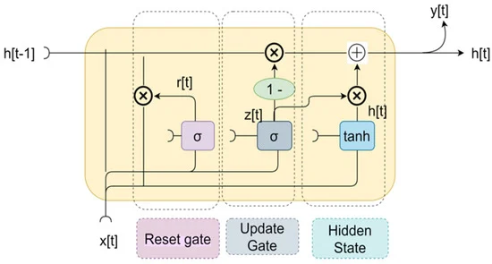

```{r setup, include=FALSE}
knitr::opts_chunk$set(echo = TRUE)
```


\pagecolor{beige}

\
\
<br>
<br>


# Introduction
\
Since the establishment of the first stock exchange, the Amsterdam stock exchange, in 1602, people have sought to predict value and develop strategies to identify unseen opportunities.\
Since then, the world economy has grown exponentially with the advent of the industrial era, followed by the information age and increasing globalization. This has naturally led to the growth of financial markets and their global importance. Today more than ever, we see financial markets playing a key role not only in the global economy, but also in the geopolitical and socioeconomic landscape.\
As such, the financial markets do not just impact investors and market participants, nor do they exclusively affect the general public passively through their implied influence on global politics. As we’ve seen in the past, the volatile and delicate nature of these markets can lead to significant direct and sudden impacts on uninvolved bystanders when paired with market crazes. \
Moreover, the performance of a country’s financial market can be a crucial determinant in their overall economic health. Since a country’s economic situation hugely impacts various sectors, the trickle-down effect can be felt in almost all aspects of life.
\

In order to grasp why financial markets have an impact on a country's economy and serve as an indicator of its economic health, it's beneficial to examine the structure of the country's economy and the fundamental mechanisms at play in the financial markets.\
While financial markets encompass various types of markets, including stock markets, derivatives markets, bond markets, and commodity markets in which this interconnectivity can be observed; the stock market stands out as a key driving force and best exemplifies the aforementioned characteristics.\
A country's economy consists of various sectors such as finance, agriculture, and metal, among others. These sectors collectively represent the overall economic power of a country. The economic situation of a country directly or indirectly impacts these sectors, and vice versa. They are closely interconnected, with each one influencing the other.\
The growth of these sectors depends on their volatility, which follows the fundamental economic principle of supply and demand. Demand for a specific sector directly affects the stock market, with increased supply prompting traders and financial institutions to invest in that sector or stock, leading to higher prices. Furthermore, regular dividend payments contribute to the generation of profits and returns on invested capital.\
Each sector is a part of the country's overall economy, and as such, the sector's growth is reflected in the health of the economy. Conversely, a country's economic situation also impacts supply and demand, as stable financial times lead to the increase of both. A better financial landscape results in the founding and success of more companies, as well as a greater inclination for individuals to invest.

The stock market provides a platform for investors to buy and own a part of a company. As companies expand, they often need more funds to support their future plans. With the approval of existing shareholders, who see a reduction in their ownership due to the creation of new shares, companies can sell these shares to investors to raise money. Successful outcomes lead to an increase in the stock market value for the shares.
\

In this context, there are different strategies that investors can use, and various types of specialized traders. Fundamentally, there are long-term investment strategies and short-term investment strategies. Investors using a long-term strategy hold on to shares for an extended period, while short-term investments involve buying and selling shares in a shorter timeframe; aiming for profits within days or weeks. Some specialized types of traders include scalpers, swing traders, day traders, and position traders. \
It is crucial for any investor, regardless of their strategy, to find the most opportune moments to buy and sell shares in order to achieve their desired returns. This is a very challenging task, as the above explanation is an immense oversimplification. In practice, numerous factors are involved in determining a security's price, and investors have to consider various aspects.
\

Given the difficulty of predicting the stock market, investors are constantly seeking tools and methods to assist them. Since the stock markets present significant opportunity for financial gain and are notoriously challenging to predict, they are widely popular among both investors and data scientists. While investors are primarily drawn to potential monetary gain, data scientists are primarily interested in the analytical challenges. This has led to the development and application of various different methods and techniques in this field.

Throughout the years of their existence, as financial markets evolved, so have the strategies and techniques utilized by market entities. Traditionally, fundamental and technical analysis are popular approaches to understand market trends, but they possess inherent limitations due to the involvement of lagging indicators and prediction inaccuracy. \
In the present day, the financial markets are being redefined by advanced algorithms that make use of machine learning and deep learning models. Although traditional time series forecasting methods, such as autoregressive algorithms continue to be used successfully, the continuous improvement of these new algorithms is pushing the boundaries of what is possible.
\

That being said, the use of these systems is not universal as many investors continue to rely on more traditional strategies, such as chart analysis and news trading, thus proving that such strategies are still viable and profitable. \
While it is possible for individuals who do not possess extensive knowledge of the financial markets or utilize advanced strategies to be profitable, for instance, either by sheer luck or by investing in low volatility securities during stable economic times; the true objective of any investor is risk adjusted returns. In financial circles, this concept is referred to as “Alpha”.
\

Throughout this project, several popular techniques that can be employed to forecast the stock market will be analyzed and evaluated. Methods will be described and applied in order to identify if they can be successfully utilized to seek alpha.


\
\

# Abstract


## Prior Work and Research
\
The field of stock market research is a popular field of study. Investors are on a continuous search for methods that help them better quantify hidden information, tools that simplify the search for good investment opportunities, or systems that are simply better at forecasting a security’s value. New and improved systems and methods can be utilized by investors to automate their processes with sufficient prediction accuracy or serve as another reference point to make better informed investment decisions. \
While a significant part of the present research in the field is undoubtedly motivated by investors and their interest in monetary gain, much of the current research is also motivated by data scientists that are invested in this field for its notorious unpredictability, and challenging nature. Paired with the fact that the stock market enjoys a wide appeal in the general public for the same reasons, it is not surprising that a plethora of research papers, articles, and open source resources on this matter are published and made openly available.
\

Existing research into the field encompasses all areas and disciplines of stock market investing. The stock market is a broad field that includes many niches. As such, scientific papers conducted on a wide range of diverse focal points can be found. \
This variety encompasses the many specific strategies scientific papers choose to discuss, the various different exchanges that analyses are conducted on, and all types of investing; including, but not limited to, the general buying and selling of stocks. \
While the specific topics of analyses can differ greatly, most commonly, scientific research is aimed at predicting future stock prices of predominantly American securities that can be found in the S&P 500 or the NASDAQ stock exchange. 

Less variety can be found in the chosen forecast horizon, as the majority of papers aim to predict the next day price. This often leads to a common pitfall in stock market forecasting, discussed later. \
Other popular forecast periods include predicting two weeks into the future, which is useful for swing trading, and periods used for long term investment strategies. Most commonly, predictions are acquired recursively, while predictions for either a single end date value, or all individual values within the forecast horizon are obtained.

For the target value, a wide majority of scientific papers choose the daily closing price of a stock. While a limited feature selection including the volume, the high price, the low price, and the open of a security is often utilized, more sophisticated papers include various different technical, fundamental and sentiment indicators, either in combination or in a vacuum. While occurring the least, sentiment indicators generally provide the most predictive power. However, the validity of each indicator highly depends on the particular method that is utilized, and thus features can have varying degrees of success.

When it comes to the evaluation of results, the wide majority of papers make use of the MSE, RMSE, and MAE error metrics. Scientific papers utilizing error metrics that relate more specifically to the stock market, for instance the Sharpe ratio, are a rare occurrence. Similarly, papers contextualizing their results, simulating practical environments and evaluating results based on practical applications are an exception. 
\

This variety pertaining the focal point of analyses extends to the types of forecasting methods utilized. Over the years, researchers have proposed several solutions to the task of stock market prediction. Some of the most popular approaches include machine learning algorithms, deep learning algorithms, and algorithms specialized on time series forecasting. However, traditional approaches used in prediction tasks as well as novel approaches can still be seen applied. \
In addition to this, various papers propose ensemble algorithms, in an attempt to combine the strengths of multiple individual algorithms. If those systems are carefully deliberated and applied successfully, they usually show the most promising results.

While traditional methods have not lost their relevance and can still be seen applied with success, deep learning algorithms have surged in popularity in recent years for their superior accuracy and capability to deal with large quantities of data. \
Generally speaking, improvements of deep learning algorithms and advancements in computational power have let to clear improvements in prediction accuracy. Due to that, state of the art deep learning algorithms and ensembles including various deep learning algorithms are the most discussed methods for stock market forecasting in the field today. \
It is yet to be seen if transformer models can further improve prediction accuracy in stock market forecasting. While transformers have successfully been applied in many fields, scientific papers applying these systems on stock market forecasting tasks are sparse. However, most papers which apply transformers to predict stock seem to suggest good results. \
The same can be said for the closely related theory of “attention”, first seen applied in the paper “Attention is everything”. It showed particular notoriety for its impact on natural language processors and inspired the transformer models that followed.
\
\


While prior research is comprised of a lot of quantity, quality on the other hand can be hard to come by. Research papers discussing stock market prediction, for instance, are oftentimes conducted by data scientists who do not possess intimate knowledge of the financial markets. This can lead to the loss of nuance, important aspects and terminology being misrepresented, crucial financial mechanisms being ignored, the misuse of features which in financial forecasting are oftentimes technical indicators, oversimplifications, the reliance on traditional evaluation metrics and difficulties in conceptualizing results, among others. This is often manifested in the use of similar features, that do not add combined value, the utilization of suboptimal scaling methods, an uncertainty in how many previous values should be considered, and model applications that show little practical value. \
Additionally, as is the case in many other scientific fields, results are often glorified and misrepresented. This can be observed more commonly in a popular and challenging field such as stock market forecasting. It can be thus difficult to trust results, as such papers muddy the waters. \
This is only intensified by the fact that most research papers do not include complete or even partial code of their models, nor do they include the utilized hyper-parameters. This is especially the case for papers that allege good results. 

Similar fallacies can be observed in a wide range of available articles describing various different techniques and models in the field. Most articles do not give detailed explanations but instead resolve to surface-level descriptions. Articles that supply code, and attempt to showcase how certain methods can be utilized for stock market forecasting in practice, usually do not explain the supplied source code in sufficient detail, while oftentimes including mistakes and false information. \
Articles describing the theory of certain methods can be similarly depthless. In addition, it is common for such articles to contradict one another while the used terminology is highly inconsistent.
\

These problems become only more prominent when asserting the fact, that credible and detailed scientific resources on theories and methods are generally close to impossible to find. Informative literature on these topics must often be purchased or otherwise be pieced together, as easily accessible summations of information do not exist. Hence, it can be difficult to gain intricate knowledge of these topics, that goes beyond a fundamental understanding of the subject. Conversely, to confidently utilize certain methods, apply them to specific problems and aim to add value that goes beyond plagiarism, it is essential to be intimately aware of the subject matter.

While good resources can be found, it can be a challenging task due to the reasons mentioned above. Finding resources often involves relying on sources that apply the pertinent methods in other fields. They must thus be adapted to the specific use case. This tailoring is not always straight forward, as different fields can have different problem statements, priorities and characteristics. \
A similar challenge concerns the utilized programming language, as the wide majority of deep learning algorithms are written and applied in Python. While general processes can be easily understood and applied in R, not all tools are available in both languages.
\

Lastly, it is important to note that successful models and algorithms achieving high prediction accuracy do not get published. Although the general concepts of a successful model might get published, the exact tunes and specifications never are. \
While this is generally the case for most fields, it is especially prevalent in the field of stock market forecasting due to the highly competitive nature of financial markets, and since a successful model is synonymous with monetary gain. \
An individual able to solve the mentioned problem with any success would be advised to be careful with their findings. Moreover, while it is not impossible for an individual to create a sufficiently accurate model, the most powerful models are built by collectives and held by financial institutions who possess the necessary computing power to make them viable, and naturally, do not make them public. 


\
\

## Hurdles and Pitfalls
\
Throughout this sub-section, some of the most noteworthy pitfalls and hurdles will be described. It is essential to be aware of them so that pitfalls can be avoided and hurdles can be overcome.

As is the case for all data science projects, it is important to be intricately familiar with the data that is used for analysis. This is especially the case for projects concerning the stock market, as values can be stored in various different currencies. Wrongful assumptions can thus lead to incorrect comparisons between stocks and skewed results when multiple untransformed currencies are used in the same analysis. 

Another false assumption that often occurs, is that all stocks behave the same. A model showing high prediction accuracy when applied to one security should therefore also have high predictive power when applied to other securities. In practice, however, there are many different types of securities with vastly different characteristics. High priced stocks of successful companies for instance, are usually less volatile than those of companies with less market capitalization. Those stocks show less movement while the price of the stock is less prone to rapid changes. Counterintuitively, these stock prices are more challenging to predict for some methods. 
\

An often occurring pitfall in stock market forecasting is the prediction of the previous day value for the unknown next day value. This fallacy occurs in various publications, wrongfully assuming a high prediction accuracy. While results appear highly accurate when graphically represented and when their error is calculated on one of several error metrics, their true nature is revealed when the results are more closely observed. In truth, forecasting a point to be the exact value of its preceding point, knowingly or unknowingly, naturally deems the model completely unviable. In cases in which only the next day is predicted, there is no value in predicting an already known value since it is known with certainty that the price of the security will change. In the more dangerous case that this fallacy occurs when multiple values are predicted into the future, predictions are made recursively. The model utilizes information it should not have, namely future values that should be exclusive to the test set on which the results are evaluated, to predict each future day value. Even if no future values pertaining to a particular point are utilized in forecasting that particular point, in a prediction task stating a multiple day forecast horizon, any value in the range of the period that is being forecasted must be excluded, or a fallacious statement of a multiple day forecast is made. \
While, in the case of a multiple day prediction task, this can be seen as a standalone pitfall, it usually occurs in combination with improperly built models.\
The model accurately presumes that the last value preceding the value to be forecasted, has the most predictive power, but erroneously completely disregards additional information. Therefore, the model greatly simplifies the prediction task and is incapable of discerning any real structure in the data.
This pitfall is most commonly observed in LSTM networks. For more information on this specific pitfall we refer to the resource in section 10.

Many more pitfalls pertain to LSTM networks as they are complex systems and require a lot of pre-processing, comparatively to other methods. Many pitfalls occur during the pre-processing step. Sequencing the input data is a necessary step for many LSTM network applications. Correctly sequencing the data requires attentiveness, as incorrectly sequenced data can often go unnoticed. 
\

Since stock market analysis requires problem-specific knowledge, the learning curve can be steep for data scientists unfamiliar with the stock market’s mechanics and its terminology. It can thus be challenging to properly assert the correct objective of analysis, make decisions on what features should be utilized, what key characteristics are important to be aware of, or how to properly evaluate results.\
As the stock market is a complex field with many moving parts this can be a major hurdle for data scientists who do not have pre-existing knowledge or interest in the field. That being said, this hurdle can be fairly easily overcome as many resources on the subject matter are openly accessible.

Good sources for data, on the other hand, are not always easy to find and freely accessible. Good data is essential to be able to obtain good results. Previously the popularity of the stock market, hugely motivated by monetary incentives, was mentioned. Consequently, clean datasets containing useful information are exceedingly valuable. For that reason, many sources offering stock market data require payment. Some free alternatives will be mentioned later.

Another hurdle pertains to the fact, that good resources on the most promising forecasting techniques are difficult to find. The reasons and ramifications of this are described in much detail in the previous sub-section. The majority of deep learning algorithms were first applied and made available in Python backends. Due to this, most primary and secondary resources providing detailed information on their utilization are also written in Python, more specifically PyTorch. For some deep learning algorithms, applications and resources are exclusively found written in Python. It can hence be difficult for a data scientists, not familiar in Python, to apply these models. In addition to this, applications in other coding languages are often limited and do not include all options and specifications available.
\

Many other possible hurdles relate to deep learning algorithms specifically. For instance, machine learning algorithms in general are non-deterministic. Due to the stochastic nature of the algorithms or the evaluation procedure, and since weights in neural networks are randomly initialized, results can have high variance. Furthermore, deep learning algorithms are computationally expensive, turning repeated model runs into a tedious process. Therefore, it can be challenging to evaluate the results properly. However, this can be somewhat counteracted by setting a seed. 


\
\

## Mission Statement
\
The objective of this analysis is to describe and compare several different forecasting methods in an attempt to build a useful and viable model to predict future stock prices. Throughout this process, this paper will simultaneously aim to answer several fundamental questions. \
A useful and viable model will be defined as either achieving sufficient prediction accuracy or otherwise showing value in forecasting. As such, the viability and usefulness of models will be evaluated on either their prediction performance measured on the RMSE, or in their ability to add overall value in forecasting trends and market movements. Additionally, computational efficiency will be considered in the evaluation, as available computational power might be limited in practice, and decreases the time it takes to obtain predictions; which can be highly beneficial in stock market prediction tasks. 
\

The overarching question this paper aims to answer is, if it is possible for an individual to build a model that is sufficiently capable of predicting a stock’s price or is able to add value in stock market investment decisions, given a reasonable amount of time and effort invested. Additionally, this paper will explore how accurate such a model can be, and if deep learning algorithms can simplify the process of building a good model. \
Throughout this process, more specific questions will be answered. Do other new techniques exist to make stock forecasting easier for individuals? Various papers can be found utilizing sentiment indicators with success, while “news trading” is a popular trading strategy. Can models refraining from utilizing sentiment indicators be viable and accurate? While most financial institutions and many investors utilize some form of stock market prediction algorithm, rarely are they utilized in isolation. Can models provide sufficient value to be used as lone prediction tool? 
\

An often discussed topic in the field of investing is the efficient-market theory. This hypothesis states that share prices reflect all available information, and that generating consistent alpha is impossible. According to the efficient market hypothesis, stocks always trade at their fair value, making it impossible for investors to purchase undervalued stocks, or sell stocks for inflated prices. Therefore, even if stocks are selected expertly and the ideal market timing is chosen, it should be impossible to outperform the overall market. The only way for an investor to obtain higher returns is by making riskier investments. \
Proponents of this hypothesis state that the financial markets become continuously more efficient and are close to reaching their peak efficiency. Information on the financial markets is more available than ever before, and computational power is increasing exponentially while advanced machine learning and deep learning algorithms improve at a rapid rate. In particular, institutional investors benefit from those factors the most, as they have vast resources available to them. Consequently, it is impossible for retail investors to find profitable investment opportunities as they are put at a major disadvantage.\
Although, the efficient-market theory is a cornerstone of modern financial theory, it is highly controversial and often disputed. While academics point to a large body of evidence in support of the hypothesis, equal amount of dissension also exists. Examples of investors consistently beating the market over long periods can be found, which by definition, should be impossible according to the efficient market theory. 

Since a lot of academic research including empirical and theoretical research was conducted on this topic, and no clear consensus could yet be reached, this paper does not presume to find irrefutable evidence for or against the theory. Regardless, it will be put into question and discussed.


\
\
\

# Methodology
\
In this chapter we will outline the general approaches considered to tackle the problem of stock market prediction, and describe the approaches and techniques that were ultimately used throughout this paper in more detail.

Since the stock market is a very popular research topic, the literature includes various techniques from other fields that were adapted to fit this specific use case. For that reason, this section will not be an exhaustive representation of all approaches researched and adapted in this field but instead, will focus on the most promising and widely used techniques.

This overview will start from the ground up, describing the format and properties of the data we will be working with. Afterwards, this paper will outline the most popular and widely used techniques in the field, of which the ones chosen for further examination will be described later in our analysis. \
Additionally, possible features will be assessed, given that they are an important facet in any data science project and are an essential avenue to consider in the attempt to improve model performance. Due to the fact, that most features in stock market prediction require some knowledge of the underlying field and their interconnectivity with the stock price we are trying to predict, their role and value in the wider picture will be explained with the goal of understanding the opportunities they could present.\
This is especially vital, since most of the features considered in this paper are classified as “Technical Indicators”, derivative values that do not have a clear intuitive meaning. In those cases their respective formulas will be given and put into perspective.\
Lastly, this section will aim to highlight error metrics used to evaluate the results of our forecasts and model performance.


\
\

## Stock Market Data
\
The most crucial part in any analytic endeavor and data science project is to understand the subject matter of the analysis and hence the underlying data.

As previously stated, the task of predicting the stock market might not necessarily focus on the close price of a given stock or any price for that matter. Some projects might instead find more value in predicting the volatility of any given stock or the entire market, thus focusing on predicting the trading volume with accuracy. Other investors might choose to focus on future dividend yields or another aspect entirely. Aside from all other facets of the financial markets not mentioned here, such as ETF’s, bonds, FOREX, the derivative markets among many others, which can be considered their own discipline. There are many different objectives stock market analyses can set out to achieve, each with their own respective value.\
The focal point of this analysis will be the natural choice of predicting a stocks price after a given period, and over a given forecast horizon. While this approach might seem straightforward, there are in fact many ways the price of a stock can be represented, depending on the information it aims to convey. Each used for a specific purpose and relaying information important to unique use cases.\
An example for price quantifications that are particularly case specific are intraday data. Intraday data describes the price in a short time frame throughout any given trading day, such as in a 15 or 30 minute window, usually averaging the price in the given period or representing its last value. It is utilized by active day-traders or “scalpers” interested in the short term price movement of a stock oftentimes without the aim of holding the stock past the market close.
\
\newpage

Excluding examples such as these, the list provided below focuses solely on the most commonly seen methods to evaluate a securities value.
\

$\text{\underline{Open Price:}}$

The **Open Price** is the price at which the security is first traded, on a particular trading day. Therefore, it is the security’s price at the opening of its stock exchange on the trading day. Investors might choose to submit trades to execute “At the Open”. Those trades can be submitted before the trading day begins.
\

$\text{\underline{High Price:}}$

The **High Price** can be referred to as the highest closing price of a stock over a 52 week period, adjusted for stock splits, but is more commonly used to describe the highest intraday price of a given trading day.
\

$\text{\underline{Low Price:}}$

The **Low Price** represents the inverse of the stock’s High and describes the lowest price a security was traded for during a given trading day.
\

$\text{\underline{Close Price:}}$

The **Close Price** or closing price describes the last price at which a stock is traded during a regular trading day. It is the standard and most commonly used benchmark to quantify a security’s performance and to track it over time. Thus, it is also the aim of most stock market prediction tasks.
\

$\text{\underline{Adjusted Close Price:}}$

The **Adjusted Close Price** amends a stock’s closing price to reflect that security’s value after accounting for any corporate actions. While the closing price represents the raw price, which is just the cash value of the last transacted price before the market closes, the adjusted close factors in stock splits, dividends and right offerings. These adjustments allow investors to obtain an accurate record of a stock’s performance.

To understand how accounting for these adjustments can add value to investors, it is helpful to observe how a stock’s price behaves during corporate actions. When a company issues a stock split, for example, it increases the number of shares in their company. In turn, this decreases the value of each individual share since it then represents a smaller percentage of the company’s total share. Still, the value of the shares an investor held before the stock split and after, remains the same. Highlighting the reasons it might benefit a company to execute such corporate actions is beyond the scope of this section. 

The Adjusted Close Price is more complex and accurate than the unaltered close price since it displays the true price and accounts for outside factors. For that reason, it is especially useful when examining historical returns or when working with historical prices to attempt to deduce future trends.\
Due to these reasons, the choice was made to focus on the Adjusted Close Price throughout the course of this paper as the main benchmark to represent a stock’s current and future value, whilst rendering it the target value of our prediction task. 

\
\
\newpage

**$\text{\underline{Format:}}$**

Generally speaking, stock market data is most commonly found in one of three formats. Commonly referred to as “OHLC”, ”OHCV” and “OHLCVA” charts. The letters in these acronyms respectively symbolize:

- Open
- High
- Close
- Volume
- Adjusted Close

They are stored in a data frame from left to right, aligning with the order of their initials in the acronyms.

Additionally, each format includes the date pertinent to the trading day on which the above listed values were recorded, in a ymd (year-month-day) format. Depending on the data we are working with, the stock ticker of the security, a short letter representation of the underlying company that is listed at the exchange, might also be included. This is the case when multiple securities are jointly stored in a single dataframe for analysis. 

Similarly, to the above mentioned variaties in stock price representation, storing methods for stock market data also vary depending on the specific prediction or analysis task at hand. As such, intraday data is found in formats useful for their specific purpose.

Moreover, a data scientist working with stock market data will come across additional market and company information such as fundamental data. Fundamental data, such as company balance sheets are naturally stored in their own respective formats, which can vary on the primary source providing that data.

As is the case with any data, it is not only essential to be acutely aware of the format in which the data is stored but also the data’s properties, namely what unit of measurement is being utilized to illustrate the values. This is especially true when working with stock market data. The currency in which values are stored can vary dramatically. Wrongfully assuming the currency in which the data was recorded is a common pitfall that must be avoided.
\

Throughout the analysis in this paper, data will be found in the OHLCVA format and will then be further wrangled. All values found in the datasets used throughout this analysis will be represented in US Dollar.

\
\

**$\text{\underline{Forcast Horizon:}}$**

Intraday data will not be considered to achieve the stated objective. Different forecast horizons, on the other hand, will be utilized to compare the capabilities of models to accurately predict into the short-, medium-  and long-term future. The overall success and promise of predicting said periods will also be analyzed and compared.
\

These ranges were chosen to represent each forecast period:

- Short Term: 1 trading day 
- Medium Term: 20 trading days (~ one calender month) 
- Long Term : 260 trading days (~ one calender year)

\
\

## Features
\
Features commonly utilized in the attempt to predict future stock prices and market movements can be classified into one of three core groups: Fundamental Indicators, Technical Indicators and Sentiment Indicators.

\

$\text{\underline{Fundamental Indicators:}}$

Fundamental analysis measures a security’s intrinsic value by examining related economic and financial factors. Intrinsic value describes the value of an investment based on the issuing company’s financial situation, as well as, the current market and economic conditions.

Fundamental analysis can encompass a wide array of factors that can affect the value of a security, ranging from macroeconomic factors such as the state of the economy as a whole, or that of a specific industry, to microeconomic factors like the effectiveness of management.\
The most commonly utilized fundamental factors can be found on a company’s balance sheet, including a company’s liquidity, their liabilities and assets, their earnings, their profit margins and so forth.\
These factors can be utilized by investors to judge whether or not a security is overvalued or undervalued or deduce possible risks involved. \
Investors focusing on fundamental analysis usually attempt to find value in long term investment opportunities, putting weight on a company’s overall health and long term potential. These investors are known to hold their position for prolonged periods of time. 
\

Fundamental Indicators considered:

- Total Liabilities
- Total Assets
- Liquidity
- Federal Funds Interest Rate
- Gold Price
- US GDP

\

$\text{\underline{Technical Indicators:}}$

Technical Indicators are heuristic or pattern-based signals. They are mathematical calculations based on the price, volume and/or interest of a security and aim to forecast market direction. By analyzing historical data these indicators can be used to predict future price movements.\
In contrast to fundamental analysis, that attempts to evaluate a security’s intrinsic value based on financial or economical data, technical analysis focuses on patterns of price movement and trading signals to evaluate a stock’s strength or weakness.\
Technical analysis can be used on any security with historical trading data but is most prevalent in commodity and forex, where traders focus on short-term price movements. While they are most commonly used by active traders, they do still provide value for long term investment strategies. \

Technical Indicators considered:

- MA (Moving Average) ; Simple and Exponential Moving Average
- MACD (Moving Average Convergence Divergence)
- MTM (Momentum Index)
- RSI (Relative Strength Index)
- ATR (Average True Range)
- VWAP ( Volume-Weighted Average Price)
- ADOSC (A/D oscillator)
- CCI (Commodity Channel Index)
- MFI (Money Flow Indicator)
- ULTOSC (Ultimate oscillator)
- Donchian Channels
- DMI (Directional Movement Index)
- VR ( Volatility Ratio)
- OBV (On Balance Volume)
- Price Momentum Index(CR) and CR-MA
- Bollinger Bands

Below, the Technical Indicators ultimately chosen for this analysis will be described in more detail.

\

$\text{\underline{Sentiment Indicators:}}$

A sentiment indicator is designed to represent how a group feels about the market or the economy. \
Sentiment analysis attempts to gauge how market actors are thinking or feeling, which may help to forecast investor’s future behavior. These signals may be used in unison with other signals and can confirm trends, as well as inspire a contrarian strategy.

Instead of solely looking at assets or data points, sentiment analysis analyzes the economy from the perspective of participants involved and aims to extract and summarize consumer and investors behaviors and beliefs.\
Data extraction for sentiment analysis mostly focuses on extracting information from the internet, through a process called “scalping”. News articles, social media and financial reports being the most rich sources to gauge market sentiment and thus the primary targets of sentiment analysis efforts. These resources are then fed into NLP-algorithms (Natural Language Processing) such as Google’s BERT (Bidirectional Encoder Representation from Transformers).

This paper will not include sentiment analysis since the process of extracting and analyzing information needed to obtain viable sentiment indicators can be seen as their own discipline and exceeds the scope of this analysis. \
Sentiment analysis does provide value, as research proved its ability to improve model’s performance. Thus, it will be considered for future research and mentioned later on in this paper.

\

$\text{\underline{Summary and Overview of Included Features}}$

Following is a short introduction to each feature ultimately chosen for closer examination. These summaries are intended to supply a framework and basic knowledge of the features presented in this paper and should not be treated as exhaustive definitions.

These features were ultimately chosen for closer examination and are present in this paper:

\
Basic features:

- Adjusted Close
- Volume
\newpage

Fundamental Indicators:

- Federal Funds Interest Rate
- US GDP

Technical Indicators:

- RSI
- VWAP
- MACD
- ATR
- CMF
- MFI
- OBV
- Donchian Channels


\

**Volume:**

While the inclusion of all five main features in a OHLCV chart is prevalent in many research papers and projects regarding stock market analysis, it was chosen that including any price in addition to the adjusted close price is redundant. The assumption was made that the adjusted close price already encapsulates all the important information the other prices would provide, and that they therefore would only add unnecessary noise.

Volume on the other hand, was included since it might add information not present in the adjusted close price and describes how active a given security is traded. This can be an important factor, as trading volume represents the volatility of a stock and thus also its implied variance.

In simple terms, volume describes the total number of shares traded during the given period.

\
\

$\text{\underline{Fundamental Indicators:}}$
\

**Federal Funds Interest Rate:**

The federal funds interest rate is the interest rate at which depository institutions (banks and credit unions) lend reserve balances to other depository institutions. Reserve balances are amounts held at the US Federal Reserve. Institutions with surplus funds in their account lend those to institutions in need of larger balances. The federal funds rate is an important benchmark in financial markets as it influences a wide range of market interest rates. \
This influence manifests in the form of a “trickle down effect”, as the interest rate for depository institutions increases to keep a balanced liquidity, they charge higher interests for credits issued to individuals. \
This in turn effects the overall stock market activity, among various other financial markets. As interest rates rise, both businesses and consumers cut back on spending and instead, choose to save more of their funds, due to the increased returns. In contrast, businesses and consumers will be incentivized to increase spending as saving money yields less returns. \
As the interest rate rises, stock prices decrease, as market activity decreases and businesses generally report lower earnings. This can lead to contrarian strategies attempting to buy assets at a lower cost. 

The effect of changing interest rates does not effect every industry similarly, as higher interest rates do not tend to negatively affect investments into the financial market sector. Additionally, investors will choose investments that are considered more risk averse in times of high interest rates and uncertainty. The commodity market will feel less of a negative impact as gold, for example, is considered a less volatile, “safe” investment. The same holds true for bonds and ETF’s, as investors are more likely to balance their portfolios in favor of “safer” investments, and are more likely to employ hedging strategies.

This all goes to say that there are a multitude of ways interest rates affect the stock market and therefore they are an important indicator to consider.

\

**US GDP:**

A country’s GDP , or gross domestic product, has effects on the financial market similar to those of the interest rates. As the average funds available to the population increase, they will be more likely to invest.

Furthermore, changes in the GDP can be a sign of impending inflation or deflation, both usually translating into changes in interest rates, hence the GDP acts as a very early indicator of impeding changes causing the effects mentioned above. 

The GDP is also often utilized as reliable benchmark to gauge the state of a country’s economy and can thus, in theory, be used to judge the current general market strength. 

\
\

$\text{\underline{Technical Indicators:}}$
\

**RSI:**

The Relative Strength Index is a momentum indicator used to measure the speed and magnitude of a security’s recent price changes to evaluate overvalued or undervalued conditions in the price of that security. It is a popular momentum oscillator frequently used by technical analysts since its introduction in 1978.

\
Calculation: 

The RSI is calculated using the average price gains and losses over a certain time period. The default time period is typically going to be 14 time periods (in daily chart → 14 days).
\

$$
\begin{aligned}
RSI &= 100 - \left(\frac{100}{1 + RS}\right)\\
\\
RS &= \frac{\text{Average  Gain}}{\text{Average Loss}} \text{  (over that time period)}
\end{aligned}
$$

\

Average Gain: \
- Look back during period (usually 14 days) \
- How many days did the stock move up during period \
- Add up all the values (total points) and divide by days (14) 

Average Loss: \
- Same as average gain with the difference that we observe how many days a stock   moved down during the period
\

\newpage

Evaluation:

The RSI will typically spit out a number between 0 and 100.

- Traditionally every time the RSI value is over 70, the stock is said to be **overbought**
 → sell
 
- Traditionally every time the RSI value is under 30, the stock is said to be **underbought**
 → buy


There are more strategies that can be applied with the help of the RSI and more signals that can be deduced from the RSI’s behavior, especially when used in tandem with other indicators, we do not describe here.

\

**VWAP:**

The Volume-Weighted Average Price Indicator is a benchmark that represents the average price a security has traded throughout the day, based on both volume and price. Its purpose is to provide a smoothed out indication of price, and an idea of whether or not a security is currently undervalued or overvalued. VWAP is important because it provides investors insights into both the trend and the value of a security. It is typically used by traders operating in the short term.

\
Calculation:

VWAP is calculated by multiplying the _cumulative typical price_ by volume, then dividing by _cumulative_ price.

The typical price gets calculated by taking the sum of the high price, low price of the time period that is being measured and the closing price, and then dividing it by 3.

The _cumulative volume_ is the total volume since the trading session opened.
\

$$ 
\begin{aligned}
\text{VWAP} &= \frac{\text{Cumulative Typical Price x Volume}}{\text{Cumulative Volume-Weighted Price}}\\
\\
\text{Typical Price} &= \frac{\text{High Price}+\text{Low Price}+\text{Closing Price}}{3}
\end{aligned}
$$


\

Evaluation:

When we look at the indicator on a chart we notice a colored center line, as well as an upper and lower band. The colored center line is the VWAP line. The upper and lower bands act as our standard deviation lines. Specifically, the upper and lower bands are two standard deviations away from the mean, so 95% of the price action takes place between these bands.

The VWAP virtually acts as the average price of the stock for the day.

- When the price of the stock is $\text{\underline{below the VWAP}}$ line it may be considered $\text{\underline{undervalued}}$.

- When the price of the stock is $\text{\underline{above the VWAP}}$ line it may be considered $\text{\underline{overvalued}}$.


This does not mean one should enter a short or long position.


These terms of overvalued and undervalued are going to apply to large institutional traders. They will use these as reference points before placing their trades. Many institutional traders will utilize the indicator in their trading to ensure their trading does not move the stock price too extremely in either direction.\
Since institutional traders use the VWAP as an indicator or benchmark, it is regarded as a highly influential metric for intraday trading.

More sophisticated methods of utilizing the VWAP to find possible trading signals will not be described in this paper.

\

**MACD:**

The Moving Average Convergence/ Divergence indicator is utilized by investors to identify price trends, momentum changes, and market entry points for buying and selling. It is a trend following momentum indicator that shows the relationship between two exponential moving averages (EMA’s) of a security’s price. The MACD is widely used and one of the most well known technical indicators since its introduction in the 1970’s.

\
Calculation:

The MACD is calculated by subtracting the long-term EMA from the short-term EMA. The study specifically uses the exponential moving average (EMA), rather than the simple moving average to place greater weight on recent price movements.

The MACD is best used with daily periods, where traditionally it is calculated from subtracting the 26 period EMA from the 12 period EMA. Furthermore, the 9 period EMA is commonly the default for the Signal Line.

\
$$
\begin{aligned}
\text{MACD Line} &= \text{12 Period EMA} - \text{26 Period EMA} \\
\\
\text{Signal Line} &= \text{9 Period EMA of MACD}\\
\\
\text{MACD Histogram} &= \text{MACD Line} - \text{Signal Line}
\end{aligned}
$$


\
Signal Line: \
- Basically acts as an average of the MACD Line\
- Slower moving than MACD

MACD Histogram: \
- Reflects the distance between the MACD-Line and the Signal-Line\
- Changes in the histogram can be observed as the MACD- and Signal-Line
 separate or diverge and when they move closer together or converge

\
EMA calculation:
\

$$ 
\begin{aligned}
\text{EMA} &= (\text{Closing} * \text{Multiplier})+ \text{Previous EMA} * ( \text{1 - Multiplier})\\
\\
\text{Multiplier} &= \frac{2}{\text{Number of Periods + 1}}
\end{aligned}
$$


\

Evaluation:

Divergence can be interpreted as strengthening momentum, while Convergence can be interpreted as weakening momentum. Trading signals are usually found when a crossover of the MACD- and Signal-Line can be observed.

As is the case with the other technical indicators described in this paper, we will not detail more sophisticated methods of utilizing the MACD in practice. 

\

**ATR:**

The Average True Range is a market volatility indicator. It measures market volatility by decomposing the entire range of an asset price for the target period. This indicator’s purpose is to show investors the average range of the price swing over a specified period. 

The ATR was originally developed for use in commodity markets but has since been applied to all types of securities. It is typically derived from the 14-day simple moving average of a series of true range indicators; although shorter periods can be used to generate more trading signals, while longer periods have a higher probability to generate fewer trading signals.

\
Calculation:

Formula for ATR calculation if a previous ATR is present:
\

$$
\begin{aligned}
\text{ATR} &= \frac{\text{Previous ATR (Number of Periods - 1)} + \text{TR}}{\text{Number of Periods}} \\
\\
\text{TR} &= \text{True Range}
\end{aligned}
$$

\
If there is not a previous ATR:
\

$$\left(\frac{1}{n}\right) \sum_{i}^{n}\text{TR}_i$$

$\text{TR}_i$ = Particular True Range; TR for each specific day

$n$ = number of periods

\

To calculate True Range (TR):
\

$$\text{TR} = \text{Max}[(H-L),|H-C_p|,|L-C_p|]$$
\
$H$ = Today’s High \
$L$ = Today’s Low \
$C_p$ = yesterdays closing price \
$Max$ = Highest value of the three terms \


\
\newpage

Evaluation:

A stock experiencing a high level of volatility has a higher ATR, and a lower ATR indicates lower volatility for the period evaluated. It was created to accurately measure a security’s volatility and does not indicate price direction. It is commonly used as an exit method, regardless of how the entry decision was made. One of those techniques is the popular “Chandelier Exit”, not described here.

Being aware of the underlying volatility of a security can help investors to decide what size trade they should use, adjusted for their willingness to accept risk and the volatility of the markets. 

\

**CMF:**

The Chaikin Money Flow is a volume-weighted average of accumulation and distribution over a specified period. It shares similarities with the MACD indicator as both are momentum oscillator using exponential moving averages in their calculations.

The Chaikin Money Flow stems from the principle that the nearer the closing price is to the high, the more accumulation has taken place. Conversely, the nearer the closing price is to the low, the more distribution has taken place. If the price action consistently closes above the midpoint on increasing volume, the Chaikin Money Flow will be positive. If the inverse on increasing volume is true, the CMF will be negative.

The typical period for the CMF is 21 days.

\
Calculation:
\

$$
\begin{aligned}
\text{CMF} &= \frac{\text{n-day Average of the Money Flow}}{\text{n-day Average of the Money Flow Volume}} \\
\\
\text{Money Flow} &= \frac{((\text{Close Value}- \text{Low Value})- (\text{High Value}- \text{Close Value}))}{\text{High Value}-\text{Low Value}}\text{ ; for 
each period} \\
\\
\text{Money Flow Volume} &= \text{Money Flow Multiplier} *\text{Volume for the period} 
\end{aligned}
$$


\

Evaluation:

A CMF above the zero line is a sign of strength in the market, while a value below the zero line is a sign of weakness in the market. The CMF can also be utilized to draw trend lines and to analyze crosses. Crosses can be observed when the CMF intersects the zero line and can be an indication of possible trend reversals. 

As is the case with the other technical indicators, the proper detailed utilization of the indicator and its full potential, including more sophisticated analysis techniques, will not be described in this paper.

\

**MFI:**

The Money Flow Index is a technical oscillator that uses price and volume data to identify overbought or undersold trading signals in an asset. It can also be used to spot divergences, which can indicate trend changes. Many Traders view this indicator as a volume-weighted RSI, since they are closely related; with the main difference being that the MFI includes both price and volume in its calculation.

The MFI moves between 0 and 100. 

\
Calculation:

\
$$
\begin{aligned}
\text{Money Flow Index} &= 100 - \left(\frac{100}{1+ \text{Money Flow Ratio}}\right) \\
\\
\text{Money Flow Ratio} &= \frac{\text{14 Period Positive Money Flow}}{ \text{14 Period Positive Money Flow}} \\
\\
\text{Raw Money Flow} &= \text{Typical Price} *\text{Volume} 
\end{aligned}
$$


\
 → When the price rose from one period to the next Raw Money Flow is positive and is added to Positive Money Flow, if the Raw Money Flow is negative because the price dropped that period, it is added to the Negative Money Flow
 
\
$$\text{Typical Price} = \frac{\text{High}+\text{Low}+\text{Close}}{3} $$

\

Evaluation:

An MFI reading of above 80 is considered overbought while a reading of under 20 is considered undersold. Values of 90 and 10 can also be used as thresholds.

The primary way of using the Money Flow Index is to spot a divergence. A divergence occurs when the indicator is moving in the opposite direction of price. This is a signal of a potential reversal in price trend.\
For example, a very high Money Flow Index that begins to fall below the reading of 80 while the underlying security continues to gain in value is a price reversal signal to the downside. On the other hand, a very low Money Flow Index reading that climbs above the threshold of 20 while the underlying security continues to sell off is a trend reversal signal to the upside.

There are many different signals investors can look out for when utilizing the MFI in their analysis that are not described here. 

\

**OBV:**

On-Balance Volume is a momentum indicator that uses volume flow to predict changes in stock price. While it is not one of the most used indicators it never fell into oblivion since its introduction in 1963.

OBV was designed upon the belief that volume is the key force behind the market and that major market moves can be projected based on volume changes. The assumption is that when volume increases sharply without a significant change in the stock’s price, the price will eventually jump upward or fall downward. OBV thus aims to infer crowd sentiment to predict future market trends.

\newpage

Calculation:

\
$$
\text{OBV} = \text{OBV}_\text{Prev} +
 \begin{cases}
\text{volume} \, ,& \text{if close} >\text{close}_\text{prev} \\
0 ,& \text{if close}  = \text{close}_\text{prev}\\ 
- \text{volume} ,& \text{if close} >\text{close}_\text{prev}
 \end{cases}
$$

OBV : Current On-Balance Volume

Volume: Latest trading volume amount


\

Evaluation:

The theory behind OBV is based on the distinction between institutional investors and the individual retail investors. As mutual funds and pension funds begin to buy into an asset that retail investors are selling, volume may increase even as the price remains relatively level. Eventually, volume begins to drive the price upwards, at which point retail investors begin buying while larger investors begin to sell.\
Despite being plotted and measured numerically, the actual quantitative value of the OBV is irrelevant since the real number OBV depends on the start value and is thus arbitrary. Instead, the focus lies in the OBV’s movement over time.

To summarize, the OBV attempts to analyze volume numbers to track large institutional investors, or “smart money”. Divergences between volume and price are treated as synonyms for the relationship between "smart money" and the disparate masses, in the hopes of showcasing opportunities for buying against incorrect prevailing trends.

There are many ways that tracking institutional money can have benefits, as institutional investors may drive up the price of an asset or are able to recognize trends sooner than retail investors due to their resources.

\

**Donchian Channels:**

Donchian Channels are a popular analysis tool, particularly used in commodity trading but applied to many markets. These channels are primarily used to determine the relative volatility of a market and the potential for price breakouts. To form it, three lines are generated from moving average calculations that produce a filled-in channel formed by upper and lower bands around a midrange band. The upper band marks the highest price of a security over a period, while the lower band marks the lowest price of a security over that time. Donchian channels are usually used in unison with other common indicators to paint a more complete picture of the market. While this makes them a versatile tool in technical analysis, their effectiveness hinges on the careful consideration of many factors such as what other indicators to match it with.

\
Calculation:
\

$$
\begin{aligned}
\text{Upper Channel} &=  \text{Highest High in last n Periods} \\
\\
\text{Middle Channel} &=  \frac{\text{Upper Channel} + \text{Lower Channel}}{2}\\
\\
\text{Lower Channel} &= \text{Lowest Low in last n Periods}
\end{aligned}
$$


\

Evaluation:

Donchian channels depict the relationship between current price and set trading ranges over set periods and are therefore similar to Bollinger Bands, as they both aim to build a visual map of price over time. As there are several applications of the Donchian channels, often in combination with other technical indicators, detailed strategies will not be highlighted here. Examples to what extent Donchian channels can be utilized include: Accessing volatility, finding support and resistance levels, identifying breakouts, finding entry and exit points.


\
\

## Algorithms, Models and Theoretical Basis
\
The popularity of stock market analysis lead to the publication of a multitude of research papers, in addition to wide variety of open resources, describing the potential of various different forecasting techniques and methods. Many of which, apply cutting edge machine learning systems and recently developed data science techniques, developed originally for completely different problem statements, to this field.

While the extensive prior research opens up a lot of opportunities, one might find himself lost in front of the lush forest of possibilities. For that reason, the most prevalent techniques will be highlighted in this section, while the ones this paper focuses on, will be described in more detail.

Generally speaking, the most prominent algorithms in the space of stock market forecasting, can be assigned to one of four core categories as shown in the figure below, with some examples for each respective category.
\


### Basic Machine Learning Algorithms
\
**$\text{\underline{Linear Regression}}$**

Linear Regression is a data analysis technique that predicts the value of unknown data by using another related and known data value. It mathematically models the unknown or dependent variable, and the known or independent variable as a linear equation.\
In financial market prediction one or more attributes, such as close price, volume, open price, etc., are employed to forecast the stock price. 

At its core, regression modeling aims to simulate the relationship between dependent and independent variables. To that extent, the model produces a best-fit line that describes the relationship between the independent factors, also called explanatory or predictor variables, and the dependent variable, often referred to as response variable or predictor variable.
\

This straight line is represented by this equation:
\

$$O = S_x + K$$
\
Where $O$ represents the output, $S_x$ represents the slope and $K$ is a constant.

When charting the dataset’s values on a graph, this line is fitted between the points so that the square of the distance or difference between each point and the line is as small as possible. For each given point, the hypothesis line is used to predict the forecast value.\
Different types of linear regression include simple linear regression, multiple linear regression and logistic regression.

This technique is relatively simple and easy to interpret and thus often used for preliminary analysis and baseline models. On the other hand, it is less powerful than techniques described later on and offers limited potential on complex analysis tasks.

\

**$\text{\underline{Logistic Regression}}$**

Logistic Regression is a supervised method of machine learning. This technique is used to predict categorical dependent variables using a given set of independent variables. Therefore, the outcome must be categorical or discrete. As mentioned, Logistic Regression is closely related to Linear Regression, the important differentiation being that Linear Regression is used on regression problems, whereas Logistic Regression is used to solve classification problems.

To obtain its outputs, which are given as probabilistic values between 0 and 1, Logistic Regression utilizes the log-odds of an event as a linear combination of one or more independent variables.

When employed in financial market analysis, this method groups several independent factors into one or more mutually exclusive groups and forecasts the likelihood of equities performing well, by utilizing variables for logistic curves. The maximum likelihood is calculated as such:
\


$$Z_{it} = \beta_1 + \beta_2EPS_{it} + \beta_2PB_{it} + \beta_2ROE_{it} + \beta_2CR_{it}+ \beta_2DE_{it} + \beta_2sales_{it} + V_{it}$$
\

where $z = loglog \left(\frac{Pr}{1-Pr}\right)$ and $Pr$ = probability of outcome being positive.
\

or:

$y = b_0 + b_1 + b_1x_1 ... b_nx_n$

where $y = log[\frac{y}{1-y}]$

\

While being fairly simplistic, one paper in particular showed promising results utilizing this method on intraday data. In addition, variants of this method can be found, such as Binary Logistic Regression, that can improve finance ratios and investor’s ability to improve stock price anticipation. 

\

**$\text{\underline{K-Nearest Neighbor (KNN)}}$**

While KNN algorithms can be used for classification or regression problems, it is typically used as a classification algorithm, working off the assumption that similar points can be found near one another.

KNN has been termed as a lazy learner, as it does not need a huge time period for learning. It also offers the advantage of being one of the easiest machine learning algorithms. Namely, it has only a few requirements, the distance metric and the value of k, which defines how many neighbors will be checked to determine the classification of a specific query point. Most commonly, the Euclidean distance is chosen as distance metric. 

The calculation for the Euclidean distance is given as:
\

$$d(x,y) = \sqrt{\sum_{i = 1}^n (x_i - y_i)^2}$$
\

where $x$ and $y$ represent the data value and predicted value respectively.
\

On one hand, the slow learning aspect makes this algorithm quicker than others. On the other hand, this leads to its difficulties in generalizing big data well, as it skips the learning process. It also falls victim to the “curse of dimensionality”, as additional features are more likely to increase the amount of classification errors, especially when the sample size is smaller. Due to this, KNN is also more prone to overfitting. While feature selection and dimensionality reduction techniques are leveraged to prevent this from occurring, the value of k can also impact the model’s behavior. Lower values of k can overfit the data, whereas higher values of k tend to “smooth out” the prediction values since it is averaging the values over a greater area, or neighborhood. However, if the value of k is too high, then it can underfit the data.

\

**$\text{\underline{Support Vector Machine (SVM)}}$**

Similarly to KNN, SVM is a supervised machine learning algorithm that can be used for both classification and regression, while being better suited for the former. SVM’s can be used for a variety of tasks such as image or text classification, spam and face detection, handwriting identification and also for financial market analysis.

A Support Vector Machine categorized inputs using a separator which is discovered when the data is initially mapped to a high-dimensionality feature space. The main objective of the algorithm is to then find the optimal hyperplane in the N-dimensional space that can separate the data points into different classes in the feature space. The hyperplane attempts to keep the margin between the closest points of different classes should be as high as possible. The dimension of the hyperplane depends upon the number of features. If the number of input features is two, then the hyperplane is just a line. If the number of input features is three, then the hyperplane becomes a 2-D plane. Thus, it is difficult to conceptualize when more than 3 features are present.

The performance of SVM can be greatly impacted by its tuning parameters, such as regularization, gamma, and kernel parameters. Advanced variants of SVM are also prevalent, and have shown to improve prediction accuracy further.\
We will not describe the various formulas utilized by this algorithm on this occasion since they each require detailed explanations, which is beyond the scope of this paper.

SVM is a popular choice for sentiment analysis and is capable of dealing with both high-dimensional datasets and small scale datasets.

\

**$\text{\underline{Naive Bayes}}$**

Naive Bayes is a supervised machine learning technique build on of the most important principles in statistics, the Bayes Theorem. This algorithm is probabilistic classifier, and thus used for classification tasks such as text classification.

It would be difficult to give an overview of this algorithm without explaining the basics of Bayesian statistics. The Bayes Theorem, also known as Bayes’ Rule allow us to ‘invert’ conditional probabilities. Conditional probabilities represent the probability of an event given some other event has occurred. In other words, it allows us to infer probabilities given the knowledge of the probability of a connected event. 

The rule is given by this formula:
\

$$P(X|Y) = \frac{P(\text{Y and X})}{P(Y)} = \frac{P(Y|X) * P(X)}{P(Y)}$$
\

Bayes’ Theorem is distinguished by its use of sequential events, where
additional information later acquired impacts the initial probability.

Naive Bayes classifiers work differently in that they operate under a couple of key assumptions, hence earning the title of “naive”. It assumes that predictors in the model are conditionally independent, or unrelated to any other feature present in the model. Additionally it assumes that all features have an equal contribution to the outcome. While this assumption simplifies the classification problem and makes the computations more intuitive, it often does not hold true in real world scenarios, where predictors do usually influence each other and some features offer more predictive value than others. Despite this flawed independence assumption, the algorithm usually performs well, especially on small sample sizes, while also being computationally efficient since it requires only a single probability for each variable. 
\

The formula used for Naive Bayes in stock market forecasting is given as:
\

$$P(A_i = a_1|B = b_i) = \frac{1}{\sqrt{2\pi\sigma}}*e^{- \frac{(a_i-\mu_{i_j})^2}{2\sigma^4_{ij}}} $$
\
\

### Time Series Forecasting Algorithms
\
Predicting stock market data is a time series task and thus many algorithms specifically created to solve those tasks were applied to this field. Before deep learning models became widely adopted, these algorithms were the most utilized, and despite the success of deep learning models they remained influential.\
Since time series problems are not unique to stock market analysis, some of these algorithms were intended for very specific use cases different from the one discussed here. When applying those algorithms, it is important to be aware of the nuances presented by that fact.

\

**$\text{\underline{ARIMA (Autoregressive-Integrated Moving Average)}}$**

To better understand ARIMA, it is helpful to dissect the acronym and to look at each part individually. The “AR” stands for autoregressive which refers to the model that shows a changing variable that regresses on its own or prior lagged values. This means it predicts future values, based on past values.\
The “I” stands for integrated, which means it observes the differences between static data values and previous values. This is an integral part of this model, as a successful utilization of this algorithm requires stationarity. To determine if the data is stationary, the Augmented-Dickey-Fuller Test (ADF) is employed; more on this later. If the data is not stationary, it will have to be transformed during pre-processing. The goal is to achieve stationary data, that is not subject to seasonality, so that the statistical properties of the data series, such as mean, variance and autocorrelation, are constant over time. \
Lastly, the “MA” refers to the moving average, which is the dependency between an observed value, and a residual error from a moving average model applied to previous observations.

To understand the model theory and building process of an ARIMA model, the concept of stationarity must first be understood. As mentioned, a stationary time series is one whose statistical properties do not depend on the time at which the series is observed. When a time series is stationary it should resemble white noise, meaning it does not matter when it is observed. 
This can be confusing at times, as time series can be stationary and cyclical, as long as those cycles are not of a fixed length. \
In general, time series will have no predictable patterns in the long term. Additionally, time plots will show the series to be roughly horizontal, with constant variance. 

Whenever working with ARIMA, it is required that the data is stationary. That is why when working with a non-stationary time series dataset, as is the case for historical stock market data, we first have to make the data stationary. One way of doing this is to compute the differences between consecutive observations. This transformation is known as differencing. Differencing can help stabilize the mean of a time series by removing changes in the level of a time series, thereby removing, or at least reducing, seasonality and trends. \
In addition to that, a transformation such as logarithms can help to stabilize the the variance of a time series. We can combine both transformations to log difference our data. Applied to stock market price, this means we end up with the returns of any given stock. 

Stationarity in data can not only be identified by examining the plot of a time series. ACF and PACF plots are an integral part of ARIMA models and will serve an important role later. They can also be used to identify stationarity as for stationary time series, the ACF will drop to zero relatively quickly while it decreases relatively slowly for non-stationary data, for example.

ACF and PACF plots will be not be discussed in full detail as their analysis involves a lot of detail. We refer to external resources as the analysis of those plots is essential to be able to build ARIMA models. 

There are more objective ways to determine whether or not a time series has to be differenced. Unit root tests such as the KPSS test act under the null hypothesis that a time series is stationary. We look for evidence that the null hypothesis is false and thus small p-values suggest that differencing is required. \
Occasionally, the data will not appear to be stationary after differencing. In that case it might be necessary to difference the data a second time. This is called second-order differencing. It is almost never necessary to go beyond that. 

\
ARIMA models are a combination of two models, Autoregressive models and Moving Average models. Differencing combined with both of these results in a non-seasonal ARIMA model.\
In the autoregression model, the variable of interest is forecasted using a linear combination of past values and the variable. The term _autoregression_ indicates that it is a regression of the variable against itself.

An autoregression model of order p can be written as:
\

$$y_t = c + \phi_1y_{t-1} + \phi_2y_{t-2} + \phi_py_{t-p} + \epsilon_t$$
\
where $\epsilon_t$ is white noise. We refer to this as an AR(p) model, an autoregressive model of order $p$.

\

Instead of using past values of a forecast variable in a regression, a moving average model uses past forecast errors. The formula is given as:
\

$$y_t = c + \epsilon_t + \theta_1\epsilon_{t-1} + \theta_2\epsilon_{t-2} + ... +  \theta_q\epsilon_{t-q} $$
\
where $\epsilon_t$ is white noise. We refer to this as an MA(q) model, a moving average model of order $q$. Since we do not observe the values of $\epsilon_t$ it is not a regression model in the usual sense.

\

When combined the full model can be written as:
\

$$y^{'}_t = c + \phi_1y^{'}_{t-1} + ... + \phi_py^{'}_{p-1} + \theta_1\epsilon_{t-1} + ... + \theta_q\epsilon_{t-q} + \epsilon_t$$
\

where $y^{'}_t$ is the differenced time series. This is called an ARIMA(p,d,q) model, where

$p$ = order of the autoregressive part\
$d$ = order of differencing\
$q$ = order of the moving average part

\

To determine appropriate values of p and q we make use of the ACF plot and the closely related PACF plots. An ACF plot shows the autocorrelations which measure the relationship between $y_t$ and $y_{t-k}$ for different values of $k$. PACF plots, on the other hand, show the partial autocorrelations which measure $y_t$ and $y_{t-k}$ after removing the effects of lags up to $k-1$. We cannot use the ACF plot alone since it does not tell us whether or not an observed correlation at a specified point was introduced by new information or correlation present from a previous value. Both plots must therefore be used in unison.

How those plots are utilized to determine p and q will not be explained in this section. Instead, we will touch on the core mechanics and ways to read these plots during the model building process.  

Once the model order is identified, the parameters need to be estimated. For that, maximum likelihood estimation (MLE) is used in an ARIMA model. For ARIMA models, the MLE is similar to the least square estimate.

On this occasion it is also important to mention information criteria. They are similar to error metrics in that they are used to determine the quality and validity of each model and estimate prediction accuracy. They are helpful for determining the order of an ARIMA model and are crucial in their evaluation. 

Akaike’s Information Criteria is given as 
\

$$\text{AIC} = -2log(L) + 2(p + q + k +1)$$
\

where $L$ is the likelihood of the data, $k =1$ if $c\neq 0$ and $k = 0$ if $c=0$.

\

For ARIMA models, the corrected AIC can be written as
\

$$\text{AICc} = \text{AIC} + \frac{2(p+q+k+1)(p+q+k+2)}{T - p-q-k-2}$$
\

and the Bayesian Information Criterion can be written as
\

$$\text{BIC} = \text{AIC} + [log(T)-2](p+q+k+1)$$
\

Good models can be obtained by minimizing the AIC, AICc or BIC. The most commonly chosen one being the AICc. Throughout later analysis the AICc will be utilized.

For more information on the model theory we refer to more comprehensive resources given in section 10.

\

**$\text{\underline{FB Prophet}}$**

Prophet is an open-source time series forecasting tool developed by Facebook’s Core Data Science team. It was originally designed for businesses and intended for internal company use, such as forecasting sales, capacity etc. To that extend, Prophet is particularly well suited for forecasting problems that involve daily or seasonal patterns and holiday effects, while also being accessible to a wide array of users with varying levels of expertise. 

One of Prophets key feature is its Additive Decomposition Model. Prophet decomposes a time series into three components: trend, holidays, and seasonality. Since the decomposition is additive the time series is modeled as a sum of these parts. Not only is this intuitive, it also often fits well in practical use cases.

Prophet can be considered a nonlinear regression model of the form,
\

$$y_t = g(t)+s(t)+h(t)+epsilon_t$$
\

where $g(t)$ describes a piece-wise linear trend also referred to as “growth trend”, $s(t)$ describes various growth patterns and $h(t)$ captures the holiday effect.

\
Prophet offers many advantages as it is easy to use, interpretable and can handle large datasets efficiently. It also offers flexibility as it can be either linear or logistic. For those reasons it has been applied to a multitude of different fields.

\

### Deep Learning Algorithms

Deep Learning is a subset of machine learning based on artificial neural networks (ANN). Since they are based on artificial neural networks they are also known as deep neural networks (DNN). These neural networks are inspired by the structure and function of the human brain’s neurons. Therefore a lot of the core terminology of DNN’s can be traced back to neurology. For example, similar to how neurons work in the human brain, deep learning architecture contains a computational unit that allows modeling of nonlinear function called perceptron (also referred to as simply “neuron”). Similarly to how neurons work in the human brain, perceptrons receive a list of inputs signals and transform them into output signals. \
The perceptron aims to understand data representation by stacking together many layers, where each layer is responsible for understanding some part of the input.\
Each layer of perceptrons is responsible for interpreting a specific pattern within the data. A network of these perceptrons mimics how neurons in the brain form a network, so the architecture is called neural networks (or artificial neural networks). Deep neural networks use many layers of interconnected nodes.

These systems gained have wide ranging popularity in many fields of data science and engineering due to their ability to capture complex patterns, handle a large volume of data, for their feature learning and their adaptability. These qualities also make them an ideal choice for financial market forecasting.

While these systems have been popular since their inceptions, in recent years their popularity starkly increased due to the advances in computing power and availability of large datasets.\
Deep learning is also used in a wide variety of tasks, such as image recognition, natural language processing, and speech recognition where they have achieved significant success, while playing an important role in artificial intelligence systems.


\

**$\text{\underline{Long-Short Term Memory (LSTM)}}$**

Long Short Term Memory is a special type of Recurrent Neural Network (RNN), which in turn are a special type of ANN, capable of learning long term dependencies. It originated in the attempt to solve the vanishing gradient problem, a common shortcoming of regular recurrent neural networks, which occurs when the gradients propagated backwards through the layers become very small and thus making it difficult for the network to train the weights effectively. This led to small weights being multiplied over and over through several time steps while the gradients diminish asymptotically to zero.

Since LSTM networks are capable of handling and remembering long sequences of data, this powerful algorithm is able to capture historical patterns and therefore predict future values with high accuracy. This characteristic makes these networks an ideal choice for financial market forecasting tasks.

\

\newpage

The general structure of an LSTM network is shown in this figure:
\


\

The key component to understand LSTM networks is the Cell State ($C_t$). LSTM networks consist of memory blocks, referred to as cells, connected through layers. The Cell State represents the internal short- and long-term memories of a cell. These cells are regulated through mechanisms known as gates employing sigmoid and tanh activation functions.

An LSTM network contains three gates, the input gate, the forget gate and the output gate. These gates can be viewed as filters that decide what information should be let in (remembered) or left out (forgotten). 

\

$\text{\underline{Forget Gate:}}$

The forget gate, as the name implies, determines which information should be deleted from the current cell state. It applies a sigmoid function to output a value between 0 and 1 for each value from the previous cell state ($C_t{-1}$). A returned value of 1 would indicate that all values are being passed through or “remembered”, whereas a returned value of 0 implies all values are being filtered out or “forgotten”.
\

It is mathematically represented by this equation:
\

$$f_t = \sigma (W_{f}*[h_{t-1}, x_t]+b_f)$$

\newpage
\

$\text{\underline{Input Gate:}}$

There are two functions in the second gate. The first is the sigmoid function, and the second is the tanh function. The sigmoid function decides what values to let through (0 or 1) and is implemented to reduce the values in the input vector ($i_t$). The tanh function gives the weightage of the values passed, deciding their level of importance from -1 to 1. Lastly, the cell state is updated by element-by-element matrix multiplication of it and the $C_t$. The result represents new information that needs to be added to the current cell state.

\
The sigmoid layer creates an update function as follows:
\

$$i_t = \sigma(W_i*[h_{t-1}, x_t]+b_i)$$
\

The tanh activation layer is given as follows:
\

$$\tilde{C_t} = tanh(W_C*[h_{t-1}, x_t]+b_C)$$
\

The old cell state (C t-1) is updated as follows:
\

$$C_t = f_t* C_{t-1}+ (1-f_t)*\tilde{C_t}$$

\

$\text{\underline{Output Gate:}}$

The third gate is implemented to decide what the final output, flowing into the next cell state, will be. Similar to the input gate, the output gate applies a sigmoid and tanh activation function to filter out unwanted information.
Finally, the scaled cell state is multiplied by the filtered output to obtain the hidden cell state ht, which is then passed to the next cell:
\

$$h_t = o_t* tanh(C_t)$$

\

For more information on LSTM networks we refer to the additional resources in section 10.


\

**$\text{\underline{Gated Recurrent Neural Network / Gated Recurrent Unit (GRU)}}$**

Comparable to LSTM, GRU is yet another RNN-based model and can be seen as a variation of LSTM since both networks are designed similarly. As seen in LSTM, GRU utilizes gated mechanisms to control the flow of information between current and previous time steps. GRU therefore shares the ability with LSTM to capture long-term dependencies in sequential data. \
However, a clear distinction between the two is that GRU networks only utilize two gates, a reset gate and an update gate, whereas LSTM has three gates. This leads Gated Recurrent neural networks to be more computationally efficient and faster to train than LSTM, while also being less powerful. In practice, GRU networks do not perform significantly worse in most tasks, while producing equally excellent results in some cases. Thus, GRU is often preferred, especially for tasks that do not place as much value in slight improvements in prediction accuracy, or for tasks that are less complex.

\

The structure of a GRU network can be seen here:
\




\

Mathematically the two gates that GRU utilizes can be represented as such:

\
- Update gate:
\

$$Z[t] = \sigma (W^{z}x_t + U^{z}h_{t-1}) $$
\
- Reset gate:
\

$$r[t] = \sigma (W^{r}x_t + U^{r}h_{t-1}) $$
\

The processes behind these gates is very similar to the ones found in LSTM. 

To summarize, GRUs are a simplified version of LSTMs that use a single update gate to control the flow of information into the memory cell. They are easier and faster to run than LSTM, although not as effective at storing data and accessing long-term dependencies. That being said, one cannot be generally preferred over the other, as which type is better depends on the requirements of the specific task at hand.


\

**$\text{\underline{Convolutional Neural Network (CNN)}}$**

Convolutional Neural Networks, also known as ConvNets or CNNs, are a type of neural network that specializes in processing data in a grid like topology, such as an image. It is thus most commonly in computer vision in various image classification tasks. 

A typical CNN has three types of layers; a convolutional layer, a pooling layer, and a fully connected layer.
\


\

The Convolutional layer applies filters to the input image to extract features or channels, the Pooling layer downsamples the image to reduce computation, and the fully connected layer makes the final prediction. The network learns the optimal filters through backpropagation and gradient descent. 

Without detailing the computational process of the model, CNNs may be used to reduce the dimensionality of the feature space and can therefore, also be helpful in fields outside of computer vision. 

In stock market analysis, these networks can be utilized to extract the most useful features and can be combined with other models such as recurrent neural networks in various different ways. 

\
\newpage


**$\text{\underline{Echo State Network (ESN)}}$**

Echo State Networks are a type of recurrent neural network specifically engineered to handle sequential data. The key characteristic of these networks is a randomly initialized recurrent layer known as the “reservoir”, which allows them to effectively capture temporal input in sequential data. 

The structure of an ESN is comprised of three parts; an input layer, a reservoir filled with randomly initialized interconnected neurons, and the output layer. What makes ESNs unique is the reservoir, where weights are fixed and randomly assigned. This creates an ‘echo’ effect capturing the dynamics of the input signal. Since the weights in the ESNs hidden layer (reservoir) are fixed, they cannot be trained. Strictly the output neurons have weights that are trainable, and can be learned so that the network is able to produce or reproduce particular temporal patterns. 

This approach makes echo state networks particularly useful in which capturing temporal dependencies is critical, such as time-series prediction and signal processing. Research suggests that these systems are well suited to deal with the chaotic dynamic of the stock market, as these systems were applied to the field with some success.

\

### Ensemble Learning Methods

Ensemble Learning models work by combining multiple models, often of the same type or different type, to collectively enhance predictive performance. They leverage the collective strength of the ensemble to overcome individual limitations. While each individual part might have low predictive ability, the joint model can make more informed decisions created a better performing model.


\

**$\text{\underline{Random Forest Algorithm}}$**

Random forests, or, random decision forests are supervised learning methods that employ a technique called ensemble learning. They are equally capable of dealing with classification and regression tasks. It derived from the concept of decision trees as it creates several decision trees during its training phase. Each tree is constructed using a random subset of the data set to measure a random subset of features for each position. This randomness introduces variability among trees, which reduces overfitting and improves overall performance. For classification tasks the algorithm aggregates the results of all trees and outputs the class selected by most trees. For regression tasks, the result of all trees is aggregated and averaged. Random Forest models have been a cornerstone in machine learning since their inception in 2001. 

A random forest algorithm begins by randomly picking a set number of N data points. Then, a decision tree is build based on the N inputs. Afterwards, the number of trees to be considered is picked. Lastly, the output is predicted based on the steps performed before.

\
A major downside of random forests is, that while they can perform well on large datasets, the increase in tree size slows down the computation substantially. While this characteristic does not make them ideal for the task of stock prediction, which often includes large sets of data, some analyses reported good results on bidirectional models, predicting up or down movements of stocks.

\
\newpage

The process of random forest is visually shown here:
\


\

**$\text{\underline{XG-Boost}}$**

XG-Boost stands for Extreme Gradient Boosting and is a popular prediction model for stock forecasting. It is a scalable, distributed decision tree, similar to random forest. The difference between the two models is in how the trees are built and combined. In contrast to random forest, XG-Boost uses a number of weak learners and combines them in order to generate a collectively stronger model. This process is referred to as “boosting”. 

Gradient boosting is an extension of that where the process of additively generating weak models is formalized as a gradient descent algorithm over an objective function. Additionally, targeted outcomes for the next model are set in an effort to minimize errors, which for each case, are based on the gradient of each error. While decision trees in random forest are built sequentially, here, they are built in parallel. The model follows a level-wise strategy, scanning across gradient values and using these partial sums to evaluate the quality of splits at every possible split in the training set.

\
\newpage

The process of XG-Boost is depicted here:
\


\
\

**$\text{\underline{LightGBM}}$**

LightGBM is a popular gradient-boosting framework similar to XG-Boost in that it shares many of its advantages. In contrast to XG-Boost and other gradient-boosting frameworks like it, it uses a gradient-based one-sided sampling method to split trees, which reduces memory usage and improves accuracy. It also employs leaf-wise growth instead of level-wise growth, meaning it chooses the leaf it believes will yield the largest decrease in loss. This makes LightGBM faster than traditional depth-wise growth methods. In addition to that, LightGBM replaces the sorted-based decision tree, found in other gradient boosting frameworks, for a highly optimized histogram-based decision tree algorithm, improving memory consumption and efficiency. 

Due to these features LightGBM is a valuable machine learning tool and should not be overlooked. 


\

**$\text{\underline{Summary}}$**

There are various additional methods present in the space of stock market prediction not described here. Some popular algorithms not highlighted here include Multi-Layer Perceptron(MLP), Subsequent Artificial Neural Network (SANN), ARCH (autoregressive conditional heteroskedasticity), and GARCH (generalized autoregressive conditional heteroskedasticity).

Any of the algorithms, mentioned throughout this section, can also be integrated with one another to create ensemble models that potentially combine individual method strengths. 


\
\

## Error Metrics
\
To enumerate the performance of any given machine learning algorithm, we have a wide array of error metrics at our disposal. It is indispensable to use such a performance metric when building and testing models, since it makes the quantification of the model’s performance reproducible and comparable. 

Most commonly, _loss functions_ are used to evaluate a model’s performance. Loss functions, or “Cost functions”, are mathematical functions that calculate the difference, or error, between the model’s predictions and the true values. These functions map an event or values of one or more values onto a real number intuitively representing some ‘cost’ associated with the event. We always strive to minimize a loss function. 


\
The most common loss functions in Machine-Learning are:

- _Mean Absolute Error/L1 Loss (MAE)_\
The _mean absolute error_ is measured as the average of the sum of absolute differences between predictions and actual observations. It measures the magnitude of error without considering their direction. _MAE_ uses linear programming to compute the gradients and is robust to outliers, since it does not make use of squares.

- _Mean Square Error/Quadratic Loss/ L2 Loss (MSE)_ \
The _mean square error_ is measured as the average squared difference between predictions and actual observations. Similarly to the _MAE_, it is only concerned with the average magnitude of error irrespective of their direction. However, due to squaring, predictions that are far away from actual values are penalized heavily in comparison to less deviated predictions. Additionally, _MSE_ make its easier to calculate gradients, due to its mathematical properties.

- _Root Mean Square Error (RMSE)_ \
The _root mean square error_, or _root mean square deviation_, is one of the most commonly used measures for evaluating the quality of predictions. It shows how far predictions fall from the measured true values using Euclidean distance.
_RMSE_ is commonly used in supervised learning applications, as _RMSE_ uses and needs true measurements at each predicted data point.

To compute the _RMSE_, the residuals (difference between prediction and true values) are calculated for each data point, the norm of residual is computed for each data point, the mean of residuals is computed, after which the square root of that mean is taken. 

That equates to this simple formula:
$$ RMSE = \sqrt{ \frac{1}{n} \sum_{i = 1}^n (X_i - x_0)^2 }$$

There are many more loss functions that are of value in different use cases and types of problems, as they each offer their own strength and weaknesses.
\

Throughout this paper, results will mostly be evaluated based on the RMSE. Although there is value in examining multiple loss functions to evaluate model performance, the deliberate choice was made to focus on a single value for model evaluation to ease comparison between the vast number of models presented in this paper. \
This is only extrapolated by the fact that not only, will the performance of different methods be analyzed, but additional factors such as multiple different forecasting horizons and features will be considered and compared to one another in separate models. \
Evaluating multiple loss functions and attempting to visually represent each, could lead to confusion and make clear comparisons more cumbersome.

There will be exceptions to this as the MSE and the MAE will be presented and evaluated on occasion while some methods require the use of additional evaluation metrics, namely the AICc utilized to evaluate ARIMA model performance and build. 


\
\

# Preliminary Steps
\
In this section we will describe the groundwork necessary before beginning the actual building process of models in later sections. \
The primary libraries and dependencies utilized throughout the analysis will be described and resources that allow the required data to be freely downloaded will be outlined. \
Lastly, the data will be explored to show how stock market data is structured, stored and how stock market data is visually represented.


\
\

## Downloading Dependencies and Libraries
\
In this section all dependencies and libraries needed throughout the analysis will be listed and downloaded. As most of these packages and libraries have specific use-cases, they will be described in more detail once they are utilized. 


First, all packages required to conduct the analysis shown throughout this project, are downloaded:
\

```{r downloading packages, eval = T, class.source = "fold-hide", message =F, warning= F, error =F, results = "hide",tidy =T,tidy.opts=list(width.cutoff=40)}

#############
################### Packages to Download


if(!require(tidyverse)) install.packages("tidyverse",repos ="http://cran.us.r-project.org")
if(!require(jsonlite)) install.packages("jsonlite",repos ="http://cran.us.r-project.org")

if(!require(caret)) install.packages("caret",repos ="http://cran.us.r-project.org")
if(!require(lubridate)) install.packages("lubridate",repos ="http://cran.us.r-project.org")
if(!require(rmarkdown)) install.packages("rmarkdown",repos ="http://cran.us.r-project.org")
if(!require(dplyr)) install.packages("dplyr",repos ="http://cran.us.r-project.org")
if(!require(tidyr)) install.packages("tidyr",repos ="http://cran.us.r-project.org")
if(!require(ggplot2)) install.packages("ggplot2",repos ="http://cran.us.r-project.org")
if(!require(stringr)) install.packages("stringr",repos ="http://cran.us.r-project.org")
if(!require(scales)) install.packages("scales",repos ="http://cran.us.r-project.org")

if(!require(widyr)) install.package("widyr",repos ="http://cran.us.r-project.org")
if(!require(knitr)) install.package("knitr",repos ="http://cran.us.r-project.org")
if(!require(gghighlight)) install.package("gghighlight",repos ="http://cran.us.r-project.org")
if(!require(RColorBrewer)) install.packages("RColorBrewer",repos ="http://cran.us.r-project.org")
if(!require(kableExtra)) install.packages("kableExtra",repos ="http://cran.us.r-project.org")


# Stock API:
if(!require(alphavantager)) install.packages("alphavantager")

if(!require(quantmod)) install.packages("quantmod")
if(!require(tidyquant)) install.packages("tidyquant")


# Prophet:
if(!require(prophet)) install.packages("prophet")

# Forecast and tseries (ARIMA):
if(!require(forecast)) install.packages("forecast")
if(!require(tseries)) install.packages("tseries")

# LSTM:
if(!require(keras)) install.packages("keras")

# To enable parallel computing:
if(!require(doParallel)) install.package("doParallel")

```

\

The most prominent of the packages listed here is the tidyverse, a collection of core R packages that are designed to work together seamlessly. It is an essential R package, as it simplifies the work flow and includes many useful packages commonly used throughout various analysis tasks. As such, many core features of the tidyverse, packages and corresponding function will be in use throughout this project.

In addition to this, we download the method specific packages needed for the forecasting methods described in later sections and packages that allow us to make use of stock API’s, through which the stock data can be downloaded.

\

The required libraries are downloaded as such:
\

```{r downloading libraries, eval = T, class.source = "fold-hide", message =F, warning= F, error =F, results = "hide"}

#############
################### Libraries

library(tidyverse)
library(caret)
library(dplyr)
library(tidyr)
library(scales)
library(widyr)
library(knitr)
library(lubridate)
library(magrittr)
# library(Metrics)
library(ModelMetrics)
library(jsonlite)
library(reticulate)
library(httr)
library(kableExtra)
# library(doParallel) # If wanted


# Stock API:
library(quantmod)
library(tidyquant)
library(alphavantager)


# Prophet:
library(prophet)

# Forecast and tseries (ARIMA):
library(forecast)
library(tseries)

# LSTM:
library(keras)

```

\

While their specific purposes should become clear once they are utilized, following is a short overview of these libraries for reference:

\

- tidyverse – collection of 8 core packages to make data science projects faster and easier 

- caret – package that includes a set of functions and tools that attempt to streamline the process of creating predictive models 

- dplyr – part of the tidyverse; designed for data-frame manipulation

- tidyr – part of the tidyverse; includes tools to create tidy data, a standard way of storing data

- scales – Graphical scales map data to aesthetics, and provides methods for automatically determining breaks and labels for axes and legends

- widyr – for work with wide matrices

- knitr – general purpose tool for dynamic report creation

- lubridate – includes functions to work with date-time and time-span data

- magrittr – part of tidyverse; provides mechanism for chaining commands

- Metrics – implementation of several evaluation metrics

- jsonlite – JSON parser and generator

- reticulate – provides a comprehensive set of tools for interoperability between Python and R

- doParallel – allows for parallel computing and thus, faster computation in some cases


\
\

## Downloading Data
\
There are various resources available that offer a multitude of stock market datasets. However, trustworthy institutions that offer clean datasets of high quality either usually require a paid subscription or datasets to be purchased. This is especially the case for recent or up-to-date market data.

Instead of manually downloading stock market data, a more advantageous alternative is the use of a stock market API. They can usually be easily integrated and allow for data to be directly downloaded into the working environment for further analysis. Hence, they are the fastest way to download financial data for analysis and allow for easy reproduce-ability. 

This section will describe two options available that can be freely used, and provide market data from credible sources. 

\

The first of which is a stock market API, “Alpha Vantage”. This stock API is popular among many investors being a credible resource for accurate and current market data. In addition to traditional stock market data, Alpha Vantage offers data on several financial markets, data on many economic indicators and fundamental data of various publicly traded companies. \
While Alpha Vantage is generally free to use, not all of the data is freely accessible. Intraday data, many of the most popular technical indicators and realtime data for instance, is thus locked behind a subscription fee. Additionally, Alpha Vantage bottle caps the amount of downloads per day for non-premium users. \
Another caveat of this stock market API is, that to be able to use it, a free API key will have to be downloaded on their website. It is to be noted that the API key shown in the following examples is a place holder and will need to be replaced by a personal key.
\

A unique personalized key can be obtained via this link: \

https://www.alphavantage.co/support/#api-key

\

First, the Alpha Vantage package will have to be downloaded if it was not already. Afterwards we load the library and submit out personal API key as such:
\

```{r setting av key, eval = F, class.source = "fold-hide", message =F, warning= F, error =F, results = "hide", include = T}
# Install the API R package and load library:

install.packages("alphavantager")
# Or
# devtools::install_github("business-science/alphavantager")

library(alphavantager)


# Set your API key:

av_api_key("YBEX2W45GF6IXNJG")
print(av_api_key())

```

```{r, eval = T, class.source = "fold-hide", message =F, warning= F, error =F, results = "hide", echo =F}
av_api_key("YBEX2W45GF6IXNJG")
```

\

To download the stock market data of a particular stock ticker we can utilize the `av_get()` function. 

Throughout this project, Microsoft stock market data will be utilized. It was chosen since it is widely recognized and listed on the NASDAQ stock exchange. It will be the primary example on which the analysis shown throughout this project will be conducted on.
\

```{r downloading data, eval = F, class.source = "fold-hide", message =F, warning= F, error =F, results = "hide", include = T}

# Download stock tickers:

msft_van <- av_get(symbol     = "MSFT",
                     av_fun     = "TIME_SERIES_DAILY",
                     outputsize = "full")

```

\

An alternative to Alpha Vantage is quantmod. In contrast to Alpha Vantage, quantmod has more limitations in the types of data that can be downloaded and does not allow for realtime data to be downloaded. It is however, completely free to use. Another benefit of quantmod is that data can be easily downloaded as a tibble with the help of the `tidyquant` package.
\

Similar to the previous API, we must first download the package and load the required libraries. We utilize the function `getSymbols()` to create a dataframe of the ticker name of the respective stock, which is stored as a class of xsx or zoo. 
Utilizing the tidyquant function `tq_get()` we can download the stock market data.
\

```{r quantmod and tidyquant data, eval = T, class.source = "fold-hide", message =F, warning= F, error =F, results = "hide", include = T}

getSymbols("MSFT") # creates dataframe with ticker name of class xsx/zoo

## tidyquant

msft <- tq_get("MSFT",get="stock.prices")

```

```{r, eval = T, class.source = "fold-hide", message =F, warning= F, error =F, results = "hide",echo =F}
# So we have the same subset originally used for training:

msft <- msft %>% filter(date <= "2024-02-20") 
```

\

In addition to the stock price data, quantmod also allows us to download certain financial data pertaining to the underlying company.
\

```{r fin data tq, eval = F, class.source = "fold-hide", message =F, warning= F, error =F, results = "hide", include = T }
tq_get("MSFT", get ="dividends")
```

\

This is also possible utilizing Alpha Vantage, while a lot more processing is required to store the data in a tibble, so that it can be used for further analysis.\
The function `av_get()`, that was previously used to download stock price data, cannot be used in the same way to download financial data through the Alpha Vantage API.
\

```{r av fin data, eval = F, class.source = "fold-hide", message =F, warning= F, error =F, results = "hide", include = T }

msft_fin <- av_get(symbol     = "MSFT",
                   av_fun     = "BALANCE_SHEET",
                   outputsize = "full")


```

\
\
Instead, we utilize the Jsonlite package to obtain Microsofts total assets, total liabilities and their respective fiscal dates.
\

```{r av json data download, eval = F, class.source = "fold-hide", message =F, warning= F, error =F, results = "hide", include = T }
library(httr)
base_url <- "https://www.alphavantage.co"
myquery <- list("function"="BALANCE_SHEET",
                "symbol"= "MSFT",
                "outputsize" = "full",
                "apikey"="YBEX2W45GF6IXNJG") # Remember to fill in your key

msft_fin <- GET(base_url, path = "query", query = myquery)


# Convert the response content to a list
content_string <- rawToChar(msft_fin$content)
json_list <- fromJSON(content_string)

# Interrogate the list
class(json_list)
names(json_list)
names(json_list[1]) # json is lists of lists in R

# extracting "fiscalDateEnding", "totalAssets" and "total Liabilities"
result <- sapply(json_list[3], `[`)

fiscal_date <- sapply(json_list[3][[1]][[1]], `[`)
total_assets <-  sapply(json_list[3][[1]][[3]], `[`)
total_liabilities <- sapply(json_list[3][[1]][[20]], `[`)


msft_fin_dat <- tibble(fiscal_date=ymd(fiscal_date),
                       total_assets = as.numeric(total_assets),
                       total_liabilities = as.numeric(total_liabilities))

```

\
A similar process is needed to download technical indicators through the Alpha Vantage API. To download the RSI technical indicator we, again, make use of the Jsonlite package.
\

```{r av rsi ,eval = F, class.source = "fold-hide", message =F, warning= F, error =F, results = "hide", include = T }


# RSI
library(httr)
base_url <- "https://www.alphavantage.co"
myquery <- list("function" = "RSI",
                "symbol"= "MSFT",
                "interval" = "daily",
                "time_period"= "60",
                "outputsize" = "full",
                "series_type"= "close",
                "apikey"="YBEX2W45GF6IXNJG") # Remember to fill in your key

msft_rsi <- GET(base_url, path = "query", query = myquery)


# Convert the response content to a list
content_string <- rawToChar(msft_rsi$content)
json_list <- fromJSON(content_string)

# Interrogate the list
class(json_list)
names(json_list)
names(json_list[1]) # json is lists of lists in R

# extracting RSI
result <- sapply(json_list[2], `[`) %>% head

msft_rsi_av <- sapply(json_list[2][[1]], `[`) %>% as_tibble() %>% unnest(cols=c()) %>% 
  pivot_longer(cols = everything(),names_to="date", values_to ="rsi") %>% 
  mutate(date = ymd(str_remove(date, "\\.RSI$")),rsi = as.numeric(rsi)) %>% 
  rename(ds=date)


```

\
\

Quantmod in combination with `tidyquant` offers a far simpler alternative. Rather than downloading each respective technical indicator, they can be calculated individually on previously downloaded stock market data. \
To that extent, we utilize the tidyquant function `tq_transmute`, which in turn includes several built in functions, that allow for the calculation of many popular technical indicators. While some require minor adjustments, this greatly simplifies the process.

While this method does not have the bottle cap limitations of the previously shown method, it has the disadvantage of including missing values at the beginning of each dataframe. This is due to the fact, that the technical indicators are calculated on several past values, which are supplied by a dataframe that has a limited range of values. 

Ultimately, this method was chosen due to its simplicity and lack of bottle cap limitation. The technical indicators that were chosen for analysis were described in a previous section. They can be downloaded as shown here:
\

```{r quantmod data msft,eval = T, class.source = "fold-hide", message =F, warning= F, error =F, results = "hide", include = T }

### Basic

# Volume

msft_vol <- tq_get("MSFT",get="stock.prices") %>% 
  select(volume,date)


#### Technical Indicators


# RSI (14 day RSI)
msft_rsi <- tq_get("MSFT",get="stock.prices") %>% 
  tq_transmute(select=adjusted,n = 14, mutate_fun=RSI) %>% 
  replace(is.na(.),0)


# VWAP (10 days)

msft_vwap <- tq_get("MSFT",get="stock.prices") %>% 
  mutate(price = (high + low + close) /3 ) %>% 
  tq_transmute_xy(x = price, y = volume, mutate_fun=VWAP) %>% 
  replace(is.na(.),0)


# MACD 
# On adjusted close,
# Long Term EMA = 26
# Short Term EMA = 12
# Signal line = 9 periods

msft_macd <- tq_get("MSFT",get="stock.prices") %>% 
  tq_transmute(select = adjusted,maType = "EMA", mutate_fun=MACD) %>% 
  select(date,macd) %>% 
  replace(is.na(.),0)


# ATR

msft_atr <- tq_get("MSFT",get="stock.prices") %>% 
  tq_transmute(select = c(high,low,close),n = 14, mutate_fun=ATR) %>% 
  select(date,atr) %>% 
  replace(is.na(.),0)


# CMF (Chaikin Money Flow)

tq_cmf <- function(clv, volume, n = 20){
  runSum(clv * volume, n)/runSum(volume, n)
}

msft_cmf <- tq_get("MSFT",get="stock.prices") %>% 
  tq_mutate(select = c(high, low, close), mutate_fun = CLV) %>%
  mutate(cmf = tq_cmf(clv, volume, 20)) %>% select(date,cmf) %>% 
  replace(is.na(.),0)


# MFI 

msft_mfi <- tq_get("MSFT",get="stock.prices") %>% 
  mutate(price = (high + low + close) /3 ) %>% 
  tq_transmute_xy(x = price, y = volume, mutate_fun=MFI) %>% 
  replace(is.na(.),0)


# OBV

msft_obv <- tq_get("MSFT",get="stock.prices") %>% 
  tq_transmute_xy(x = adjusted,y = volume, mutate_fun=OBV)


# Donchian Channels


msft_dc <- tq_get("MSFT",get="stock.prices") %>% 
  tq_transmute(select= c(high,low), mutate_fun=DonchianChannel) %>% 
  rename(dc_high = high,
         dc_mid = mid,
         dc_low = low) %>% replace(is.na(.),0)

```

\

Lastly, the federal funds interest rate and the US gross domestic product are downloaded. Alpha Vantage is utilized to download historical interest rate data, while projected future values are obtained with `tidyquant`.
\

```{r int rate,eval = F, class.source = "fold-hide", message =F, warning= F, error =F, results = "hide", include = T,tidy =T,tidy.opts=list(width.cutoff=40) }
### Interest Rate 

# Future projected via quantmod/tidyquant
fed_proj_rates <- tq_get("FEDTARMD", get = "economic.data",from = "2023-01-01", to  = "2025-12-31")

# Download via Alpha Vantage
fred_int_rate_av <- av_get(av_fun     = "FEDERAL_FUNDS_RATE",
                           outputsize = "full") %>% rename(date = timestamp)

```

```{r,eval = T, class.source = "fold-hide", message =F, warning= F, error =F, results = "hide", echo =F}
fed_proj_rates <- tq_get("FEDTARMD", get = "economic.data",from = "2023-01-01", to  = "2025-12-31")
```

\

To find a dataset for the “Real US GDP”, multiple sources were checked without success. As the projected GDP could only be found as growth percentage, and Real GDP growth numbers could not be obtained, it was ultimately decided to utilize the potential Real GDP as it includes projections:
\

```{r gdp,eval = F, class.source = "fold-hide", message =F, warning= F, error =F, results = "hide", include = T }
### GDP

# Download via Alpha Vantage
fred_rea_gdp_av <- av_get(av_fun     = "REAL_GDP",
                          outputsize = "full") %>%
  rename(date = timestamp)


# Tidyquant
fred_rea_pot_gdp_tq <- tq_get("GDPPOT", get = "economic.data",
                              from = "2014-01-01", to  = "2025-12-31") 

```

```{r,eval = T, class.source = "fold-hide", message =F, warning= F, error =F, results = "hide", echo =F}
fred_rea_pot_gdp_tq <- tq_get("GDPPOT", get = "economic.data",
                              from = "2014-01-01", to  = "2025-12-31") 
```

\

The projections for both the federal funds interest rate and the GDP were downloaded from FRED (Federal Reserve Economic Data), an open resource providing various economic datasets made available by the Federal Reserve Bank of St. Louis.\
As such, both datasets can be found on FRED’s website to be closer examined: \

Federal Funds interest rate: https://fred.stlouisfed.org/series/FEDTARMD  \

US GDP: https://fred.stlouisfed.org/series/GDPPOT


\
\

## Data Exploration
\
Stock market data throughout this analysis will be stored in an OHLCV format. This acronym refers to the type and order of stored data. From left to right datapoints for the open, high, low, close and volume are stored, in addition to the adjusted close. 
\

```{r , eval = T, class.source = "fold-hide", message =F, warning= F, error =F, include = T }
## First look at dataframe
# Our data will be stored in an OHLCV format

head(msft)
```

\

Besides columns storing the price values and the volume, a column specifying the respective trading day can be found. As can be seen in the above sample, historical data available ranges back to January $2^{nd}$ of 2014. \
While not always present, the first column denotes the symbol for the trading ticker. It serves as a short form for the publicly listed company who’s stock the data refers to. It becomes necessary when working with multiple securities, especially when they are stored in the same dataframe. \
All price values and the volume are represented in US Dollar. 

On the first look it is immediately noticeable how all values are on a similar range, excluding the volume, which is stored in a significantly higher order of magnitude. It is important to be mindful of that when scaling the values or otherwise processing the data.

\

As our our data is cleaned up and stored in a tibble, we can begin to conduct some preliminary data exploration to find significant points of interest. Our data being stored in a tibble, greatly simplifies this process.
\

```{r , eval = T, class.source = "fold-hide", message =F, warning= F, error =F, include = T, echo = T, results ="hide"}


## Highest Price

# Highest Open
msft %>% select(-symbol) %>% filter(open == max(open)) %>% 
  summarize(date,"Highest Open" = open) %>% kable()

# Highest Adjusted Close
msft %>% select(-symbol) %>% filter(adjusted == max(adjusted)) %>% 
  summarize(date,"Highest Adjusted" = adjusted) %>% kable()

# Highest Close
msft %>% select(-symbol) %>% filter(close == max(close)) %>% 
  summarize(date,"Highest Close" = close) %>% kable()

# # or
# msft[which.max(msft$open),]
# msft[which.max(msft$adjusted),]
# msft[which.max(msft$close),]


## Lowest Price

# Lowest Open
msft %>% select(-symbol) %>% filter(open == min(open)) %>%
  summarize(date,"Lowest Open" = open) %>% kable()

# Lowest Adjusted Close
msft %>% select(-symbol) %>% filter(adjusted == min(adjusted)) %>% 
  summarize(date,"Lowest Adjusted" = adjusted) %>% kable()

# Lowest Close
msft %>% select(-symbol) %>%filter(close == min(close)) %>% 
  summarize(date,"Lowest Close" = close) %>% kable()

# # or
# msft[which.min(msft$open),]
# msft[which.min(msft$adjusted),]
# msft[which.min(msft$close),]

```

```{r, eval = T, class.source = "fold-hide", message =F, warning= F, error =F, include = T, echo = F, results ="hold"}
options(digits=5)
h_o <- msft %>% select(-symbol) %>% filter(open == max(open)) %>% 
  summarize("Date"= date,"Highest Open" = open) %>% kable(booktabs = T)%>% kable_styling(latex_options = "HOLD_position")

h_a <- msft %>% select(-symbol) %>% filter(adjusted == max(adjusted)) %>% 
  summarize("Date"= date,"Highest Adjusted" = adjusted) %>% kable(booktabs = T)%>% kable_styling(latex_options = "HOLD_position")

h_c <- msft %>% select(-symbol) %>% filter(close == max(close)) %>% 
  summarize("Date"= date,"Highest Close" = close) %>% kable(booktabs = T)%>% kable_styling(latex_options = "HOLD_position")

options(digits=4)
l_o <- msft %>% select(-symbol) %>% filter(open == min(open)) %>%
  summarize("Date"= date,"Lowest Open" = open) %>% kable(booktabs = T)%>% kable_styling(latex_options = "HOLD_position")

l_a <- msft %>% select(-symbol) %>% filter(adjusted == min(adjusted)) %>% 
  summarize("Date"= date,"Lowest Adjusted" = adjusted) %>% kable(booktabs = T)%>% kable_styling(latex_options = "HOLD_position")

l_c <- msft %>% select(-symbol) %>%filter(close == min(close)) %>% 
  summarize("Date"= date,"Lowest Close" = close) %>% kable(booktabs = T)%>% kable_styling(latex_options = "HOLD_position")

aligned_high_prices <- paste0("
\\begin{minipage}[t]{0.32\\textwidth}
", h_o, "
\\end{minipage}
\\hfill
\\begin{minipage}[t]{0.32\\textwidth}
", h_a, "
\\end{minipage}
\\hfill
\\begin{minipage}[t]{0.32\\textwidth}
", h_c, "
\\end{minipage}
")

knitr::asis_output(aligned_high_prices)
```
\

```{r, eval = T, class.source = "fold-hide", message =F, warning= F, error =F, include = T, echo = F, results ="hold"}

aligned_low_prices <- paste0("
\\begin{minipage}[t]{0.32\\textwidth}
", l_o, "
\\end{minipage}
\\hfill
\\begin{minipage}[t]{0.32\\textwidth}
", l_a, "
\\end{minipage}
\\hfill
\\begin{minipage}[t]{0.32\\textwidth}
", l_c, "
\\end{minipage}
")

knitr::asis_output(aligned_low_prices)

```

\

When we look at the highest and lowest price points found in the data, we first notice that both extremes for the adjusted close and the close are, to not much surprise, found on the same day. The extremes for the open price, on the other hand, are found a few days after for the highest value and on the next day for the lowest value, so generally all extremes are found around the same time frame. \
Most notably, we can observe that the lowest price values can be found close to the earliest available dates for which data is present, while the highest values are close to the most recent dates available. At the same time, we see a stark difference between the two extremes. This implies a general uptrend in the stock price throughout time. Given the difference, a fairly steep continuous uptrend can be assumed.

\

Below we see the average prices for the security:
\

```{r avg, eval = T, class.source = "fold-hide", message =F, warning= F, error =F, include = T, echo =F}

options(digits= 5)
## Average prices

msft %>% select(-symbol) %>% summarize("Average Open Price" = mean(open),
                                       "Average Adjusted Price" = mean(adjusted),
                                       "Average Close Price" = mean(close)) %>% kable()

```

\

The averages further imply a general uptrend in the stock price. Furthermore, a slight exponential growth can be assumed. 

\

To gain a better understanding of the variance found in the data, we look at the day-to-day differences in price.
\

```{r dif, eval = T, class.source = "fold-hide", message =F, warning= F, error =F, include = T, echo =F }
options(digits= 5)
## Day to day differences in price

# Open

msft %>% reframe(lag = diff(open)) %>% summarize("Average Open Lag" = mean(lag),
                                                 "Highest Open Lag" = max(lag),
                                                  "Lowest Open Lag" = min(lag),
                                                 sd = sd(lag)) %>% kable()


# Adjusted Close

msft %>% reframe(lag = diff(adjusted)) %>% summarize("Average Adj Close Lag" = mean(lag),
                                                  "Highest Adj Close Lag" = max(lag),
                                                  "Lowest Adj Close Lag" = min(lag),
                                                  sd = sd(lag)) %>% kable()


# Close
msft %>% reframe(lag = diff(close)) %>% summarize("Average Close Lag" = mean(lag),
                                                    "Highest Close Lag" = max(lag),
                                                    "Lowest Close Lag" = min(lag),
                                                  sd = sd(lag)) %>% kable()

```

\

We observe that the day-to-day price is highly variable, seen in the wide range of price differences and a high standard deviation. The positive, small average value is to be expected as the price increases over a long period. \
Furthermore, the up-down split of the stock is fairly balanced while up movements are slightly more common, aligning with our previous findings.
\

```{r, eval = T, class.source = "fold-hide", message =F, warning= F, error =F, include = T, echo =F }
# Up-Down split


msft %>% reframe(adj = diff(adjusted)) %>%
  mutate(day = 2:sum(nrow(msft)), direction = case_when(adj > 0 ~ "Up",
                                                        adj < 0 ~ "Down",
                                                        TRUE ~ "No change")) %>%
  summarize("Up" = mean(direction == "Up"),
            "Down" = mean(direction == "Down"),
            "No change" = mean(direction == "No change")) %>% kable()


```

\

When we observe the intraday difference we see that on average, the stock closes lower than it opens. Additionally, we observe high variance similar to the day-to-day difference. 
\

```{r intra, eval = T, class.source = "fold-hide", message =F, warning= F, error =F, include = T, echo =F  }

## Intraday difference

msft %>% group_by(date) %>% mutate(diff = open - close) %>% ungroup() %>% 
  select(date,diff) %>% 
  summarize("intraday difference" = mean(diff), sd = sd(diff)) %>% kable()

```

\

Market timing is a factor of huge importance to investors. For that reason, there is value in knowing on which days the stock is usually priced the highest, and on which days it is at its lowest price, on average. \
As most stock exchanges, including the NASDAQ in which we find the Microsoft stock listed, are closed on Saturdays and Sundays, only weekdays will be shown here.
\

```{r avg day price,eval = T, class.source = "fold-hide", message =F, warning= F, error =F, include = T, echo =F}
## Average price on each trading day


msft %>% mutate(Weekday = weekdays(as.Date(date))) %>% group_by(Weekday) %>% 
  summarize("avg close" = mean(close),
            "avg open" = mean(open),
            "avg adjusted" = mean(adjusted),
            "avg volume" = mean(volume)) %>% 
  arrange(match(Weekday, c("Monday","Tuesday","Wednesday","Thursday","Friday"))) %>% kable()

```

\

The price of the security seems to be generally balanced throughout the week. On average we can observe a slight increase in price and volume at the end of the week, while the stock typically begins the week at its lowest value.

\
\

Financial markets were strongly affected by the Covid pandemic. As we can see here, this was not the case for Microsoft. The Microsoft stock can be referred to as an active stock, meaning it is highly traded, or in other words has fairly high volume. In addition to this, it is a stock with comparatively low volatility. High volume on fairly tight price movements are common for stocks in the tech sector, especially those with high liquidity, as is the case for Microsoft.
\

```{r covid eval,eval = T, class.source = "fold-hide", message =F, warning= F, error =F, include = T, echo =F }
## Covid
options(digits =7)
msft %>% filter(date >= "2018-1-1") %>% mutate(date = year(date)) %>% 
  group_by(date) %>% select(-symbol) %>% summarize_all(mean) %>% 
  mutate(date = str_replace(date,"2019","First Covid year")) %>% 
  rename("Date"=date) %>% kable()

```

\
\

When traders and investors work with stock market data, it is oftentimes visually represented by charts. Subsequently, much of a traders time is spent looking at, and analyzing charts. Unsurprisingly, the general public thus commonly associates the stock market with images of price charts.

There are many ways charts are used for stock market analysis in practice. Active traders overlay their charts with various visual aids and indicators, to find possible buy and sell signals, while oftentimes setting their buy and sell calls directly on the chart. \
Humans are visual creatures, and while generally great at pattern recognition, we are much better at memorizing and recognizing patterns when they are visually represented. Much of the structure in data is impossible for most humans to recognize if it is solely represented by numbers.

For that reason, various different forms of charts are commonly utilized by traders, investors, and analysts alike. \
The most popular forms of charts being the line chart, bar chart and candlestick chart, the latter of which has become highly popular in recent years. 

A similarity all these charts share, is the price scale being represented by the y-axis (vertical axis), while the x-axis (horizontal axis) denotes the time scale. Prices are plotted left to right across the x-axis, with the most recent plot being the furthest right.

Line charts usually only show the close price of a stock. While not as common, the open, high or close could also be chosen to be represented in isolation instead. Traders utilize this form of chart when one price is considered to be more important than the others. For instance, traders might choose to only pay attention to the close price, so that intraday swing can be ignored. 
\

```{r line chart,eval = T, class.source = "fold-hide", message =F, warning= F, error =F, include = T, echo =F, out.width = "75%",fig.align="center"}

chartSeries(MSFT,
            subset = "last 11 years",
            type = "line",
            TA = NULL,
            name = " Microsoft Line Chart")

```

\
\newpage
Perhaps the most popular chart are bar charts. Here, the high, low and close price are shown simultaneously for each period. 
\

```{r bar chart,eval = T, class.source = "fold-hide", message =F, warning= F, error =F, include = T, echo =F,out.width = "75%",fig.align="center"}
chartSeries(MSFT,
            subset = "last 1 year",
            type = "bar",
            TA = NULL,
            name = " Microsoft Bar Chart")


```

\
\
Candlestick charts represent the high, low, open and close of a stock and are visually reminiscent of error-bar plots. The rectangular portion of a candlestick, called the body, represents the opening and closing price of the stock, while the lines above and below, called shadows, stand for the highest and lowest price of the underlying stock in the respective trading period.
\

```{r candlestick chart, eval = T, class.source = "fold-hide", message =F, warning= F, error =F, include = T, echo =F, out.width = "75%",fig.align="center"}
# Candlestick Chart

chartSeries(MSFT,
            subset = "last 1 year",
            type = "candlestick",
            TA = NULL,
            name = " Microsoft Candle Chart")

```

\
\

As mentioned, traders usually overlay their charts with various different technical indicators that help them visualize trading signals. A popular visual tool, for example, are Bollinger Bands as they help gauge a securities volatility and can be used to determine if a stock is under- or overvalued. 
\

```{r bb bands, eval = T, class.source = "fold-hide", message =F, warning= F, error =F, include = T, echo =F,out.width="85%",fig.align="center"}
# Bollinger Bands


chartSeries(MSFT,
            subset = "last 1 year",
            type = "line",
            TA = c(addBBands()),
            name = "Bollinger Bands")
```

\

The center line represents the simple moving average of a specified period, usually the 20-day SMA, while the upper and lower bounds are the standard deviation, usually set to 2. 

\
\newpage
Other technical indicators are often represented underneath the primary chart in a smaller rectangular chart. Oftentimes, traders utilize multiple technical indicators in combination.
\

```{r multi chart, eval = T, class.source = "fold-hide", message =F, warning= F, error =F, include = T, echo =F,out.width="85%",fig.align="center" }
# MACD underlayed

chartSeries(MSFT,
            subset = "2023",
            type = "line",
            TA = "addMACD()",
            name = " Microsoft")

```

\
\

We will refrain from utilizing advanced visual tools to analyze the data as it would go beyond the scope of this project. Instead, we return to the graphical representation of the Microsoft stock as a line chart from 2014 to today, without any overlayed indicators.
\

```{r msft, eval = T, class.source = "fold-hide", message =F, warning= F, error =F, include = T, echo =F,out.width="85%",fig.align="center"}

chartSeries(MSFT,
            subset = "last 11 years",
            type = "line",
            TA = NULL,
            name = " Microsoft Line Chart")
```

\

Our earlier assumption holds true, as a general uptrend can be observed, with one major exception. \
While the Covid years did not significantly affect the share value, a noticeable price decrease can be seen in 2022. This is not a surprising observation, nor exclusive to the Microsoft stock. In 2022 stock markets globally experienced a decline. For American stock indices, it was the first since the 2008 financial crisis. This decline can be largely attributed to the Russian invasion of Ukraine causing sell-offs across many financial markets.

For comparison, the same observations can be made on Alphabets and Apple stocks, while the latter was affected to a smaller extent.
\

```{r google chart,eval = T, class.source = "fold-hide", message =F, warning= F, error =F, include = T, echo =F,results="hide",out.width="50%"}


getSymbols("GOOG")
chartSeries(GOOG,
            subset = "last 11 years",
            type = "line",
            TA = NULL,
            name = " Microsoft Line Chart")

getSymbols("AAPL")
chartSeries(AAPL,
            subset = "last 11 years",
            type = "line",
            TA = NULL,
            name = " Microsoft Line Chart")

```


\
\
\
As this event was motivated by outside factors that are challenging to replicate and to quantize in numerical form, it could present a challenge for forecasting models. 

\

While a general uptrend can be observed when we look at the close price of the stock, when taking the daily returns, or in other words, the log adjusted day-to-day percent difference, we obtain a chart reminiscent of white noise.
\

```{r day to day diff, eval = T, class.source = "fold-hide", message =F, warning= F, error =F, include = T, echo =F}

# Day-to-day differences and log returns

msft %>% reframe(open = diff(open),
                 adj = diff(adjusted),
                 close = diff(close)) %>%
  mutate(day = 2:sum(nrow(msft))) %>% 
  pivot_longer(cols =c(open,adj,close),names_to = "name", values_to = "price") %>% 
  ggplot(aes(day,price, color = name)) +
  ggtitle("Day-to-day Differences in Price")+
  xlab(NULL)+
  ylab("Price Difference") +
  theme_minimal()+
  geom_line()+
  labs(color ="Price")+
  theme( plot.title = element_text(size = (10)),
         panel.background = element_rect(fill = "white"),
         axis.text.x = element_blank()) 


msft %>% reframe(open = 100*diff(log(open)),
                 adj = 100*diff(log(adjusted)),
                 close = 100*diff(log(close))) %>%
  mutate(day = 2:nrow(msft)) %>% 
  pivot_longer(cols =c(open,adj,close),names_to = "name", values_to = "price") %>% 
  ggplot(aes(day,price, color = name)) +
  geom_line()+
 # scale_color_manual(values =c("red","cornflowerblue","darkorange"))+
  xlab(NULL)+
  ylab("Log Adjusted Price Difference") +
  theme_minimal()+
  ggtitle("Daily Log Adjusted Returns")+
  labs(color ="Price")+
  theme( plot.title = element_text(size = (10)),
         panel.background = element_rect(fill = "white"),
         axis.text.x = element_blank()) 
  
```

\

While this seems to be a random walk process, we will later find out if underlying structure can be found.

\
\

Most of the charts shown throughout this section can be easily obtained with the `chartSeries()` function found in the quantmod package. \
Many traders and investors can be found utilizing visual analysis and data exploration as their primary means of analysis, or even entirely base their investment decisions on these methods.

Conducting visual analysis and data exploration on stock market data can thus be seen as a discipline in it its own right, but when building stock market forecasting algorithms it provides little value.\
The main objective of this section is rather, to build a fundamental understanding of how stock market data can be presented and how the stock market data utilized for later analysis is formatted, in addition to outlining its basic properties.


\
\

# Prophet
\
The first stock market forecasting method described in this paper will be FB Prophet, an open-source time series forecasting tool developed by Facebooks Core Data Science Team.\
Originally designed for internal company use, it combines ease of usability with powerful underlying algorithms, thus providing a good introduction into the field of forecasting methods. Within this environment, it was intended for tasks such as forecasting sales and optimizing warehouse logistics, which motivated and are reflected by one of its major characteristics, as it focuses on trend forecasting, seasonality, and the effects of holidays. 

In the following section, Prophet will be applied to the field of stock market forecasting. The process of which will be described in detail, while the model’s unique properties, benefits and limitations will be outlined. \
To that extend, Microsoft stock market data will be utilized to forecast its adjusted close, comparing the models performance on forecast horizons of 1, 20 and 260 trading days.


\
\

## Prophet Wrangling and Preprocessing
\
This subsection describes the additional preliminary processing steps needed to build all subsequent Prophet models.

As Prophet requires its input to be in a specific format, we begin by wrangling the previously downloaded data.
\

```{r pro wrangling, eval = T, class.source = "fold-hide", message =F, warning= F, error =F,echo =T, results ="hide"}

msft_x <- msft %>% select(date,adjusted) %>% rename(ds = date, y = adjusted)


```

\

Date values must be supplied to Prophet in a column titled “ds”, while the target values must be supplied in a column titled “y”. As previously stated, the objective of the prediction task described in this paper, will be to forecast the adjusted close price. Hence, it will be stored in the “y” column.\
We append the suffix “x” to the resulting dataframe, to differentiate it from the original. While the suffix “p” might be more appropriate due to the models name, it was ultimately not chosen, as it could be confused to contain predictions. 

To be able to evaluate the prediction accuracy of future Prophet models, the data is split into train- and test sets. While the train-set will be utilized as model input, the test-set will be exclusively used to evaluate the forecast accuracy. To that purpose, values in the test set will be withheld and treated as unknown future values until the evaluation step. Under no circumstances should these values be included as model input. \
Since we are working with time series data, the order in which values are stored is of crucial importance. For that reason, values in the train- and test-set splits cannot be randomly chosen, but rather, be obtained by segmenting the data, so that the most recent values are contained in the test set, thus keeping the order of values intact. 

Furthermore, the data will be split twice, resulting in two pairs of train- and test-sets. One of which will be used during the model tuning phase and to compare the performance of models, while the other will be completely withheld throughout the model building process, allowing for final models to undergo a final validation. This allows for a practical scenario to be replicated.

For the first train-set, the two most recent periods are removed. The prior of the two removed periods is then stored in the corresponding test-set. In similar fashion, the second train-set is created by removing the last period, which are then stored in the final validation test-set.

As previously stated, the ability of models to forecast different length horizons will be evaluated, and their performance on each compared. This process must therefore be repeated once for each forecast horizon.
\

```{r ,eval = T,class.source = "fold-hide", message =F, warning= F, error =F,echo =T, results ="hide" }
###### First train/test split "daily" (next day prediction)


msft_x_daily_train <- msft_x[1:sum(length(msft_x$ds)-2),]


msft_x_daily_test <- msft_x[length(msft_x$ds)-1,]


###### Second train/test split "daily" (next trading day prediction)

msft_x_daily_final_train <- msft_x[1:sum(length(msft_x$ds)-1),]
  

msft_x_daily_final_test <- msft_x[length(msft_x$ds),]
  
  
  
  

###### First train/test split "monthly" (next month prediction; 20-trading days 
#                                                                        period)


msft_x_monthly_train <- msft_x[1:sum(length(msft_x$ds)-40),]


msft_x_monthly_test <- msft_x[sum(length(msft_x$ds)-39):sum(length(msft_x$ds)-20),]


###### Second train/test split "monthly" (next month prediction)

msft_x_monthly_final_train <- msft_x[1:sum(length(msft_x$ds)-20),]


msft_x_monthly_final_test <- msft_x[sum(length(msft_x$ds)-19):length(msft_x$ds),]


###### First train/test split "yearly" (next year prediction; 260-trading days 
#                                                                        period)


msft_x_yearly_train <- msft_x[1:sum(length(msft_x$ds)-520),]


msft_x_yearly_test <- msft_x[sum(length(msft_x$ds)-519):sum(length(msft_x$ds)-260),]


###### Second train/test split "yearly" (next year prediction)

msft_x_yearly_final_train <- msft_x[1:sum(length(msft_x$ds)-260),]


msft_x_yearly_final_test <- msft_x[sum(length(msft_x$ds)-259):length(msft_x$ds),]

```


\
\

## Base Model
\
Before Prophet can be utilized, the necessary package has to be installed, and the corresponding library, loaded into the working environment, if they have not been already.
\

```{r , eval = F, class.source = "fold-hide", message =F, warning= F, error =F,echo =T, results = "hide"}

install.packages("prophet")

library(prophet)

```

\

To give an introduction into Prophet, we will first describe how a basic, barebones Prophet model can be built in a few simple steps. This is made possible by Prophet’s user-friendly interface. \
Afterwards, more sophisticated models will be described for each forecast horizon and all available hyper-parameters will be outlined.

\

The first step of every Prophet model building process, is to first initialize it. To that extent, we utilize the function aptly named `prophet()`.
\

```{r , eval = T, class.source = "fold-hide", message =F, warning= F, error =F,echo =T, results = "hide"}

# Initializing prophet model
msft_pro_mod <- prophet(msft_x)

```

\

While the data was already wrangled and split in the previous subsection, Prophet requires us to create an additional dataframe, containing the dates of all future values included in the forecast horizon. \
The function `make_future_dataframe()`, provided by Prophet, simplifies this step.  
\

```{r , eval = T, class.source = "fold-hide", message =F, warning= F, error =F,echo =T, results ="hide"}

msft_future <- make_future_dataframe(msft_pro_mod,periods = 1)

```

\

The “periods” argument, refers to the period length of the forecasting horizon, and as can be seen in the above code is the only argument required next to the submission of the initialized model. In this example, only the next-day trading values will be predicted. 

\
To obtain our first base predictions, we utilize the function `predict()` and submit both the initialized Prophet model, and the dataframe containing all future dates to predict.
\

```{r eval = T, class.source = "fold-hide", message =F, warning= F, error =F,echo =T, results ="hide"}
# Predictions
msft_preds <- predict(msft_pro_mod, msft_future)


```

\

As can be seen here, the process of building a basic Prophet model is comprised of only a few, easily understood steps.


After the predictions are obtained, the results can be plotted for analysis and evaluation. While this can be easily achieved with the base R plotting function, Prophet’s own `dyplot.prophet()` allows for the creation of an interactive plot, on which subsets can be closer examined.
\

```{r, eval = F, class.source = "fold-hide", message =F, warning= F, error =F,echo =T, include =T}
dyplot.prophet(msft_pro_mod,msft_preds)
```

\

It is to be noted that Prophet is not able to discern what constitutes a trading day, by default. Due to that, weekends and holidays must be considered when supplying the future period length to `make_future_dataframe()`. All future days, not exclusively future trading days, must be included when creating a future dataframe.\
To be more specific, if we want to predict the stock price one year into the future, which would be the equivalent of 260 trading days, we must specify a period length of 365 days as shown below:
\

```{r, eval = F, class.source = "fold-hide", message =F, warning= F, error =F,echo =T}

msft_pro_mod_2 <- prophet(msft_x)


# Creating future date dataframe containing future dates to predict
msft_future_2 <- make_future_dataframe(msft_pro_mod,periods = 365)


# Predictions

msft_preds_2 <- predict(msft_pro_mod_2, msft_future_2)

```


\
\

## Different Forecast Horizons
\
In the following section, it will be described how Prophet models can be improved by detailing the model building process for the three chosen forecast horizons. 

In the previous subsection, we initialized models with the input data exclusively. While this is possible, there are many input arguments and hyper-parameters available, that can be utilized to better fit the model to specific problems, and help improve their prediction accuracy. 
These specifications in Prophet mainly fall under three categories; trend, seasonality which can be adjusted, and external regressors that can be added. 
\

All available arguments will be explained in detail in the following.

\

**Trend:**

Trend refers to the general underlying trajectory of the data observed at a given time. As real time series data frequently and abruptly change their trajectories, there is a need to detect these changepoints so that the trend can be adapted appropriately.\
By default, Prophet detects these changepoints and allows the trend to adapt accordingly. However, there are many options available that help fine tune this behavior, which might improve the model fit.
\

_growth:_ Specifies a linear, logistic or flat trend. It is not usually tuned. If there is a known saturating point, the logistic trend will be used, otherwise it will be linear.

_changepoints:_ Specifies the location of changepoints. These are automatically placed by default.

_n_changepoints:_ Number of automatically placed changepoints, which defaults to 25. It is usually preferred to fine tune the flexibility at which trends change, rather than increasing or decreasing the overall amount.

_changepoint_range:_ Refers to the proportion of history in which the trend is allowed to change. It defaults to 0.8 or 80% of the data. This means, that the model will not fit any changepoints in the last 20% of the time series, by default. This value is conservative to avoid overfitting to trend changes at the end of the time series, where less available datapoints make it difficult to fit trend changes well. If a specific model is tuned by hand, this parameter can be easily changed as a models performance on the last portion of the series can be identified visually. In a fully automated setting, a more conservative approach should be utilized as this parameter cannot be effectively tuned with cross-validation. 

_changepoint_prior_scale:_ Probably the most impactful parameter; it determines the flexibility of the trend, particularly how much the trend changes at the changepoints. Small values can lead to underfitting, as variance that should have been treated as trend will instead be captured as noise. On the other hand, large values lead to overfitting, in the most extreme case capturing yearly seasonality.\
This hyper-parameter defaults to 0.05 and should be kept between the range of 0.001 and 0.5.

\

**Seasonality:**

Seasonality refers to changes in the time series that repeat themselves based on a particular calendar time. It is additive by default.
\

_yearly_seasonality / weekly_seasonality / daily_seasonality:_ All boolean and default to TRUE. Determines whether or not each particular seasonality should be turned on or off.

_seasonality_mode:_ Additive or multiplicative. If the magnitude of seasonal fluctuations grows with the magnitude of the time series it should be set to multiplicative.

\

**Other:**

- _holidays:_ Passes a dataframe containing specified holidays \
- _holiday_prior_scale:_ Modulates the strength of the holiday components \
- _interval_width:_ Range of the uncertainty interval given with predict()  returns \
- _uncertainty_samples:_ Number of samples to use for uncertainty interval \
- _mcmc_samples:_ Markov chain Monte Carlo samples; Boolean \


\

**$\text{\underline{Next Month Prediction Model}}$**

We begin by describing a Prophet model for next-month prediction, predicting the stock price of the next 20 future trading days. \
Similarly to the base model building process, we start by initializing the model, only this time a few more specifications are included.
\

```{r, eval = T, class.source = "fold-hide", message =F, warning= F, error =F,echo =T, results ="hide"}
msft_pro_mod_month <- prophet(holidays = NULL, 
                              changepoint.prior.scale = 0.3,
                              seasonality.prior.scale = 5,
                              holidays.prior.scale = 10,
                              seasonality.mode = "additive",
                              changepoint.range = 0.9,
                              daily.seasonality = F)
```

\
As Prophet does not have holidays of specific countries saved by default, they can be passed to the initialization with the input argument “holidays”. Supplying the model with the proper country holidays is useful in some cases, and essential in others. They serve two purposes, either they are utilized to determine what days to ignore, or to find holiday effects that act as a multiplier on the pertinent day. In the use-cases Prophet was originally intended for, the latter serves an important role, as sales, for instance, are greatly impacted by holidays. In stock market prediction, on the other hand, it serves the former purpose.\
On this occasion, however, the holidays argument is set to `“NULL”`, as holidays will be added after the fact.\
The `changepoint.prior.scale` was set to 0.3 after deliberate consideration. Values between 0.3 and 0.5 provided similar results and make intuitive and contextual sense. \
We set `seasonality.prior.scale` to 5, while keeping the default value of holidays.prior.scale. \
The input argument referring to the changepoint range showed to be highly impactful in practice, and will be set to 90% of the data.\
Time series in business usually show a multiplicative seasonality effect over time. The same is usually the case in stock market forecasting. For the next 20 trading day forecast horizon shown here however, additive seasonality with the standard Fourier order was chosen.\
Lastly, we turn off daily seasonality as our data does not include intraday data.
\

The Prophet function `add_country_holidays()` allows us to add the aforementioned holidays. We specify the United States as country of which holidays are added, since the NASDAQ is an American exchange, operating on the American calendar.
\

```{r, eval = T, class.source = "fold-hide", message =F, warning= F, error =F,echo =T, results ="hide"}
msft_pro_mod_month <- add_country_holidays(msft_pro_mod_month, 
                                           country_name = 'US')
```

\

For the last step of the initialization, we fit the model to the data with the function `fit.prophet()`:

\

```{r, eval = T, class.source = "fold-hide", message =F, warning= F, error =F,echo =T, results ="hide"}
msft_pro_mod_month <- fit.prophet(msft_pro_mod_month, msft_x_monthly_train)

```

\

After the initialization we have to make a dataframe containing the future dates of the values that are being predicted. For the reasons mentioned in the previous section, we create it ourselves as shown here:
\

```{r, eval = T, class.source = "fold-hide", message =F, warning= F, error =F,echo =T, results ="hide"}
msft_future_month <- msft_x[1:sum(length(msft_x$ds)-20),] %>% select(ds)

```

\

To run the model and to obtain our predictions we utilize the common `predict()` function. Afterwards, we can plot and analyze the model results.
\

```{r, eval = T, class.source = "fold-hide", message =F, warning= F, error =F,echo =T, results ="hide"}
#### Predictions

msft_preds_month <- predict(msft_pro_mod_month, msft_future_month)
```
\

```{r, eval = F, class.source = "fold-hide", message =F, warning= F, error =F,echo =F}
dyplot.prophet(msft_pro_mod_month,msft_preds_month)
```

\

We evaluate the models prediction accuracy on various error metrics, namely the RMSE, MSE, MAE and MAPE and store them for later comparison.

Prophet predicts all input values in addition to the unknown future values in the forecast horizon, as can be observed in the above plot. For that reason, the model’s prediction accuracy on the complete dataset will be calculated, as well as the forecast horizon prediction accuracy. The different forecast horizon models will thus also be compared on their general performance in an attempt to determine if stark differences in prediction accuracy can be observed.
\

```{r, eval = T, class.source = "fold-hide", message =F, warning= F, error =F,echo =T, results ="hide",tidy =T,tidy.opts=list(width.cutoff=40)}

### RMSE

# RMSE of all values (stock prices) in the dataset:

rmse_mon_f<- RMSE(msft_x[1:sum(length(msft_x$ds)-20),]$y ,msft_preds_month$yhat)

# RMSE of the unknown future period we are trying to predict:

rmse_mon <- RMSE(msft_x_monthly_test$y, 
     msft_preds_month[sum(length(msft_preds_month$ds)-19):length(msft_preds_month$ds),]$yhat)


### MSE

# MSE of all values (stock prices) in the dataset:

mse_mon_f <- mse(msft_x[1:sum(length(msft_x$ds)-20),]$y ,msft_preds_month$yhat)

# MSE of the unknown future period we are trying to predict:

mse_mon <- mse(msft_x_monthly_test$y, 
    msft_preds_month[sum(length(msft_preds_month$ds)-19):length(msft_preds_month$ds),]$yhat)

### MAE

# MAE of all values (stock prices) in the dataset:

mae_mon_f <- mae(msft_x[1:sum(length(msft_x$ds)-20),]$y ,msft_preds_month$yhat)


# MAE of the unknown future period we are trying to predict:

mae_mon <- mae(msft_x_monthly_test$y, 
    msft_preds_month[sum(length(msft_preds_month$ds)-19):length(msft_preds_month$ds),]$yhat)


### MAPE

# MAPE of all values (stock prices) in the dataset:
mape_mon_f <- Metrics::mape(msft_x[1:sum(length(msft_x$ds)-20),]$y ,msft_preds_month$yhat)

# MAPE of the unknown future period we are trying to predict:

mape_mon <- Metrics::mape(msft_x_monthly_test$y, 
    msft_preds_month[sum(length(msft_preds_month$ds)-19):length(msft_preds_month$ds),]$yhat)


```


\

The model’s prediction accuracy on future values measured on the RMSE is `r rmse_mon`.

\
\

To understand each of Prophets unique components effect on the predictions, the model can be deconstructed and each component plotted individually.
\

```{r, eval = T, class.source = "fold-hide", message =F, warning= F, error =F,echo =T}
## Individual Model Components


prophet_plot_components(msft_pro_mod_month,msft_preds_month)

```

\

Most notably, we observe a near constant upwards trend, which aligns with previous observations. 


\
\

**$\text{\underline{External Regressors}}$**

In an attempt to improve the prediction accuracy of the model, features could be added. In Prophet they are referred to as external regressors. In theory, external regressors contain information, not present in historic values of the target variable, and would thus add predictive value to the model, improving prediction accuracy. \
The process of adding external regressors to Prophet models is not straightforward as we first have to create a Prophet applicable dataframe containing one or multiple external regressor we wish to include. \
In the below example we focus on adding the RSI technical indicator, which was described in an earlier section. 

The RSI values for the Microsoft stock were previously downloaded with the Alpha Vantage API and can thus be easily added to the earlier Prophet dataframe:
\

```{r, eval = T, class.source = "fold-hide", message =F, warning= F, error =F,echo =T, results ="hide"}

msft_x_monthly_train_rsi <- msft_x_monthly_train %>% left_join(msft_rsi_av) 

```

\

Values of the RSI pertaining to each trading day are now saved in a column titled “rsi”.


The model can now be initialized as shown before:
\

```{r, eval = T, class.source = "fold-hide", message =F, warning= F, error =F,echo =T, results ="hide"}
msft_pro_mod_month_2 <- prophet(holidays = NULL, 
                              changepoint.prior.scale = 0.5,
                              seasonality.prior.scale = 5,
                              holidays.prior.scale = 10,
                              seasonality.mode = "additive",
                              changepoint.range = 0.9,
                              daily.seasonality = F)
msft_pro_mod_month_2 <- add_country_holidays(msft_pro_mod_month_2, 
                                           country_name = 'US')

msft_pro_mod_month_2 <- add_regressor(msft_pro_mod_month_2, "rsi")
```

\

The tuning parameters for the model stay mostly the same, with the exception of the changepoint.prior.scale being set to 0.5. In addition to adding the country holidays, we now also add the external regressor. The input name for the external regressor must be the same as its column title in the input dataframe.

Lastly, we fit the model on the data, now including the external regressor.
\

```{r, eval = T, class.source = "fold-hide", message =F, warning= F, error =F,echo =T, results ="hide"}
msft_pro_mod_month_2 <- fit.prophet(msft_pro_mod_month_2,
                                    msft_x_monthly_train_rsi)

```

\

Before we can predict and evaluate the results, we again, must first create a dataframe containing the dates for future values. In contrast to prior examples, in which only the date was added, we additionally have to add the future values of the external regressor. 
\

```{r, eval = T, class.source = "fold-hide", message =F, warning= F, error =F,echo =T, results ="hide"}
#### Creating future date dataframe containing future dates to predict

msft_future_month_2 <- msft_x[1:sum(length(msft_x$ds)-20),] %>% 
  left_join(msft_rsi_av) %>% select(ds,rsi)
```

\

We obtain the model’s predictions as before, after which, we calculate and save the prediction error. 
\

```{r, eval = T, class.source = "fold-hide", message =F, warning= F, error =F,echo =T, results ="hide"}

msft_preds_month_2 <- predict(msft_pro_mod_month_2, msft_future_month_2)

```

```{r, eval = F, class.source = "fold-hide", message =F, warning= F, error =F,echo =F}
dyplot.prophet(msft_pro_mod_month_2,msft_preds_month_2)
```


```{r, eval = T, class.source = "fold-hide", message =F, warning= F, error =F,echo =F, results ="hide"}
#### Model Evaluation


### RMSE

# RMSE of all values (stock prices) in the dataset:

rmse_mon_2_f<- RMSE(msft_x[1:sum(length(msft_x$ds)-20),]$y ,msft_preds_month_2$yhat)

# RMSE of the unknown future period we are trying to predict:

rmse_mon_2 <- RMSE(msft_x_monthly_test$y, 
                msft_preds_month_2[sum(length(msft_preds_month_2$ds)-19):length(msft_preds_month_2$ds),]$yhat)


### MSE

# MSE of all values (stock prices) in the dataset:

mse_mon_2_f <- mse(msft_x[1:sum(length(msft_x$ds)-20),]$y ,msft_preds_month_2$yhat)

# MSE of the unknown future period we are trying to predict:

mse_mon_2 <- mse(msft_x_monthly_test$y, 
               msft_preds_month_2[sum(length(msft_preds_month_2$ds)-19):length(msft_preds_month_2$ds),]$yhat)


### MAE

# MAE of all values (stock prices) in the dataset:

mae_mon_2_f <- mae(msft_x[1:sum(length(msft_x$ds)-20),]$y ,msft_preds_month_2$yhat)


# MAE of the unknown future period we are trying to predict:

mae_mon_2 <- mae(msft_x_monthly_test$y, 
               msft_preds_month_2[sum(length(msft_preds_month_2$ds)-19):length(msft_preds_month_2$ds),]$yhat)


### MAPE

# MAPE of all values (stock prices) in the dataset:
mape_mon_2_f <- Metrics::mape(msft_x[1:sum(length(msft_x$ds)-20),]$y ,msft_preds_month_2$yhat)

# MAPE of the unknown future period we are trying to predict:

mape_mon_2 <- Metrics::mape(msft_x_monthly_test$y, 
                 msft_preds_month_2[sum(length(msft_preds_month_2$ds)-19):length(msft_preds_month_2$ds),]$yhat)


```

\

In the above plot clear improvement can be observed. This observation is confirmed by the model’s RMSE of `r rmse_mon_2` , showing a clear improvement over the model without the RSI as external regressor.

\
\

While this improvement is impressive if evaluated in a vacuum, it is an example of a fallacy that needs to be avoided under all circumstances. Purposely, we brushed over the fact that future values for the external regressor are required to obtain predictions. To that extent, known future values were utilized. In doing that, information was introduced that the model would not have access to in a practical setting. This is especially detrimental in the example shown above, as the RSI is derived from the stock price.

Instead, future values for the external regressor must first be predicted, and then supplied to the model to predict the future adjusted close price of a stock.\
The process to obtain predictions remains the same. We first create a Prophet appropriate dataframe:
\

```{r, eval = T, class.source = "fold-hide", message =F, warning= F, error =F,echo =T, results ="hide"}
msft_rsi_x <-  msft_x_monthly_train %>% left_join(msft_rsi_av) %>% 
  select(ds,rsi) %>% 
  rename(y = rsi)

msft_rsi_test <- msft_x_monthly_test %>% left_join(msft_rsi_av) %>% 
  select(ds,rsi) %>% 
  rename(y = rsi)
```


\

This dataframe can then be used as input for our prediction model:
\

```{r, eval = T, class.source = "fold-hide", message =F, warning= F, error =F,echo =T, results ="hide",tidy =T,tidy.opts=list(width.cutoff=40)}
######
## RSI prediction

rsi_pro_mod <- prophet(holidays = NULL,
                       changepoint.prior.scale = 0.4,
                       seasonality.prior.scale = 5,
                       holidays.prior.scale = 10,
                       seasonality.mode = "multiplicative",
                       changepoint.range = 0.9,
                       daily.seasonality = F)
rsi_pro_mod <- add_country_holidays(rsi_pro_mod, 
                                    country_name = 'US')

rsi_pro_mod <- fit.prophet(rsi_pro_mod,
                           msft_rsi_x)

#### Creating future date dataframe containing future dates to predict

msft_future_rsi <- msft_x[1:sum(length(msft_x$ds)-20),] %>% select(ds)


#### Predictions

rsi_preds_month <- predict(rsi_pro_mod, msft_future_rsi)


### Evaluation

## RMSE

rmse_rsi <- RMSE(msft_rsi_test$y, 
                  rsi_preds_month[sum(length(rsi_preds_month$ds)-19):length(rsi_preds_month$ds),]$yhat)


# dataframe to use:
rsi_preds <- rsi_preds_month %>% select(ds,yhat)
```

\

Notably, the seasonality mode was changed to multiplicative. We obtain a prediction accuracy of `r rmse_rsi` and save the RSI predictions in a dataframe, which we then use to repeat the earlier adjusted close price prediction model.
\

```{r, eval = T, class.source = "fold-hide", message =F, warning= F, error =F,echo =T, results ="hide"}
# dataframe to use:
## Next Month Prediction model with predicted future RSI values


msft_pro_mod_month_3 <- prophet(holidays = NULL, 
                                changepoint.prior.scale = 0.5,
                                seasonality.prior.scale = 5,
                                holidays.prior.scale = 10,
                                seasonality.mode = "additive",
                                changepoint.range = 0.9,
                                daily.seasonality = F)
msft_pro_mod_month_3 <- add_country_holidays(msft_pro_mod_month_3, 
                                             country_name = 'US')

msft_pro_mod_month_3 <- add_regressor(msft_pro_mod_month_3, "rsi")


msft_pro_mod_month_3 <- fit.prophet(msft_pro_mod_month_3,
                                    msft_x_monthly_train_rsi)


#### Creating future date dataframe containing future dates to predict

msft_future_month_3 <- msft_x[1:sum(length(msft_x$ds)-20),] %>% 
  left_join(rsi_preds) %>% select(ds,yhat) %>% rename(rsi =yhat)


#### Predictions

msft_preds_month_3 <- predict(msft_pro_mod_month_3, msft_future_month_3)


```


```{r, eval = T, class.source = "fold-hide", message =F, warning= F, error =F,echo =F, results ="hide"}
#### Model Evaluation


### RMSE

# RMSE of all values (stock prices) in the dataset:

rmse_mon_3_f<- RMSE(msft_x[1:sum(length(msft_x$ds)-20),]$y ,msft_preds_month_3$yhat)

# RMSE of the unknown future period we are trying to predict:

rmse_mon_3 <- RMSE(msft_x_monthly_test$y, 
                   msft_preds_month_3[sum(length(msft_preds_month_3$ds)-19):length(msft_preds_month_3$ds),]$yhat)


### MSE

# MSE of all values (stock prices) in the dataset:

mse_mon_3_f <- mse(msft_x[1:sum(length(msft_x$ds)-20),]$y ,msft_preds_month_3$yhat)

# MSE of the unknown future period we are trying to predict:

mse_mon_3 <- mse(msft_x_monthly_test$y, 
               msft_preds_month_3[sum(length(msft_preds_month_3$ds)-19):length(msft_preds_month_3$ds),]$yhat)

### MAE

# MAE of all values (stock prices) in the dataset:

mae_mon_3_f <- mae(msft_x[1:sum(length(msft_x$ds)-20),]$y ,msft_preds_month_3$yhat)


# MAE of the unknown future period we are trying to predict:

mae_mon_3 <- mae(msft_x_monthly_test$y, 
               msft_preds_month_3[sum(length(msft_preds_month_3$ds)-19):length(msft_preds_month_3$ds),]$yhat)


### MAPE

# MAPE of all values (stock prices) in the dataset:
mape_mon_3_f <- Metrics::mape(msft_x[1:sum(length(msft_x$ds)-20),]$y ,msft_preds_month_3$yhat)

# MAPE of the unknown future period we are trying to predict:

mape_mon_3 <- Metrics::mape(msft_x_monthly_test$y, 
                 msft_preds_month_3[sum(length(msft_preds_month_3$ds)-19):length(msft_preds_month_3$ds),]$yhat)

```

\
\

To analyze how the model performs when another external regressor is introduced, we predict the MACD technical indicator and add it to the model. This will help to determine if the inclusion of external regressors is viable in Prophet models and if clear predictive value is added.

We begin by wrangling our data and adding the MACD indicator:
\

```{r, eval = T, class.source = "fold-hide", message =F, warning= F, error =F,echo =T, results ="hide",tidy =T,tidy.opts=list(width.cutoff=40)}

msft_macd_x <- msft_macd %>% rename(ds =date)

msft_x_monthly_train_macd <- msft_x_monthly_train %>% left_join(msft_macd_x) 


macd_x <-  msft_x_monthly_train %>% left_join(msft_macd_x) %>% 
  select(ds,macd) %>% 
  rename(y = macd)

macd_x_test <- msft_x_monthly_test %>% left_join(msft_macd_x) %>% 
  select(ds,macd) %>% 
  rename(y = macd)


msft_x_monthly_train_rm <-msft_x_monthly_train %>% left_join(msft_rsi_av) %>% 
  left_join(msft_macd_x)

####


```


```{r, eval = T, class.source = "fold-hide", message =F, warning= F, error =F,echo =T, results ="hide",tidy =T,tidy.opts=list(width.cutoff=40)}
### MACD prediction: 
macd_pro_mod <- prophet(holidays = NULL,
                        changepoint.prior.scale = 0.4,
                        seasonality.prior.scale = 5,
                        holidays.prior.scale = 10,
                        seasonality.mode = "multiplicative",
                        changepoint.range = 0.9,
                        daily.seasonality = F)
macd_pro_mod <- add_country_holidays(macd_pro_mod, 
                                     country_name = 'US')

macd_pro_mod <- fit.prophet(macd_pro_mod,
                            macd_x)


#### Creating future date dataframe containing future dates to predict

msft_future_macd <- msft_x[1:sum(length(msft_x$ds)-20),] %>% select(ds)


#### Predictions

macd_preds_month <- predict(macd_pro_mod, msft_future_macd)


### Evaluation

## RMSE

rmse_macd <- RMSE(macd_x_test$y, 
                  macd_preds_month[sum(length(macd_preds_month$ds)-19):length(macd_preds_month$ds),]$yhat)


# Dataframe to use:
macd_preds <- macd_preds_month %>% select(ds,yhat)


```

\

In similar fashion to earlier models, the model including both external regressors can be built as such:
\

```{r, eval = T, class.source = "fold-hide", message =F, warning= F, error =F,echo =T, results ="hide"}
## Next Month Prediction Model with 2 Regressors

# Model with both, correctly predicted, External Regressors


msft_pro_mod_month_4 <- prophet(holidays = NULL, 
                                changepoint.prior.scale = 0.5,
                                seasonality.prior.scale = 5,
                                holidays.prior.scale = 10,
                                seasonality.mode = "additive",
                                changepoint.range = 0.9,
                                daily.seasonality = F)
msft_pro_mod_month_4 <- add_country_holidays(msft_pro_mod_month_4, 
                                             country_name = 'US')

msft_pro_mod_month_4 <- add_regressor(msft_pro_mod_month_4, "rsi")
msft_pro_mod_month_4 <- add_regressor(msft_pro_mod_month_4, "macd")


msft_pro_mod_month_4 <- fit.prophet(msft_pro_mod_month_4,
                                    msft_x_monthly_train_rm)


#### Creating future date dataframe containing future dates to predict

msft_future_month_4 <- msft_x[1:sum(length(msft_x$ds)-20),] %>% 
  left_join(rsi_preds) %>% select(ds,yhat) %>% rename(rsi =yhat) %>% 
  left_join(macd_preds) %>% select(ds,rsi, yhat) %>% rename(macd =yhat)

#### Predictions

msft_preds_month_4 <- predict(msft_pro_mod_month_4, msft_future_month_4)


```

\

When evaluating all four 20- trading day forecasting models, we notice that only the incorrectly built model shows clear improvement in prediction accuracy. Both models utilizing predicted future external regressor values show minute improvements on all four error metrics.

```{r, eval = T, class.source = "fold-hide", message =F, warning= F, error =F,echo =F, results ="hide"}
#### Model Evaluation


### RMSE

# RMSE of all values (stock prices) in the dataset:

rmse_mon_4_f<- RMSE(msft_x[1:sum(length(msft_x$ds)-20),]$y ,msft_preds_month_4$yhat)

# RMSE of the unknown future period we are trying to predict:

rmse_mon_4 <- RMSE(msft_x_monthly_test$y, 
                   msft_preds_month_4[sum(length(msft_preds_month_4$ds)-19):length(msft_preds_month_4$ds),]$yhat)

### MSE

# MSE of all values (stock prices) in the dataset:

mse_mon_4_f <- mse(msft_x[1:sum(length(msft_x$ds)-20),]$y ,msft_preds_month_4$yhat)

# MSE of the unknown future period we are trying to predict:

mse_mon_4 <- mse(msft_x_monthly_test$y, 
                 msft_preds_month_4[sum(length(msft_preds_month_4$ds)-19):length(msft_preds_month_4$ds),]$yhat)

### MAE

# MAE of all values (stock prices) in the dataset:

mae_mon_4_f <- mae(msft_x[1:sum(length(msft_x$ds)-20),]$y ,msft_preds_month_4$yhat)


# MAE of the unknown future period we are trying to predict:

mae_mon_4 <- mae(msft_x_monthly_test$y, 
                 msft_preds_month_4[sum(length(msft_preds_month_4$ds)-19):length(msft_preds_month_4$ds),]$yhat)


### MAPE

# MAPE of all values (stock prices) in the dataset:
mape_mon_4_f <- Metrics::mape(msft_x[1:sum(length(msft_x$ds)-20),]$y ,msft_preds_month_4$yhat)

# MAPE of the unknown future period we are trying to predict:

mape_mon_4 <- Metrics::mape(msft_x_monthly_test$y, 
                   msft_preds_month_4[sum(length(msft_preds_month_4$ds)-19):length(msft_preds_month_4$ds),]$yhat)


```


```{r, eval = T, class.source = "fold-hide", message =F, warning= F, error =F,echo =F}
###### External Regressor Eval

# Next Month Prediction Model results:

xreg_eval <- data_frame(Model = "No Regressor",
                        RMSE = rmse_mon,
                        MSE= mse_mon,
                        MAE= mae_mon,
                        MAPE= mape_mon)
xreg_eval <- full_join(xreg_eval, data_frame(Model = "Known Future RSI",
                       RMSE = rmse_mon_2,
                       MSE= mse_mon_2,
                       MAE= mae_mon_2,
                       MAPE= mape_mon_2))
xreg_eval <- full_join(xreg_eval, data_frame(Model = "Predicted Future RSI",
                       RMSE = rmse_mon_3,
                       MSE= mse_mon_3,
                       MAE= mae_mon_3,
                       MAPE= mape_mon_3))
xreg_eval <- full_join(xreg_eval, data_frame(Model = "Predicted Future RSI and MACD",
                       RMSE = rmse_mon_4,
                       MSE= mse_mon_4,
                       MAE= mae_mon_4,
                       MAPE= mape_mon_4))

```

\

Likewise, the coefficients of the external regressors show them to have very little impact on the final predictions:
\

```{r, eval = T, class.source = "fold-hide", message =F, warning= F, error =F,echo =F}
# External Regressor Coefficients


regressor_coefficients(msft_pro_mod_month_4) %>% 
  kable() # Show to have very little impact
```

\

Furthermore, due to the implementation of external regressors in Prophet models, errors introduced in the prediction of the external regressors propagate to the target value prediction, adding further variance to the models. \
As no clear improvement can be observed, and known future values cannot be utilized, we will refrain from including external regressors in the following Prophet models.


\
\

**$\text{\underline{Next-Day Prediction Model:}}$**

To obtain a model that focuses on predicting the next trading day adjusted close price exclusively, the previously described next-month prediction model can be adapted.

First, the model is initialized, utilizing the previously wrangled “next-day” dataset. Additionally, the input argument changepoint.prior.scale is set to 0.4. 
\

```{r, eval = T, class.source = "fold-hide", message =F, warning= F, error =F,echo =T, results ="hide"}
####### Prophet next trading day prediction

#### Initializing prophet model
msft_pro_mod_day <- prophet(holidays = NULL, 
                            changepoint.prior.scale = 0.4,
                            seasonality.prior.scale = 10,
                            seasonality.mode = "additive",
                            changepoint.range = 0.9,
                            daily.seasonality = F)


msft_pro_mod_day <- fit.prophet(msft_pro_mod_day, msft_x_daily_train)

```

\

Afterwards, the dataframe containing the date for the future value is created and passed into the predict function with the initialized model to obtain predictions.
\

```{r, eval = T, class.source = "fold-hide", message =F, warning= F, error =F,echo =T, results ="hide"}
#### Creating future date dataframe containing future dates to predict

msft_future_day <- msft_x[1:sum(length(msft_x$ds)-1),] %>% select(ds)

#### Predictions

msft_preds_day <- predict(msft_pro_mod_day, msft_future_day)


```


```{r, eval = T, class.source = "fold-hide", message =F, warning= F, error =F,echo =F, results ="hide"}
### RMSE

# RMSE of all values (stock prices) in the dataset:

rmse_day_f <- RMSE(msft_x[1:sum(length(msft_x$ds)-1),]$y ,msft_preds_day$yhat)

# RMSE of the unknown future period we are trying to predict:

rmse_day <- RMSE(msft_x_daily_test$y, 
                 msft_preds_day[length(msft_preds_day$ds),]$yhat)


eval_pro <- data_frame(Prediction = "Next Day", RMSE = rmse_day )
eval_pro_full <- data_frame(Prediction = "Next Day", RMSE = rmse_day_f )


### MSE

# MSE of all values (stock prices) in the dataset:

mse_day_f <- mse(msft_x[1:sum(length(msft_x$ds)-1),]$y ,msft_preds_day$yhat)

# MSE of the unknown future period we are trying to predict:

mse_day <- mse(msft_x_daily_test$y, 
               msft_preds_day[length(msft_preds_day$ds),]$yhat)


eval_pro <- left_join(eval_pro, data_frame(Prediction = "Next Day",
                                           MSE = mse_day ))
eval_pro_full <- left_join(eval_pro_full, data_frame(Prediction = "Next Day",
                                                MSE = mse_day_f ))


### MAE

# MAE of all values (stock prices) in the dataset:

mae_day_f <- mae(msft_x[1:sum(length(msft_x$ds)-1),]$y ,msft_preds_day$yhat)

# MAE of the unknown future period we are trying to predict:

mae_day <- mae(msft_x_daily_test$y, 
               msft_preds_day[length(msft_preds_day$ds),]$yhat)


eval_pro <- left_join(eval_pro, data_frame(Prediction = "Next Day",
                                           MAE = mae_day ))
eval_pro_full <- left_join(eval_pro_full, data_frame(Prediction = "Next Day",
                                                MAE = mae_day_f ))


### MAPE

# MAPE of all values (stock prices) in the dataset:
mape_day_f <- Metrics::mape(msft_x[1:sum(length(msft_x$ds)-1),]$y ,msft_preds_day$yhat)

# MAPE of the unknown future period we are trying to predict:

mape_day <- Metrics::mape(msft_x_daily_test$y, 
                 msft_preds_day[length(msft_preds_day$ds),]$yhat)


eval_pro <- left_join(eval_pro, data_frame(Prediction = "Next Day",
                                           MAPE = mape_day ))
eval_pro_full <- left_join(eval_pro_full, data_frame(Prediction = "Next Day",
                                                MAPE = mape_day_f ))


```


```{r, eval = T, class.source = "fold-hide", message =F, warning= F, error =F,echo =F, results ="hide", include = F}
eval_pro <- full_join(eval_pro, data_frame(Prediction = "Next Month",
                                           RMSE = rmse_mon,
                                           MSE = mse_mon,
                                           MAE = mae_mon,
                                           MAPE = mape_mon))
eval_pro_full <- full_join(eval_pro_full, data_frame(Prediction = "Next Month",
                                                     RMSE = rmse_mon_f,
                                                     MSE = mse_mon_f,
                                                     MAE= mae_mon_f,
                                                     MAPE = mape_mon_f))

```

\

Lastly we calculate the models prediction error and save the resulting error metrics for later evaluation and comparison.

The model achieves a very promising prediction accuracy of `r rmse_day` , measured on the RMSE, correctly predicting the price to fall.


\
\

**$\text{\underline{Next-Year Prediction Model:}}$**

The “next-year” prediction model will predict the next 260 future trading days adjusted close price. As the model building process is similar to the previously described ones, only the differences will be outlined.
\

```{r, eval = T, class.source = "fold-hide", message =F, warning= F, error =F,echo =T, results ="hide"}
####### Prophet next year prediction ( 260-day trading period)


#### Initializing prophet model

msft_pro_mod_year <- prophet(holidays = NULL, 
                            changepoint.prior.scale = 0.4,
                            seasonality.prior.scale = 5,
                            holidays.prior.scale = 10,
                            seasonality.mode = "multiplicative",
                            changepoint.range = 0.9,
                            daily.seasonality = F)

msft_pro_mod_year <- add_country_holidays(msft_pro_mod_year, 
                                           country_name = 'US')
msft_pro_mod_year <- fit.prophet(msft_pro_mod_year, msft_x_yearly_train)

```

\

To initialize the model, we utilize a multiplicative seasonality mode and pass the “next-year” prediction dataset to the model.

Afterwards, we repeat the steps previously explained to obtain predictions for the one year forecast horizon and save the error metric results for analysis.
\

```{r, eval = T, class.source = "fold-hide", message =F, warning= F, error =F,echo =T, results ="hide"}
#### Creating future date dataframe containing future dates to predict

msft_future_year <- msft_x[1:sum(length(msft_x$ds)-260),] %>% select(ds)


#### Predictions

msft_preds_year <- predict(msft_pro_mod_year, msft_future_year)

```

\newpage

Out of the forecast horizons described, the one year forecast horizon naturally provides the most visually interesting and informative results when plotted.
\

```{r, eval = F, class.source = "fold-hide", message =F, warning= F, error =F,echo =F}
dyplot.prophet(msft_pro_mod_year,msft_preds_year)
```

\

As we can see in the above plot, the confidence interval, represented by the muted blue area around the final prediction line, increases exponentially with time. This is to be expected as the predictive value of available data decreases, the further the prediction lies in the future. 

\newpage
To evaluate the prediction accuracy of the model, we can plot the actual values of the adjusted close price next to the predictions.
\

```{r, eval = T, class.source = "fold-hide", message =F, warning= F, error =F,echo =F}
msft_x_yearly_test %>% left_join(by = "ds",msft_preds_year ) %>% 
  select(ds,yhat,y,yhat_upper,yhat_lower) %>%
  pivot_longer(cols =c(yhat,y),names_to = "name", values_to = "value") %>% 
  ggplot(aes(ds,value, color = name)) +
  geom_line()+
  geom_ribbon(aes(ymin = yhat_lower,max= yhat_upper), linetype =2, alpha = 0.1)+
  xlab("Date")+
  ylab("Adjusted Close")+
  ggtitle("Predicted vs Actual Values")+
  scale_color_manual(labels =c("Predictions","Actual"),values =c("blue","red"))+
  theme_minimal()+
  labs(color = "Price Values")+
  theme( plot.title = element_text(size = (10)),
         panel.background = element_rect(fill = "white"),
         axis.text.x = element_blank()) 
```

```{r, eval = T, class.source = "fold-hide", message =F, warning= F, error =F,echo =F, results= "hide"}
#### Model Evaluation

### RMSE

# RMSE of all values (stock prices) in the dataset:

rmse_yr_f <- RMSE(msft_x[1:sum(length(msft_x$ds)-260),]$y ,msft_preds_year$yhat)

# RMSE of the unknown future period we are trying to predict:

rmse_yr <- RMSE(msft_x_yearly_test$y, 
                 msft_preds_year[sum(length(msft_preds_year$ds)-259):length(msft_preds_year$ds),]$yhat)


### MSE

# MSE of all values (stock prices) in the dataset:

mse_yr_f <- mse(msft_x[1:sum(length(msft_x$ds)-260),]$y ,msft_preds_year$yhat)

# MSE of the unknown future period we are trying to predict:

mse_yr <- mse(msft_x_yearly_test$y, 
               msft_preds_year[sum(length(msft_preds_year$ds)-259):length(msft_preds_year$ds),]$yhat)


### MAE

# MAE of all values (stock prices) in the dataset:

mae_yr_f <- mae(msft_x[1:sum(length(msft_x$ds)-260),]$y ,msft_preds_year$yhat)


# MAE of the unknown future period we are trying to predict:

mae_yr <- mae(msft_x_yearly_test$y, 
               msft_preds_year[sum(length(msft_preds_year$ds)-259):length(msft_preds_year$ds),]$yhat)


### MAPE

# MAPE of all values (stock prices) in the dataset:
mape_yr_f <- Metrics::mape(msft_x[1:sum(length(msft_x$ds)-260),]$y ,msft_preds_year$yhat)

# MAPE of the unknown future period we are trying to predict:

mape_yr <- Metrics::mape(msft_x_yearly_test$y, 
                 msft_preds_year[sum(length(msft_preds_year$ds)-259):length(msft_preds_year$ds),]$yhat)


eval_pro <- full_join(eval_pro, data_frame(Prediction = "Next Year",
                                           RMSE = rmse_yr,
                                           MSE = mse_yr,
                                           MAE = mae_yr,
                                           MAPE = mape_yr))
eval_pro_full <- full_join(eval_pro_full, data_frame(Prediction = "Next Year",
                                                     RMSE = rmse_mon_f,
                                                     MSE = mse_mon_f,
                                                     MAE= mae_mon_f,
                                                     MAPE = mape_mon_f))

```

\

We observe that the model is not able to accurately predict the one year forecast horizon, while most values even fall outside the predicted confidence interval. 

We can see this equally represented in the model’s RMSE of `r rmse_yr`. 


\
\newpage


## Model Evaluation
\
In this section, Prophets general performance and its performance on the three specified forecast horizons will be evaluated.
\

The three models predicting different length forecast horizons, show near identical results on all four error metrics, when their prediction accuracy on the train set values is analyzed:
\

```{r, eval = T, class.source = "fold-hide", message =F, warning= F, error =F,echo =F}
library(knitr)
library(kableExtra)


options(digits = 5)
eval_pro_full %>% 
  kbl(caption = "Prediction Accuracy on Past Train-Set Values") %>% 
  kable_material_dark(full_width = F) %>% 
  column_spec(2, color = "white", 
              background = spec_color(eval_pro$RMSE[1:3], end = 0.7,
                                      direction = -1,option="E")) %>% 
  column_spec(3, color = "white", 
              background = spec_color(eval_pro$MSE[1:3], end = 0.7,
                                      direction = -1,option="E")) %>% 
  column_spec(4, color = "white", 
              background = spec_color(eval_pro$MAE[1:3], end = 0.7,
                                      direction = -1,option="E")) %>% 
  column_spec(5, color = "white", 
              background = spec_color(eval_pro$MAE[1:3], end = 0.7,
                                      direction = -1,option="E")) %>% 
  kable_styling(latex_options = "hold_position")

```
\

The small variations can be mostly attributed to the variable length of historical data available to each model. This observations is expected as all models were very similarly built.
\

The results on their respective forecast horizons, on the other hand, shows major differences:
\

```{r, eval = T, class.source = "fold-hide", message =F, warning= F, error =F,echo =F,results="hold"}
library(knitr)
library(kableExtra)

options(digits = 5)
eval_pro %>% 
  kbl(caption = "Prediction Accuracy on Future Forecast Horizons") %>% 
  kable_material_dark(full_width = F) %>% 
  column_spec(2, color = "white", 
              background = spec_color(eval_pro$RMSE[1:3], end = 0.7,
                                      direction = -1,option="E")) %>% 
  column_spec(3, color = "white", 
              background = spec_color(eval_pro$MSE[1:3], end = 0.7,
                                      direction = -1,option="E")) %>% 
  column_spec(4, color = "white", 
              background = spec_color(eval_pro$MAE[1:3], end = 0.7,
                                      direction = -1,option="E")) %>% 
  column_spec(5, color = "white", 
              background = spec_color(eval_pro$MAE[1:3], end = 0.7,
                                      direction = -1,option="E"))%>% 
  kable_styling(latex_options = "hold_position")

```
\

We see that Prophet shows decreased prediction accuracy with increased forecast horizon. This trend can be observed on all four measured error metrics. \
Especially on the MAPE it can be observed that the increased error is not only due to the increase in predicted data points but also in the models ability to accurately predict values far into the future. 


To summarize, Prophet shows great promise when predicting short forecast horizons but does not seem viable when it is utilized on longer forecast horizons. While this is a natural trend in prediction tasks, we will evaluate how this strong dichotomy compares to other methods discussed in this paper. \
Moreover, one of Prophets major downsides lies in its ability to deal with external regressors or features, especially those commonly used in stock market prediction, dampening this models potential. This is exacerbated by the fact that Prophets options for hyper-parameter tuning are limited. \
It is, on the other hand, fairly easy to implement while being computationally efficient, leading to fast predictions. 

Prophet is, at the very least, a good baseline tool for stock market prediction tasks. In the following sections, its results will be put into context and compared to other popular methods. In that, we will determine if Prophets limited potential leads to comparative underperformance, or if it is a viable method to aid in stock market prediction.

\newpage

# ARIMA
\
The Autoregressive-Moving Average model is one of the most widely used approaches for time series forecasting. As the name suggests, the model aims to describe the autocorrelations in the data. 

In the following, this method will be applied to stock market forecasting, while discussing the concept of stationarity and the technique of differencing time series data.\
To that extent, Microsoft stock market data will be utilized, to predict three different length forecast horizons, as specified earlier. 


\
\

## Wrangling and Preprocessing
\
We begin with the model specific wrangling and preprocessing of the data. First, we create a dataframe exclusively containing the adjusted close price and the date. The suffix “a” is added, to denote it as the ARIMA specific dataset.
\

```{r, eval = T, class.source = "fold-hide", message =F, warning= F, error =F,echo =T, results = "hide"}
msft_a <- msft %>% select(date,adjusted) %>% mutate(date = ymd(date))

```

\

Similarly to the wrangling for the Prophet models previously shown, two test and train splits are created. One of which will be utilized to tune and initially evaluate the models, while the other will be withheld to allow for final evaluation and validation. \
The first train/test split for the “Next-Month” prediction can be created as such:
\

```{r, eval = T, class.source = "fold-hide", message =F, warning= F, error =F,echo =T, results = "hide"}


msft_monthly_train_a <- msft_a[1:sum(length(msft_a$date)-40),]


msft_monthly_test_a <- msft_a[sum(length(msft_a$date)-39):sum(length(msft_a$date)-20),]

```

\

The concept and importance of differencing time series data will be explained and become clear, during the modeling phase. \
For now, it is important to know that the logarithmic difference will be utilized. Log differenced data in stock market forecasting tasks is synonymous with the daily returns. 
\

```{r, eval = T, class.source = "fold-hide", message =F, warning= F, error =F,echo =T, results = "hide"}
# Returns; to difference data

msft_month_train_ret <-  100*diff(log(msft_monthly_train_a$adjusted))

msft_month_test_ret <- c(msft_monthly_train_a$adjusted[2510],msft_monthly_test_a$adjusted)
msft_month_test_ret <-  100*diff(log(msft_month_test_ret))

```

\

To revert the returns back to the original adjusted close price, we can utilize the code shown below:
\

```{r, eval = T, class.source = "fold-hide", message =F, warning= F, error =F,echo =T, results = "hide"}
### Revert to normal price:

options(digits= 15)

exp(diffinv(msft_month_train_ret/100, xi = log(msft_monthly_train_a$adjusted[1])))

exp(diffinv(msft_month_test_ret/100, xi = log(msft_monthly_train_a$adjusted[2510])))

```

\

The same process is repeated for the two remaining forecast horizons:
\

```{r, eval = T, class.source = "fold-hide", message =F, warning= F, error =F,echo =T, results = "hide",tidy =T,tidy.opts=list(width.cutoff=40)}
####### Day
###### First train/test split "daily" (next day prediction; 1-trading day)

# msft_a %>% arrange(desc(date)) %>% view()


msft_daily_train_a <- msft_a[1:sum(length(msft_a$date)-2),]

msft_daily_test_a <- msft_a[sum(length(msft_a$date)-1),]

# Returns; to difference data

msft_day_train_ret <-  100*diff(log(msft_daily_train_a$adjusted))

# length(msft_daily_train_a$adjusted)
msft_day_test_ret <- c(msft_daily_train_a$adjusted[length(msft_daily_train_a$adjusted)],
                       msft_daily_test_a$adjusted)
msft_day_test_ret <-  100*diff(log(msft_day_test_ret))


####### Year
###### First train/test split "yearly" (next year prediction; 260-trading days)


msft_yearly_train_a <- msft_a[1:sum(length(msft_a$date)-520),]

msft_yearly_test_a <- msft_a[sum(length(msft_a$date)-519):sum(length(msft_a$date)-260),]

# Returns; to difference data

msft_year_train_ret <-  100*diff(log(msft_yearly_train_a$adjusted))


msft_year_test_ret <- c(msft_yearly_train_a$adjusted[length(msft_yearly_train_a$adjusted)],
                       msft_yearly_test_a$adjusted)
msft_year_test_ret <-  100*diff(log(msft_year_test_ret))

```

\

In similar fashion, the final validation train and test splits can be created for all three forecast horizons:
\

```{r, eval = T, class.source = "fold-hide", message =F, warning= F, error =F,echo =T, results = "hide",tidy =T,tidy.opts=list(width.cutoff=40)}
####### Final Validation train/test splits
##

####### Month
###### Second train/test split "monthly" (next month prediction; 20-trading days 
#       
msft_monthly_final_train_a <- msft_a[1:sum(length(msft_a$date)-20),]
msft_monthly_final_test_a <- msft_a[sum(length(msft_a$date)-19):length(msft_a$date),]

# Returns; to difference data
msft_month_final_train_ret <-  100*diff(log(msft_monthly_final_train_a$adjusted))
msft_month_final_test_ret <- c(msft_monthly_final_train_a$adjusted[length(msft_monthly_final_train_a$adjusted)],
                               msft_monthly_final_test_a$adjusted)
msft_month_final_test_ret <-  100*diff(log(msft_month_final_test_ret))

####### Day
###### Second train/test split "daily" (next day prediction; 1-trading day)
#
msft_daily_final_train_a <- msft_a[1:sum(length(msft_a$date)-1),]
msft_daily_final_test_a <- msft_a[length(msft_a$date),]

# Returns; to difference data
msft_day_final_train_ret <-  100*diff(log(msft_daily_final_train_a$adjusted))
msft_day_final_test_ret <- c(msft_daily_final_train_a$adjusted[length(msft_daily_final_train_a$adjusted)],
                       msft_daily_test_a$adjusted)
msft_day_final_test_ret <-  100*diff(log(msft_day_final_test_ret))

####### Year
###### First train/test split "yearly" (next year prediction; 260-trading days)
#
msft_yearly_final_train_a <- msft_a[1:sum(length(msft_a$date)-260),]
msft_yearly_final_test_a <- msft_a[sum(length(msft_a$date)-259):length(msft_a$date),]

# Returns; to difference data
msft_year_final_train_ret <-  100*diff(log(msft_yearly_final_train_a$adjusted))
msft_year_final_test_ret <- c(msft_yearly_final_train_a$adjusted[length(msft_yearly_final_train_a$adjusted)],
                        msft_yearly_final_test_a$adjusted)
msft_year_final_test_ret <-  100*diff(log(msft_year_final_test_ret))

```


\
\

**$\text{\underline{Feature Wrangling:}}$**

The process of adding features, or exogenous regressors, to ARIMA models is similar to the one described in previous Prophet models, in that both require future values of the included exogenous regressors to obtain predictions. \
Due to that, the decision was made to focus on the federal funds interest rate and the US GDP as exogenous regressors in the following ARIMA models, since FRED (Federal Funds Economic Data) provides future projections for both.
\

Historical data and projections for the federal interest rate can be downloaded, as shown below, if they have not been already:
\

```{r, eval = F, class.source = "fold-hide", message =F, warning= F, error =F,echo =T, results = "hide",tidy =T,tidy.opts=list(width.cutoff=40)}
### Interest Rate 

# Future projected via quantmod/tidyquant (not needed for month/day set)
fed_proj_rates <- tq_get("FEDTARMD", get = "economic.data",from = "2023-01-01", to  = "2025-12-31")

# Download via Alpha Vantage
fred_int_rate_av <- av_get(av_fun     = "FEDERAL_FUNDS_RATE",
                       outputsize = "full") %>% rename(date = timestamp)


```

\

To be able to utilize the exogenous regressor in the modeling phase, it has to be fitted to the test and train set. We fit the interest rate data to both, the log differenced dataset and the undifferenced dataset containing untransformed values of the adjusted close price, and create a dataframe for each. As the future dataframe, or test set, contains the same dates in both cases, only one test set will be created that can be utilized for both. \
Below, this process is shown for the “Next-Month” prediction model.
\

```{r, eval = T, class.source = "fold-hide", message =F, warning= F, error =F,echo =T, results = "hide",tidy =T,tidy.opts=list(width.cutoff=40)}
## Wrangling; fitting to test and train set
fred_int_rate <- data.frame(date = seq(min(msft_monthly_train_a$date), 
                                       max(msft_monthly_train_a$date), by = "days")) %>%
  left_join(fred_int_rate_av) %>%
  fill(value, .direction = "downup") %>% 
  inner_join(msft_monthly_train_a) %>% tibble() %>% rename(int_rate = value) %>% 
  .[2:length(.$date),] %>% select(int_rate) %>% as.matrix()


fred_int_rate_fut <- data.frame(date = seq(min(msft_monthly_test_a$date), 
                                           max(msft_monthly_test_a$date), by = "days")) %>%
  left_join(fred_int_rate_av) %>%
  fill(value, .direction = "downup") %>% 
  inner_join(msft_monthly_test_a) %>% tibble() %>% rename(int_rate = value) %>% 
  select(int_rate) %>% as.matrix()


# For adjusted (undifferenced) set
fred_int_rate_adj <- data.frame(date = seq(min(msft_monthly_train_a$date), 
                                       max(msft_monthly_train_a$date), by = "days")) %>%
  left_join(fred_int_rate_av) %>%
  fill(value, .direction = "downup") %>% 
  inner_join(msft_monthly_train_a) %>% tibble() %>% rename(int_rate = value) %>%
  select(int_rate) %>% as.matrix()

```

\

To examine in what form the interest rate provides the highest predictive value and is best fitted to the model, we additionally fit lagged values of the interest rate to the data and store them in a dataframe. \
We will evaluate log differenced values of the interest rate, as well as the simple daily difference of interest rate values. 
\

```{r, eval = T, class.source = "fold-hide", message =F, warning= F, error =F,echo =T, results = "hide",tidy =T,tidy.opts=list(width.cutoff=40)}
## Lagged interest rate

fred_int_rate_lag <- data.frame(date = seq(min(msft_monthly_train_a$date), 
                                           max(msft_monthly_train_a$date), by = "days")) %>%
  left_join(fred_int_rate_av) %>%
  fill(value, .direction = "downup") %>% 
  inner_join(msft_monthly_train_a) %>% tibble() %>% rename(int_rate = value) %>% 
  select(int_rate) %>% summarize(int_rate = 100*diff(log(int_rate))) %>% 
  as.matrix()

fred_int_rate_fut_lag <- data.frame(date = seq(min(msft_monthly_train_a$date[2510]), 
                                           max(msft_monthly_test_a$date), by = "days")) %>%
  left_join(fred_int_rate_av) %>%
  fill(value, .direction = "downup") %>% 
  inner_join(msft_a) %>% tibble() %>% rename(int_rate = value) %>% 
  select(int_rate) %>% summarize(int_rate = 100*diff(log(int_rate))) %>% 
  as.matrix()

fred_int_rate_lag_2 <- data.frame(date = seq(min(msft_monthly_train_a$date), 
                                           max(msft_monthly_train_a$date), by = "days")) %>%
  left_join(fred_int_rate_av) %>%
  fill(value, .direction = "downup") %>% 
  inner_join(msft_monthly_train_a) %>% tibble() %>% rename(int_rate = value) %>% 
  select(int_rate) %>% summarize(int_rate = diff(int_rate)) %>% 
  as.matrix()

fred_int_rate_fut_lag_2 <- data.frame(date = seq(min(msft_monthly_train_a$date[2510]), 
                                               max(msft_monthly_test_a$date), by = "days")) %>%
  left_join(fred_int_rate_av) %>%
  fill(value, .direction = "downup") %>% 
  inner_join(msft_a) %>% tibble() %>% rename(int_rate = value) %>% 
  select(int_rate) %>% summarize(int_rate = diff(int_rate)) %>% 
  as.matrix()

```

\
\

Throughout this analysis the Potential Real US GDP will be utilized. From this point onwards, this feature will be referred to as GDP or Real GDP exclusively, omitting the “potential” prefix. It can be downloaded as such if it was not already:
\

```{r, eval = F, class.source = "fold-hide", message =F, warning= F, error =F,echo =T, results = "hide"}

### GDP

# Download via Alpha Vantage
fred_rea_gdp_av <- av_get(av_fun     = "REAL_GDP",
                       outputsize = "full")

# Tidyquant
fred_rea_pot_gdp_tq <- tq_get("GDPPOT", get = "economic.data",
                           from = "2014-01-01", to  = "2025-12-31")

```

\

The wrangling process shown above for the interest rate exogenous regressor are then repeated and applied to the GDP.
\

```{r, eval = T, class.source = "fold-hide", message =F, warning= F, error =F,echo =T, results = "hide",tidy =T,tidy.opts=list(width.cutoff=40)}

fred_rea_gdp <- data.frame(date = seq(ymd("2014-01-01"), 
                                       max(msft_monthly_train_a$date), by = "days")) %>%
  left_join(fred_rea_pot_gdp_tq ) %>%
  fill(price, .direction = "downup") %>% 
  inner_join(msft_monthly_train_a) %>% tibble() %>% rename(gdp = price) %>% 
  .[2:length(.$date),] %>% select(gdp) %>% as.matrix()


fred_rea_gdp_fut <- data.frame(date = seq(ymd("2023-10-01"), 
                                           max(msft_monthly_test_a$date), by = "days")) %>%
  left_join(fred_rea_pot_gdp_tq) %>%
  fill(price, .direction = "downup") %>% 
  inner_join(msft_monthly_test_a) %>% tibble() %>% rename(gdp = price) %>% 
  select(gdp) %>% as.matrix()


# For adjusted (undifferenced) set
fred_rea_gdp_adj <- data.frame(date = seq(ymd("2014-01-01"), 
                                           max(msft_monthly_train_a$date), by = "days")) %>%
  left_join(fred_rea_pot_gdp_tq) %>%
  fill(price, .direction = "downup") %>% 
  inner_join(msft_monthly_train_a) %>% tibble() %>% rename(gdp = price) %>%
  select(gdp) %>% as.matrix()


## Lagged real GDP

fred_rea_gdp_lag <- data.frame(date = seq(min(msft_monthly_train_a$date), 
                                           max(msft_monthly_train_a$date), by = "days")) %>%
  left_join(fred_rea_pot_gdp_tq) %>%
  fill(price, .direction = "downup") %>% 
  inner_join(msft_monthly_train_a) %>% tibble() %>% rename(gdp = price) %>% 
  select(gdp) %>% summarize(gdp = 100*diff(log(gdp))) %>% 
  as.matrix()

fred_rea_gdp_fut_lag <- data.frame(date = seq(min(msft_monthly_train_a$date[2510]), 
                                               max(msft_monthly_test_a$date), by = "days")) %>%
  left_join(fred_rea_pot_gdp_tq) %>%
  fill(price, .direction = "downup") %>% 
  inner_join(msft_a) %>% tibble() %>% rename(gdp = price) %>% 
  select(gdp) %>% summarize(gdp = 100*diff(log(gdp))) %>% 
  as.matrix()

fred_rea_gdp_lag_2 <- data.frame(date = seq(min(msft_monthly_train_a$date), 
                                             max(msft_monthly_train_a$date), by = "days")) %>%
  left_join(fred_rea_pot_gdp_tq) %>%
  fill(price, .direction = "downup") %>% 
  inner_join(msft_monthly_train_a) %>% tibble() %>% rename(gdp = price) %>% 
  select(gdp) %>% summarize(gdp = diff(gdp)) %>% 
  as.matrix()

fred_rea_gdp_fut_lag_2 <- data.frame(date = seq(min(msft_monthly_train_a$date[2510]), 
                                                 max(msft_monthly_test_a$date), by = "days")) %>%
  left_join(fred_rea_pot_gdp_tq) %>%
  fill(price, .direction = "downup") %>% 
  inner_join(msft_a) %>% tibble() %>% rename(gdp = price) %>% 
  select(gdp) %>% summarize(gdp = diff(gdp)) %>% 
  as.matrix()

```

\

To be able to evaluate both features when they are jointly utilized and to be able to include them in the same model, we bind the previously created dataframes together and form one containing both:
\

```{r, eval = T, class.source = "fold-hide", message =F, warning= F, error =F,echo =T, results = "hide"}
### GDP + Interest rate matrix

fred_int_gdp <- cbind(fred_int_rate,fred_rea_gdp)

fred_int_gdp_fut <- cbind(fred_int_rate_fut,fred_rea_gdp_fut)

fred_int_gdp_adj <- cbind(fred_int_rate_adj,fred_rea_gdp_adj)
```

\
\

This wrangling process is then repeated for the two remaining forecast horizons:
\

```{r, eval = T, class.source = "fold-hide", message =F, warning= F, error =F,echo =T, results = "hide",tidy=T,tidy.opts=list(width.cutoff=60)}

#### Interest Rate Regressor for Next-Day Prediction


## Wrangling; fitting to test and train set
fred_int_rate_day <- data.frame(date = seq(min(msft_daily_train_a$date), 
                                       max(msft_daily_train_a$date), by = "days")) %>%
  left_join(fred_int_rate_av) %>%
  fill(value, .direction = "downup") %>% 
  inner_join(msft_daily_train_a) %>% tibble() %>% rename(int_rate = value) %>% 
  .[2:length(.$date),] %>% select(int_rate) %>% as.matrix()


fred_int_rate_fut_day <- data.frame(date = seq(min(msft_daily_train_a$date), 
                                           max(msft_daily_test_a$date), by = "days")) %>%
  left_join(fred_int_rate_av) %>%
  fill(value, .direction = "downup") %>% 
  inner_join(msft_daily_test_a) %>% tibble() %>% rename(int_rate = value) %>% 
  select(int_rate) %>% as.matrix()


#### Interest Rate Regressor for Next-Year Prediction


## Wrangling; fitting to test and train set
fred_int_rate_year <- data.frame(date = seq(min(msft_yearly_train_a$date), 
                                           max(msft_yearly_train_a$date), by = "days")) %>%
  left_join(fred_int_rate_av) %>%
  fill(value, .direction = "downup") %>% 
  inner_join(msft_yearly_train_a) %>% tibble() %>% rename(int_rate = value) %>% 
  .[2:length(.$date),] %>% select(int_rate) %>% as.matrix()


fred_int_rate_fut_year <- data.frame(date = seq(min(msft_yearly_train_a$date), 
                                               max(msft_yearly_test_a$date), by = "days")) %>%
  left_join(fred_int_rate_av) %>%
  fill(value, .direction = "downup") %>% 
  inner_join(msft_yearly_test_a) %>% tibble() %>% rename(int_rate = value) %>% 
  select(int_rate) %>% as.matrix()


fred_int_rate_year_adj <- data.frame(date = seq(min(msft_yearly_train_a$date), 
                                                max(msft_yearly_train_a$date), by = "days")) %>%
  left_join(fred_int_rate_av) %>%
  fill(value, .direction = "downup") %>% 
  inner_join(msft_yearly_train_a) %>% tibble() %>% rename(int_rate = value) %>% 
  select(int_rate) %>% as.matrix()


### GDP

fred_rea_gdp_year <- data.frame(date = seq(ymd("2014-01-01"), 
                                      max(msft_yearly_train_a$date), by = "days")) %>%
  left_join(fred_rea_pot_gdp_tq ) %>%
  fill(price, .direction = "downup") %>% 
  inner_join(msft_yearly_train_a) %>% tibble() %>% rename(gdp = price) %>% 
  .[2:length(.$date),] %>% select(gdp) %>% as.matrix()


fred_rea_gdp_fut_year <- data.frame(date = seq(ymd("2022-01-01"), 
                                          max(msft_yearly_test_a$date), by = "days")) %>%
  left_join(fred_rea_pot_gdp_tq) %>%
  fill(price, .direction = "downup") %>% 
  inner_join(msft_yearly_test_a) %>% tibble() %>% rename(gdp = price) %>% 
  select(gdp) %>% as.matrix()


fred_rea_gdp_year_adj <- data.frame(date = seq(ymd("2014-01-01"), 
                                               max(msft_yearly_train_a$date), by = "days")) %>%
  left_join(fred_rea_pot_gdp_tq ) %>%
  fill(price, .direction = "downup") %>% 
  inner_join(msft_yearly_train_a) %>% tibble() %>% rename(gdp = price) %>% 
  select(gdp) %>% as.matrix()


### GDP + Interest rate matrix

fred_int_gdp_year <- cbind(fred_int_rate_year,fred_rea_gdp_year)

fred_int_gdp_fut_year <- cbind(fred_int_rate_fut_year,fred_rea_gdp_fut_year)

fred_int_gdp_year_adj <- cbind(fred_int_rate_year_adj,fred_rea_gdp_year_adj)

```

\

It is to be noted that the Real GDP was not included in the “Next-Day” predictions, as it is a low volatility feature that does not change daily. Therefore, it does not provide additional predictive value. 


\
\

## ARIMA Modeling
\
To begin the ARIMA modeling phase, the forecast package first needs to be downloaded and loaded into the working environment. Additionally, the tseries library is loaded into the working environment, as it will be required in the following analysis.
\

```{r, eval = T, class.source = "fold-hide", message =F, warning= F, error =F,echo =T, results = "hide"}
# install.packages("forecast")
library(forecast)

library(tseries)
```

\

The tseries library is useful as it allows us to test data for stationarity. A time series is stationary when its statistical properties do not depend on the time at which the series is observed. Time series with trends, or with seasonality, are not stationary as these factors affect the time series at different times. Data that is reminiscent of white noise, on the other hand, is stationary as it does not depend on when it is observed. \
Moreover, time series showing cyclical behaviors can be stationary as long as they do not have trend or seasonality. It is thus often necessary to observe time series, to find out if the cycles are of fixed length, meaning it is stationary, or not. Generally speaking, a stationary time series will have no predictable patterns in the long term.\
As visually analyzing a time series plot to determine whether it is stationary or not, can be challenging at times, and oftentimes inconclusive, unit root tests offer a more objective alternative to examine time series. \
A number of unit root tests are available such as the KPSS test or the Augmented Dickey Fuller test, the latter of which is included in the tseries library.

The ADF test operates on the null hypothesis that the data is non-stationary and non seasonal. As such, p-values observed over 0.05 would lead to the null hypothesis being rejected, suggesting that the data is stationary. \
When the ADF test is conducted on Microsoft’s stock data, we observe p-values over the 0.05 threshold, thus we reject the null hypothesis and deem the data stationary. This is confirmed when we visually analyze the time series.
\

```{r, eval = T, class.source = "fold-hide", message =F, warning= F, error =F,echo =T, results ="hold"}
## Augmented Dicky-Fuller test

# First, we test for stationarity with the unit root test for stationarity 
# adf (found in tseries package)

adf.test(msft_a$adjusted)

adf.test(msft_monthly_train_a$adjusted)

```

\

Determining whether or not a time series is stationary is a crucial step when working with ARIMA models, as they expect the input data to be stationary. 
If a time series is non-stationary, as is the case for stock market data, it first has to be differenced. 

To obtain a differenced dataset and to make it stationary, we compute the differences between consecutive observations. It is possible that a time series has to be differenced more than once to make it stationary. Transformations such as the logarithms can help stabilize the time series. \
When differencing is applied to stock price data, we obtain the daily returns.

To check if we successfully made the data stationary, we conduct the ADF test on Microsoft’s returns data:
\

```{r, eval = T, class.source = "fold-hide", message =F, warning= F, error =F,echo =T}
adf.test(msft_month_train_ret)
```

\

The resulting p-value of 0.01 confirms the null hypothesis, which means the data is now stationary. Throughout the following modeling phase, models will be fit on the returns dataset as well as the undifferenced adjusted close price dataset. Their results will be compared and evaluated to determine the impact differencing has on the predictions. 


\
\newpage

**$\text{\underline{Model Tuning}}$**

ARIMA is made up of two parts; autoregressive models, and moving average models. In an autoregressive model, the target value is forecasted using a linear combination of past values. The term “auto” in autoregressive specifies that it is a regression of the variable against itself. In that autoregressive models behave like multiple regression while utilizing past lagged values of the target value as predictors. We refer to an autoregressive model of order p as AR(p). 

Moving average models, on the other hand, use past forecast errors in a regression-like model. As values of the error are not actually observed, this is not exactly regression in the typical sense. Hence, the predictions of moving average models can be seen as as the weighted moving average of past forecast errors. We refer to moving average models of order q as MA(q).

ARIMA is an acronym for autoregressive integrated moving average, and combines both of the above models to obtain an ARIMA(p,d,q) model where

- p = order of the autoregressive part

- d = order of differencing

- q = order of the moving average part

\

ARIMA models can focus on either part specifically, referred to as an AR or MA process, or combine both models. An AR process could thus be denoted as ARIMA(p,0,0), while an MA process could be denoted as ARIMA(0,0,q). \
The order of differencing refers to how often the data is being differenced. 

For further information on the underlying systems and the theory as a whole, we refer to external resources.
\
\

Finding appropriate values of p, d and q can be a challenging task. While choosing these values based on close examination of the data usually leads to more appropriately selected order values, and thus better prediction results, they can also be automatically estimated. \
We will utilize the function `auto.arima()` to obtain our first estimations for the “Next-Month” prediction returns and adjusted close price dataset:
\

```{r, eval = T, class.source = "fold-hide", message =F, warning= F, error =F,echo =T, results ="hide"}
## Using auto.arima to estimate p,d and q

am_auto_ret <- auto.arima(msft_month_train_ret)

am_auto_adj <- auto.arima(msft_monthly_train_a$adjusted)
                        
```

\

When we examine the results, we see that an ARIMA(0,1,1) model with drift was estimated for the adjusted close price data, while the best fit for the returns dataset was estimated to be an ARIMA(3,0,3) model with non zero-mean.\
Notably, the automated model applied differencing to the previously undifferenced adjusted close price data.

The function also includes various arguments, that allow us to have more control over the automated selection process. In the below example, we specify if the data is stationary, choose the information criteria that are used to select models, and return all considered models:

\

```{r, eval = T, class.source = "fold-hide", message =F, warning= F, error =F,echo =T, results ="hide",tidy =T,tidy.opts=list(width.cutoff=40)}
set.seed(123)
arima_model_ret <- auto.arima(msft_month_train_ret, stationary = T, ic = c("aicc", "aic", "bic"), 
                          trace = TRUE)

arima_model_adj <- auto.arima(msft_monthly_train_a$adjusted, stationary = F, ic = c("aicc", "aic", "bic"), 
                          trace = TRUE)
```

\

While this gives us more control and a better overview over the automated selection process, the returned models remain the same.

\


$\text{\underline{ACF and PACF Plots:}}$

To be able to find the model that best fits the data and improves on the estimations, close examination of the data is necessary.\
It is usually not possible to determine what values of p and q are appropriate by simply examining the data’s time plot. Instead, we make use of ACF plots and the closely related PACF plots. \
ACF plots show the autocorrelations, which measure the relationship between values of the variable of interest and its lagged values. If a lagged value ($y_{t -1}$) is correlated with its subsequent value ($y_{t}$), then it must also be correlated with its preceding value ($y_{t-2}$). However, the preceding ($y_{t-2}$) and subsequent values ($y_{t}$) might be correlated simply because they are both connected to the value in between ($y_{t-1}$), rather than new information being contained in the earliest value ($y_{t-2}$) that could be used to forecast the most recent one ($y_{t}$).

For that reason, we use partial autocorrelations (PACF). These measure the relationship between a value ($y_{t}$) and each lagged value ($y_{t-k}$) while excluding the effects of all other lagged values (lags 1,2,3…, $k$ -1).

\

We can obtain the ACF and PACF for the returns dataset utilizing the identically named functions in the stats library:
\

```{r, eval = T, class.source = "fold-hide", message =F, warning= F, error =F,echo =T, results ="hide"}

#### ACF and PACF

# For returns set (differenced) :

par(mfrow = c(1, 2))
acf(msft_month_train_ret, main = "ACF Returns Dataset")
pacf(msft_month_train_ret, main = "PACF Returns Dataset")

```

\

Analyzing ACF and PACF plots to find the appropriate order of p and q require a lot of nuance, but the general concepts can be summarized as follows.

The data follows an AR process or an ARIMA(p,d,0) model if the data shows the following patterns:

- the ACF is exponentially decaying or sinusoidal;

- there is a significant spike in the PACF until lag p

On the other hand, an MA process or an ARIMA(0,d,q) model can be observed when the data shows these patterns:

- the PACF is exponentially decaying or sinusoidal;

- there is a significant spike in the ACF until lag q


In other words, we see a geometric decay in the ACF plot, while the PACF plot shows significance until p lags, when an AR process is present. The inverse is true for MA process, as the PACF plot shows geometric decay while values in the ACF plot are significant up to q lags.

ACF and PACF plots can thus be helpful in determining if an ARIMA(0,d,q) model or an ARIMA(p,d,0) model is present. However, when both p and q are positive, these plots are less helpful. 

Examination of the ACF and PACF plots of the returns data suggests that we are dealing with an MA process. Furthermore, we can confirm our previous assessment that the data is stationary. 

\

```{r, eval = T, class.source = "fold-hide", message =F, warning= F, error =F,echo =F}

#### ACF and PACF

# For returns set (differenced) :

par(mfrow = c(1, 2))
acf(msft_month_train_ret, main = "ACF Returns Dataset")
pacf(msft_month_train_ret, main = "PACF Returns Dataset")

```

\

We will consider AR(9), AR(15) and MA(15) models based on the observation of the above plots. 

\newpage

When, in turn, analyzing the ACF and PACF plot of the undifferentiated adjusted close price data, its non-stationary nature is confirmed.
\

```{r, eval = T, class.source = "fold-hide", message =F, warning= F, error =F,echo =F}

# For adjusted close set (non differenced) :
par(mfrow = c(1, 2))
acf(msft_monthly_train_a$adjusted)
pacf(msft_monthly_train_a$adjusted)
```

\
\


$\text{\underline{Checking AICc and Residuals:}}$

Information criteria can be useful in determining the appropriate order of p and q, as they can be utilized to evaluate models and their fit. Throughout this analysis, we will focus on the corrected AIC (Akaike’s Information Criterion). It is to be noted that information criteria are usually not helpful to determine the appropriate order of differencing, but are instead evaluated to select values for p and q. 

Additionally, we will conduct a Ljung-Box test and check the residuals, to observe if the data successfully behaves like white noise. 


We begin by analyzing the returns dataset, utilizing the base R function `summary()` and the forecast function `checkresiduals()`.
\

```{r, eval = T, class.source = "fold-hide", message =F, warning= F, error =F,echo =T, results ="hide"}

summary(am_auto_ret)
checkresiduals(am_auto_ret)
```

```{r, eval = T, class.source = "fold-hide", message =F, warning= F, error =F,echo =F}
summary(am_auto_ret)
checkresiduals(am_auto_ret)
```

\

We observe a good AICc value on the returns dataset of approximately 9714.

Ljung-Box test p-values over 0.05 indicate that the data behaves similarly to white noise, while values below, indicate autocorrelation and that residuals are dependent. The same observation should be apparent when visually analyzing the residuals. Furthermore, the autocorrelations should be within the threshold limits while the residuals should be approximately normally distributed.
\

While the latter can be observed on the returns data, and the plot of residuals is reminiscent of white noise, the Ljung-Box test indicates that significant autocorrelation is present in the data, that can not be attributed to chance. In addition to low p-values, we observe that lag values fall outside the threshold limit. All of which suggests a suboptimal fit, and that there is room for improvement.

\

Adversely, we observe a much higher AICc score on the adjusted close price data, equally suggesting a bad fit.
\

```{r, eval = T, class.source = "fold-hide", message =F, warning= F, error =F,echo =F}
summary(am_auto_adj)
```

\

When the results of the Ljung-Box test are examined, we see that although the automated model differenced the data, results are worse than those of the returns data. In similar fashion, the observed autocorrelations fall beyond the threshold limits, while the plotted residuals do not appear to be white noise, as indicated by the Ljung-Box test.

\

```{r, eval = T, class.source = "fold-hide", message =F, warning= F, error =F,echo =F}
checkresiduals(am_auto_adj)
```


\
\

To see if a better model fit can be estimated, we will conduct a full automated search without approximations and evaluate the results on the AICc. 
\

```{r, eval = T, class.source = "fold-hide", message =F, warning= F, error =F,echo =T, results ="hide"}

#### Full Auto search

# Returns set (Differenced):

am_auto_ret_full <- auto.arima(msft_month_train_ret,approximation = F,
                              stepwise = F)

## Adjusted close set:

am_auto_adj_full <-auto.arima(msft_monthly_train_a$adjusted,approximation = F,
                              stepwise = F)
```

\

Based on the AICc results, a full search did not yield better results for the returns dataset. It did, however, improve the fit on the adjusted close price dataset. \
It will therefore be treated as the best performing estimated model fit for the adjusted close price data, and replace the previous best fit.
\

```{r, eval = T, class.source = "fold-hide", message =F, warning= F, error =F,echo =T}

am_auto_adj <- am_auto_adj_full

```

\


$\text{\underline{Checking AICc and Residuals:}}$

To ascertain if the model fit can be further improved, we fit and test several models that were estimated based on previous observations. 

To build models with specified order, we utilize the forecast function `Arima()` and begin by fitting models to the returns data:
\

```{r, eval = T, class.source = "fold-hide", message =F, warning= F, error =F,echo =T, results ="hide"}

#### Making own estimations based on previous observations

## Returns set (Differenced)

am1_own1 <- Arima(msft_month_train_ret,order = c(15,0,0),include.drift = FALSE)
am1_own2 <- Arima(msft_month_train_ret,order = c(9,0,0),include.drift = FALSE)


am1_own3 <- Arima(msft_month_train_ret,order = c(0,0,9),include.drift = FALSE)
am1_own4 <- Arima(msft_month_train_ret,order = c(0,0,15),include.drift = FALSE)

am1_own5 <- Arima(msft_month_train_ret,order = c(9,0,3),include.drift = FALSE)

```

\

As shown before, we evaluate each model on the AICc, the Ljung-Box test p-value and the plots of their respective residuals and autocorrelations.
\

```{r, eval = T, class.source = "fold-hide", message =F, warning= F, error =F,echo =T, results ="hide",fig.show ="hide"}
summary(am1_own1)
checkresiduals(am1_own1)
summary(am1_own2)
checkresiduals(am1_own2)

summary(am1_own3)
checkresiduals(am1_own3)
summary(am1_own4)
checkresiduals(am1_own4)

summary(am1_own5)
checkresiduals(am1_own5)
```

\

All models perform significantly better in the Ljung-Box test, with p-values significantly above 0.05, indicating that their behavior is reminiscent of white noise. \
The first two models were chosen for closer examination as they showed the best cumulative performance on the chosen evaluation methods.
\

```{r, eval = T, class.source = "fold-hide", message =F, warning= F, error =F,echo =F,results="hold"}
summary(am1_own1)
checkresiduals(am1_own1)

summary(am1_own2)
checkresiduals(am1_own2)
```

\

While the second model had the lowest observed AICc value, its autocorrelation values are not within the threshold limits. Due to that, the first model was chosen as it had the second lowest observed AICc and a high Ljung-Box test p-value, while all autocorrelations stayed within the threshold limits.

\
\

For the model utilizing adjusted close price values, we decided on a second order of differencing, since we assume that the time series has a time varying trend similar to those of random trends or LES-type models.
\

```{r, eval = T, class.source = "fold-hide", message =F, warning= F, error =F,echo =T, results ="hide"}
## Adjusted close set 


am2_own1 <- Arima(msft_monthly_train_a$adjusted,order = c(1,2,1),
                   include.drift = F)

```

\

```{r, eval = T, class.source = "fold-hide", message =F, warning= F, error =F,echo =F}
summary(am2_own1)
checkresiduals(am2_own1)
```

\

The model does not show improvement over the first auto-estimated model on initial evaluation. The automated model thus proved to be a fairly good estimation. 

\


$\text{\underline{Evaluation on Prediction Accuracy:}}$

To better evaluate the models, we obtain predictions for a 20-trading day forecast horizon. We will focus on evaluating the best performing auto-estimated models and best performing models based on prior observations. \
To that extent, we utilize the forecast function and input the model and the specified forecast horizon, respectively:
\

```{r, eval = T, class.source = "fold-hide", message =F, warning= F, error =F, echo =T, results ="hide",fig.show ="hide"}
#### Predictions

# Automated models
preds_auto_ret <- forecast(am_auto_ret, h = length(msft_month_test_ret))

preds_auto_adj <- forecast(am_auto_adj,h = length(msft_monthly_test_a$adjusted))

# Best performing models based on observations
preds_own_ret <- forecast(am1_own1, h = length(msft_month_test_ret))

preds_own_adj <- forecast(am2_own1, h = length(msft_monthly_test_a$adjusted))


```

\

As the returns data was differenced prior to the modeling phase, evaluating the return predictions has little comparative value:
\

```{r, eval = T, class.source = "fold-hide", message =F, warning= F, error =F, echo =T}
rmse(preds_auto_ret$mean,msft_month_test_ret)
```

\

Therefore, they must first be transformed back to obtain the adjusted close price predictions:
\

```{r, eval = T, class.source = "fold-hide", message =F, warning= F, error =F, echo =T,results ="hide"}
## Accuracy of Return transformed back:
options(digits= 15)

p <- exp(diffinv(preds_auto_ret$mean/100, 
                 xi = log(msft_monthly_train_a$adjusted[2510])))

accuracy(p[2:length(p)],msft_monthly_test_a$adjusted)
```

```{r, eval = T, class.source = "fold-hide", message =F, warning= F, error =F, echo =F, results ="hide"}
ret_eval_auto <- accuracy(p[2:length(p)],msft_monthly_test_a$adjusted)[2]

```

\

When each model’s prediction accuracy is evaluated and compared to one another, we can clearly identify that ARIMA models perform better when their input data was differenced prior to the modeling phase. 
\

```{r, eval = T, class.source = "fold-hide", message =F, warning= F, error =F, echo =F, results ="hide"}

## Accuracy of Return transformed back:
options(digits= 15)

p <- exp(diffinv(preds_auto_ret$mean/100, 
                 xi = log(msft_monthly_train_a$adjusted[2510])))


ret_eval_auto <- accuracy(p[2:length(p)],msft_monthly_test_a$adjusted)[2]

### Adjusted close set eval:

adj_eval_auto <- accuracy(preds_auto_adj, msft_monthly_test_a$adjusted)[2,2]


#### Self-tuned Models:
## Accuracy of Return transformed back:

options(digits= 15)

p <- exp(diffinv(preds_own_ret$mean/100, 
                 xi = log(msft_monthly_train_a$adjusted[2510])))


ret_eval_own <- accuracy(p[2:length(p)],msft_monthly_test_a$adjusted)[2]


### Adjusted close set eval:

adj_eval_own <- accuracy(preds_own_adj, msft_monthly_test_a$adjusted)[2,2]


```

```{r, eval = T, class.source = "fold-hide", message =F, warning= F, error =F, echo =F}
# RMSE Results
options(digits=5)
arima_preds_eval <- data_frame(Model = c("Returns Auto",
                                         "Adj Auto",
                                         "Returns Self-Tuned",
                                         "Adj Self-Tuned"), 
                               RMSE = c(ret_eval_auto,
                                        adj_eval_auto,
                                        ret_eval_own,
                                        adj_eval_own))
kbl(arima_preds_eval) %>% 
  kable_material_dark(full_width = F) %>% 
  column_spec(2, color = "white", 
              background = spec_color(arima_preds_eval$RMSE[1:4], end = 0.7,
                                      direction = -1,option="E")) %>% 
  kable_styling(latex_options = "hold_position")
```

\

Furthermore, auto-generated models generally perform worse than models with specified orders, based on prior observations. This becomes particularly clear, when we focus on the RMSE as can be seen above.


\
\

## Exogenous Regressors
\
To identify if previously built ARIMA models can be further improved, exogenous regressors will be added. 

The two chosen exogenous regressors were previously downloaded and wrangled. 
The process of which will be described in detail. \
Moreover, regressors will be differenced to determine how they provide the most predictive value. /
In that, we will analyze and include the federal interest rate and the US GDP.

\


$\text{\underline{Federal Funds Interest Rate:}}$

Each chosen exogenous regressor will first be applied and analyzed individually. We begin by analyzing the interest rate’s impact on prediction accuracy. 

To include additional features, they can be passed as input to the xreg argument as shown below. The modeling process remains identical, with the exception of the inclusion of the interest rate data, which was downloaded and wrangled beforehand. \
Moreover, the exogenous regressors will be tested on auto-estimated models to expedite and simplify the evaluation process.
\

```{r, eval = T, class.source = "fold-hide", message =F, warning= F, error =F, echo =T, results ="hide"}

#### Model with interest rate regressor
# Returns
am_auto_ret_i1 <- auto.arima(msft_month_train_ret, xreg= fred_int_rate)

# Adjusted
am_auto_adj_i1 <- auto.arima(msft_monthly_train_a$adjusted,approximation = F,
                              stepwise = F, xreg= fred_int_rate_adj)

```

\

Afterwards, the residuals are analyzed, and the models evaluated on the AICc.
\

```{r, eval = F, class.source = "fold-hide", message =F, warning= F, error =F, echo =T, results = "hide"}
#### Checking AICc and Residuals

summary(am_auto_ret_i1)
checkresiduals(am_auto_ret_i1)

summary(am_auto_ret)
checkresiduals(am_auto_ret)

summary(am_auto_adj_i1)
checkresiduals(am_auto_adj_i1)

summary(am_auto_adj)
checkresiduals(am_auto_adj)

```

\

Both models including the interest rate regressor show improvement over their original counterparts when their respective AICc is evaluated.

\

To forecast future values, the prediction process is repeated, while future values of the exogenous regressor are included and passed to the xreg argument, similar to Prophet. \
Due to ARIMA requiring future exogenous regressor values to forecast, the interest rate and US GDP were chosen, as future projections for both can be found. 
\

```{r, eval = T, class.source = "fold-hide", message =F, warning= F, error =F, echo =T, results = "hide"}

preds_auto_ret_i1 <- forecast(am_auto_ret_i1, h = length(msft_month_test_ret),
                           xreg = fred_int_rate_fut)


preds_auto_adj_i1 <- forecast(am_auto_adj_i1,h = length(msft_monthly_test_a$adjusted),
                             xreg = fred_int_rate_fut)

```

\

After the predictions were obtained, the results are evaluated on the test set, while the returns data predictions are transformed back to the adjusted close price beforehand. 
\

```{r, eval = T, message =F, warning= F, error =F, echo =F, results = "hide"}
library(forecast)
```

```{r, eval = T, class.source = "fold-hide", message =F, warning= F, error =F, echo =T, results = "hide",tidy =T,tidy.opts=list(width.cutoff=40)}

### Returns set eval:

# Original Returns model without regressor
accuracy(preds_auto_ret, msft_month_test_ret)

# Fitted with interest rate regressor

accuracy(preds_auto_ret_i1, msft_month_test_ret)


## Accuracy of Return transformed back:

# Original, without regressor:
options(digits= 15)

p <- exp(diffinv(preds_auto_ret$mean/100, 
                 xi = log(msft_monthly_train_a$adjusted[2510])))


accuracy(p[2:length(p)],msft_monthly_test_a$adjusted)


# Fitted with interest rate regresssor
options(digits= 15)

p <- exp(diffinv(preds_auto_ret_i1$mean/100, 
                 xi = log(msft_monthly_train_a$adjusted[2510])))


intr_eval_auto <- accuracy(p[2:length(p)],msft_monthly_test_a$adjusted)[2]


### Adjusted close set eval:

# Original adjusted close model without regressor
accuracy(preds_auto_adj, msft_monthly_test_a$adjusted)


# Fitted with interest rate regressor

accuracy(preds_auto_adj_i1, msft_monthly_test_a$adjusted)
inta_eval_auto <- accuracy(preds_auto_adj_i1, msft_monthly_test_a$adjusted)[2,2]


```

\newpage

We first compare the original returns set auto-estimated model with its modified counterpart. We observe a notable improvement in prediction accuracy, which can be seen in the RMSE results shown below.
\

```{r, eval = T, class.source = "fold-hide", message =F, warning= F, error =F, echo =F, results = "hide"}
options(digits=5)
intr_preds_eval <- data_frame(Model = c("Original Returns Model",
                                        "Int Rate Included"),
                              RMSE = c(ret_eval_auto,
                                       intr_eval_auto)) %>% 
  kbl() %>% 
  kable_material_dark(full_width = F) %>% 
  kable_styling(latex_options = "hold_position")

inta_preds_eval <- data_frame(Model = c("Original Adjusted Close Model",
                                        "Int Rate Included"),
                              RMSE = c(adj_eval_auto,
                                       inta_eval_auto)) %>% 
  kbl() %>% 
  kable_material_dark(full_width = F) %>% 
  kable_styling(latex_options = "hold_position")
```

```{r, eval = T, class.source = "fold-hide", message =F, warning= F, error =F, echo =F}
intr_preds_eval
```

\

The inclusion of the interest rate regressor proved to have a lessened effect on the adjusted close price data model, as the modified model only shows marginally improved results. 
\

```{r, eval = T, class.source = "fold-hide", message =F, warning= F, error =F, echo =F}
inta_preds_eval
```

\

To determine if the interest rate regressor has more predictive value when it is differenced before its input, similar to the target value, an experiment on lagged interest rate values will be conducted.\
To that extent, the log differenced interest rate and a daily lagged interest rate will be applied to the auto-estimated returns set model. As both were previously wrangled and saved in dataframes, they are added at model initialization and the previously shown modeling process is repeated:
\

```{r, eval = T, class.source = "fold-hide", message =F, warning= F, error =F, echo =T, results="hide",fig.show="hide"}

#### Interest Rate Regressor (lagged)

#### Model with lagged interest rate regressor
# Returns
am_auto_ret_i2 <- auto.arima(msft_month_train_ret, xreg= fred_int_rate_lag)

am_auto_ret_i3 <- auto.arima(msft_month_train_ret, xreg= fred_int_rate_lag_2)


#### Checking AICc and Residuals
# Checking AICc and comparing to unlagged regressor model

summary(am_auto_ret_i1)
checkresiduals(am_auto_ret_i1)

summary(am_auto_ret_i2)
checkresiduals(am_auto_ret_i2)

summary(am_auto_ret_i3)
checkresiduals(am_auto_ret_i3)


#### Predictions

preds_auto_ret_i2 <- forecast(am_auto_ret_i2, h = length(msft_month_test_ret),
                             xreg = fred_int_rate_fut_lag)

preds_auto_ret_i3 <- forecast(am_auto_ret_i3, h = length(msft_month_test_ret),
                             xreg = fred_int_rate_fut_lag_2)

```

```{r, eval = T, class.source = "fold-hide", message =F, warning= F, error =F, echo =F, results="hide"}

# Lagged interest rate regressors transformed back
options(digits= 15)
p <- exp(diffinv(preds_auto_ret_i2$mean/100, 
                 xi = log(msft_monthly_train_a$adjusted[2510])))
lag_int_1_eval<- accuracy(p[2:length(p)],msft_monthly_test_a$adjusted)[2]
p <- exp(diffinv(preds_auto_ret_i3$mean/100, 
                 xi = log(msft_monthly_train_a$adjusted[2510])))
lag_int_2_eval<- accuracy(p[2:length(p)],msft_monthly_test_a$adjusted)[2]

options(digits=5)

lag_int_eval <- data_frame(Model = c("Unlagged Int Rate",
                                     "Log Diff Int Rate",
                                     "Daily Lag Int Rate"),
                              RMSE = c(intr_eval_auto,
                                       lag_int_1_eval,
                                       lag_int_2_eval)) %>% 
  kbl() %>% 
  kable_material_dark(full_width = F) %>% 
  kable_styling(latex_options = "hold_position")

```

\

The daily lagged interest rate showed a slight improvement when the AICc was examined, but when each models prediction accuracy is evaluated the opposite is true.
\

```{r, eval = T, class.source = "fold-hide", message =F, warning= F, error =F, echo =F}
lag_int_eval
```

\

The second transformation showed a slight improvement on the train set results, but as no improvement can be observed on actual prediction accuracy, unlagged values of the interest rate will be utilized going forward.

\
\

$\text{\underline{Real GDP:}}$

As was explained in the wrangling section, the real potential US GDP will be used. Likewise to the interest rate regressor, the US GDP will be fitted to auto-estimated models of both the returns dataset, and the adjusted close price dataset:
\

```{r, eval = T, class.source = "fold-hide", message =F, warning= F, error =F, echo =T, results="hide",fig.show ="hide"}


##### Real GDP Regressor


#### Model with real GDP regressor
# Returns

am_auto_ret_g1 <- auto.arima(msft_month_train_ret, xreg= fred_rea_gdp)


# Adjusted

am_auto_adj_g1 <- auto.arima(msft_monthly_train_a$adjusted,approximation = F,
                            stepwise = F, xreg= fred_rea_gdp_adj)


#### Checking AICc and Residuals
# Checking AICc and comparing to non regressor model

summary(am_auto_ret_g1)
checkresiduals(am_auto_ret_g1)

summary(am_auto_ret)
checkresiduals(am_auto_ret)

summary(am_auto_adj_g1)
checkresiduals(am_auto_adj_g1)

summary(am_auto_adj)
checkresiduals(am_auto_adj)


```

\

We observe a slight decrease in the AICc score for the returns dataset when compared to the original model without the GDP exogenous regressor. The adjusted close price set model, contrarily, shows a slight improvement.

\

To gain better insight into the effect the GDP has as an exogenous regressor, the predictions are obtained and evaluated.
\

```{r, eval = T, class.source = "fold-hide", message =F, warning= F, error =F, echo =T, results="hide"}
#### Predictions

# Automated models
preds_auto_ret_g1 <- forecast(am_auto_ret_g1, h = length(msft_month_test_ret),
                             xreg = fred_rea_gdp_fut)

preds_auto_adj_g1 <- forecast(am_auto_adj_g1,h = length(msft_monthly_test_a$adjusted),
                             xreg = fred_rea_gdp_fut)


```

```{r, eval = T, class.source = "fold-hide", message =F, warning= F, error =F, echo = F, results="hide"}
library(forecast)
```

```{r, eval = T, class.source = "fold-hide", message =F, warning= F, error =F, echo = F, results="hide"}

gdpr_eval_auto <- accuracy(p[2:length(p)],msft_monthly_test_a$adjusted)[2]


### Adjusted close set eval:

gdpa_eval_auto <- accuracy(preds_auto_adj_g1, msft_monthly_test_a$adjusted)[2,2]

options(digits=5)
#
gdpr_preds_eval <- data_frame(Model = c("Original Returns Model",
                                        "GDP Included"),
                              RMSE = c(ret_eval_auto,
                                       gdpr_eval_auto)) %>% 
  kbl() %>% 
  kable_material_dark(full_width = F) %>% 
  kable_styling(latex_options = "hold_position")

gdpa_preds_eval <- data_frame(Model = c("Original Adjusted Close Model",
                                        "GDP Included"),
                              RMSE = c(adj_eval_auto,
                                       gdpa_eval_auto)) %>% 
  kbl() %>% 
  kable_material_dark(full_width = F) %>% 
  kable_styling(latex_options = "hold_position")

```

\

On the returns dataset model, prediction accuracy on the train set decreases, but increases on the test set when the GDP regressor is included.
\

```{r, eval = T, class.source = "fold-hide", message =F, warning= F, error =F, echo = F}
gdpr_preds_eval
```

\

On the adjusted close price data, however, a slight accuracy improvement on future predictions can be observed as well.
\

```{r, eval = T, class.source = "fold-hide", message =F, warning= F, error =F, echo = F}
gdpa_preds_eval 
```

\

To identify if differencing has a positive effect on the predictive value of the GDP, the experiment with lagged exogenous regressor values is repeated. 
\

```{r, eval = T, class.source = "fold-hide", message =F, warning= F, error =F, echo = T, results ="hide",fig.show ="hide"}

##### GDP Regressor (lagged)

#### Model with lagged GDP regressor
# Returns
am_auto_ret_g2 <- auto.arima(msft_month_train_ret, xreg= fred_rea_gdp_lag)

am_auto_ret_g3 <- auto.arima(msft_month_train_ret, xreg= fred_rea_gdp_lag_2)


#### Checking AICc and Residuals
# Checking AICc and comparing to unlagged regressor model

summary(am_auto_ret_g1)
checkresiduals(am_auto_ret_g1)

summary(am_auto_ret_g2)
checkresiduals(am_auto_ret_g2)

summary(am_auto_ret_g3)
checkresiduals(am_auto_ret_g3)

# Both lagged worse


#### Predictions

preds_auto_ret_g2 <- forecast(am_auto_ret_g2, h = length(msft_month_test_ret),
                             xreg = fred_rea_gdp_fut_lag)

preds_auto_ret_g3 <- forecast(am_auto_ret_g3, h = length(msft_month_test_ret),
                             xreg = fred_rea_gdp_fut_lag_2)


```

\

No improvement on the AICc can be seen for both lagged models. The same can be said for their prediction accuracy on both the train and the test set, shown here on untransformed returns data:
\

```{r, eval = T, class.source = "fold-hide", message =F, warning= F, error =F, echo = F, results ="hide"}
options(digits=5)
gdp_tr_eval <-accuracy(preds_auto_ret_g1, msft_month_test_ret)[1,2] # train
gdp_ts_eval <- accuracy(preds_auto_ret_g1, msft_month_test_ret)[2,2] # test
lag_gdp_tr_2_eval <- accuracy(preds_auto_ret_g2, msft_month_test_ret)[1,2]
lag_gdp_ts_2_eval <- accuracy(preds_auto_ret_g2, msft_month_test_ret)[2,2]
lag_gdp_tr_3_eval <- accuracy(preds_auto_ret_g3, msft_month_test_ret)[1,2]
lag_gdp_ts_3_eval <- accuracy(preds_auto_ret_g3, msft_month_test_ret)[2,2]

lag_gdp_eval <- data_frame(Model = c("Unlagged GDP",
                                     "Log Diff GDP",
                                     "Daily Lag GDP"),
                           Train = c(gdp_tr_eval,
                                     lag_gdp_tr_2_eval,
                                     lag_gdp_tr_3_eval),
                           Test = c(gdp_ts_eval,
                                    lag_gdp_ts_2_eval,
                                    lag_gdp_ts_3_eval)) %>% 
  kbl() %>% 
  kable_material_dark(full_width = F) %>% 
  kable_styling(latex_options = "hold_position")

```

```{r, eval = T, class.source = "fold-hide", message =F, warning= F, error =F, echo = F}
lag_gdp_eval
```

\
\

$\text{\underline{Combined Exogenous Regressors:}}$

To ascertain if both discussed exogenous regressors add unique predictive value and improve prediction accuracy when combined, their joint performance will be evaluated.

Since unlagged regressor values performed the best, they will be utilized and included in the auto-estimated models shown below.
\

```{r, eval = T, class.source = "fold-hide", message =F, warning= F, error =F, echo = T, results= "hide",fig.show ="hide"}

##### Both exogenous regressors together (interest rate + GDP)

# Returns
am_auto_ret_iag <- auto.arima(msft_month_train_ret,
                              xreg = fred_int_gdp)


# Adjusted
am_auto_adj_iag <- auto.arima(msft_monthly_train_a$adjusted,approximation = F,
                            stepwise = F, 
                            xreg= fred_int_gdp_adj)


#### Checking AICc and Residuals
# Checking AICc and comparing to non regressor model

summary(am_auto_ret_iag)
checkresiduals(am_auto_ret_iag)

summary(am_auto_ret_i1)
checkresiduals(am_auto_ret_i1)

summary(am_auto_ret)
checkresiduals(am_auto_ret)

summary(am_auto_adj_iag)
checkresiduals(am_auto_adj_iag)

summary(am_auto_adj_i1)
checkresiduals(am_auto_adj_i1)

summary(am_auto_adj)
checkresiduals(am_auto_adj)

# 

#### Predictions

# Automated models
preds_auto_ret_iag <- forecast(am_auto_ret_iag, h = length(msft_month_test_ret),
                              xreg = fred_int_gdp_fut)


preds_auto_adj_iag <- forecast(am_auto_adj_iag,h = length(msft_monthly_test_a$adjusted),
                               xreg = fred_int_gdp_fut)

```

\

We can observe further improvement in prediction accuracy when both regressors are combined, as can be seen on the RMSE of the returns set models:
\

```{r, eval = T, class.source = "fold-hide", message =F, warning= F, error =F, echo = F, results= "hide"}
# Fitted with both regresssors
options(digits= 15)

p <- exp(diffinv(preds_auto_ret_iag$mean/100, 
                 xi = log(msft_monthly_train_a$adjusted[2510])))


iagr_eval_auto <- accuracy(p[2:length(p)],msft_monthly_test_a$adjusted)[2]

iaga_eval_auto <- accuracy(preds_auto_adj_iag, msft_monthly_test_a$adjusted)[2,2]

options(digits=5)
xregr_preds_eval <- data_frame(Model = c("Original Returns Model",
                                        "Int Rate Included",
                                        "Int Rate + GDP"),
                              RMSE = c(ret_eval_auto,
                                       intr_eval_auto,
                                       iagr_eval_auto)) %>% 
  kbl() %>% 
  kable_material_dark(full_width = F) %>% 
  kable_styling(latex_options = "hold_position")

xrega_preds_eval <- data_frame(Model = c("Original Adjusted Close Model",
                                        "Int Rate Included",
                                        "Int Rate + GDP"),
                              RMSE = c(adj_eval_auto,
                                       inta_eval_auto,
                                       iaga_eval_auto)) %>% 
  kbl() %>% 
  kable_material_dark(full_width = F) %>% 
  kable_styling(latex_options = "hold_position")


```

```{r, eval = T, class.source = "fold-hide", message =F, warning= F, error =F, echo = F}
xregr_preds_eval
```

\

To a smaller extent, the same observation can be made for the adjusted close price models:
\

```{r, eval = T, class.source = "fold-hide", message =F, warning= F, error =F, echo = F}
xrega_preds_eval
```

\

Therefore, we conclude that the amalgamation of the two exogenous regressors results in added predictive value, and they will thus both be included in final models. 


\
\

## Different Forecast Horizons
\
In this section, we will describe the final models for all three forecast horizons, beginning with the “Next-Month” prediction model. The findings of the previous section will be combined, thus utilizing the best performing order values, and including both the interest rate and US GDP exogenous regressors, in the final model building process. As performance on differenced input data proved to be vastly improved, the returns dataset will be utilized, while experiments on the adjusted close price dataset will be omitted. \
Moreover, an additional model will be built which includes the interest rate exogenous regressor exclusively. Afterwards, both models will be compared to one another, and the best performing previous models.

\

```{r, eval = T, class.source = "fold-hide", message =F, warning= F, error =F, echo = T, results ="hide"}


# With both regressors
am1_mon_fin <- Arima(msft_month_train_ret,order = c(15,0,0),
                     include.drift = FALSE,
                     xreg = fred_int_gdp)

# Only interest rate
am2_mon_fin <- Arima(msft_month_train_ret,order = c(15,0,0),
                     include.drift = FALSE,
                     xreg = fred_int_rate)

```

\

Both models are compared to the best performing auto-estimated models and the best performing model based on our own estimations, that did not include exogenous regressors. They both show improved AICc values, and vastly improved Ljung-Box test p-values when compared to the auto-estimated models. \
When compared to the self-estimated model without exogenous regressors, the combined regressor model performs slightly worse in AICc but slightly better in the Ljung-Box test. The sole regressor model, on the other hand, improves in both areas when compared to the no regressor model.
\

```{r, eval = T, class.source = "fold-hide", message =F, warning= F, error =F, echo = F}
summary(am1_mon_fin)
checkresiduals(am1_mon_fin)

summary(am2_mon_fin)
checkresiduals(am2_mon_fin) 
```

\

In similar fashion, the auto-estimated models fall behind when the prediction results are evaluated. When the remaining models are compared, we observe that in contrast to what previous observations would suggest, the self-estimated model performs better when the interest rate is included as sole exogenous regressor. 
\

```{r, eval = T, class.source = "fold-hide", message =F, warning= F, error =F, echo = T, results ="hide"}
# Predictions

preds_mon_fin <- forecast(am1_mon_fin, h = length(msft_month_test_ret),
                               xreg = fred_int_gdp_fut)

preds_mon_fin_2 <- forecast(am2_mon_fin, h = length(msft_month_test_ret),
                          xreg = fred_int_rate_fut)

```

\

```{r, eval = T, class.source = "fold-hide", message =F, warning= F, error =F, echo = F, results ="hide"}
## Accuracy of Return transformed back:

# Final 1
options(digits= 15)

p <- exp(diffinv(preds_mon_fin$mean/100, 
                 xi = log(msft_monthly_train_a$adjusted[2510])))
accuracy(p[2:length(p)],msft_monthly_test_a$adjusted)

iag_fin_eval <- accuracy(p[2:length(p)],msft_monthly_test_a$adjusted)[2]
# Final 2

options(digits= 15)

p <- exp(diffinv(preds_mon_fin_2$mean/100, 
                 xi = log(msft_monthly_train_a$adjusted[2510])))


int_fin_eval <- accuracy(p[2:length(p)],msft_monthly_test_a$adjusted)[2]


#


xreg_fin_preds_eval <- data_frame(Model = c("Self-Estimated Model",
                                         "+ Interest Rate",
                                         "+ Int Rate and GDP",
                                         "Auto Int Rate and GDP"),
                               RMSE = c(ret_eval_own,
                                        int_fin_eval,
                                        iag_fin_eval,
                                        iagr_eval_auto))


```


```{r, eval = T, class.source = "fold-hide", message =F, warning= F, error =F, echo = F}
options(digits=5)
kbl(xreg_fin_preds_eval) %>% 
  kable_material_dark(full_width = F) %>% 
  column_spec(2, color = "white", 
              background = spec_color(xreg_fin_preds_eval$RMSE[1:4], end = 0.7,
                                      direction = -1,option="E")) %>% 
  kable_styling(latex_options = "hold_position")
```

\

For that reason, the self-estimated model including the interest rate as lone exogenous regressor is chosen to be the final model.
\

```{r, eval = T, class.source = "fold-hide", message =F, warning= F, error =F, echo = T, results ="hide"}
am_month <- am2_mon_fin

options(digits= 15)
p <- exp(diffinv(preds_mon_fin_2$mean/100, 
                 xi = log(msft_monthly_train_a$adjusted[2510])))
preds_month_a <- p[2:length(p)]

```


\
\

$\text{\underline{Next-Day Prediction Model:}}$

To obtain the prediction for the next trading day, the previous model with the best performing order values is fitted to the “Next-Day” prediction data. To determine if the interest rate has a positive effect on prediction accuracy, even when a small forecast horizon is predicted, two models are fitted. 
\

```{r, eval = T, class.source = "fold-hide", message =F, warning= F, error =F, echo = T, results ="hide",fig.show="hide"}
# Using differenced adjusted close values (returns)
 
am_day1 <- Arima(msft_day_train_ret,order = c(15,0,0),
                     include.drift = FALSE,
                     xreg = fred_int_rate_day)

# Without external regressor
am_day2 <- Arima(msft_day_train_ret,order = c(15,0,0),
                 include.drift = FALSE)


## Checking AICc and Residuals

summary(am_day1)
checkresiduals(am_day1)

summary(am_day2)
checkresiduals(am_day2)
```
\

```{r, eval = T, class.source = "fold-hide", message =F, warning= F, error =F, echo = F}

## Checking AICc and Residuals

summary(am_day1)
checkresiduals(am_day1)

summary(am_day2)
checkresiduals(am_day2)
```

\

As both models show p-values above 0.05 and their ACF residuals are within the specified threshold limits, we continue and obtain predictions.
\

```{r, eval = T, class.source = "fold-hide", message =F, warning= F, error =F, echo = T, results="hide"}

### Predictions

preds_day_a <- forecast(am_day1, h = length(msft_day_test_ret),
                            xreg = fred_int_rate_fut_day)

preds_day_a2 <- forecast(am_day2, h = length(msft_day_test_ret))

```

\

When their respective results are evaluated, it can be concluded that ARIMA does not perform well when utilized on a short forecast horizon. In addition to comparatively poor prediction accuracy measured on the RMSE, both models predicted a price increase, while the price fell in actuality.
\

```{r, eval = T, class.source = "fold-hide", message =F, warning= F, error =F, echo = F, results="hide",tidy =T,tidy.opts=list(width.cutoff=40)}
# Transformed returns to adjusted close

options(digits= 15)

p <- exp(diffinv(preds_day_a$mean/100, 
                 xi = log(msft_daily_train_a$adjusted[length(msft_daily_train_a$adjusted)])))


int_day_eval <- accuracy(p[2:length(p)],msft_daily_test_a$adjusted)[2]

# Without regressor:
options(digits= 15)

p <- exp(diffinv(preds_day_a2$mean/100, 
                 xi = log(msft_daily_train_a$adjusted[length(msft_daily_train_a$adjusted)])))


day_eval <- accuracy(p[2:length(p)],msft_daily_test_a$adjusted)[2]

#
options(digits=5)
day_preds_eval <- data_frame(Model = c("Next-Day Prediction with Int Rate",
                                       "Next-Day Prediction without Int Rate"),
                                  RMSE = c(int_day_eval,
                                           day_eval)) %>% 
  kbl() %>% 
  kable_material_dark(full_width = F) %>% 
  kable_styling(latex_options = "hold_position")
```

```{r, eval = T, class.source = "fold-hide", message =F, warning= F, error =F, echo = F}
day_preds_eval
```

\

```{r, eval = T, class.source = "fold-hide", message =F, warning= F, error =F, echo = T, results ="hide"}

### Final Next-Day Prediction Model:

am_day <- am_day2

options(digits= 15)
p <- exp(diffinv(preds_day_a2$mean/100, 
                 xi = log(msft_daily_train_a$adjusted[length(msft_daily_train_a$adjusted)])))

preds_day_a <- p[2:length(p)]
```


\
\

$\text{\underline{Next-Year Prediction Model:}}$

To forecast the longest horizon discussed in this analysis, the order value is retained, and the model fitted to the “Next-Year” prediction data. To identify the most suitable model for long term stock data predictions, four models will be considered, three of which will utilize the returns dataset; one will include interest rate data, one will include no additional exogenous regressor, and one will include the GDP and interest rate exogenous regressors. Lastly, a model is fitted on the adjusted close price data and both exogenous regressors.
\

```{r, eval = T, class.source = "fold-hide", message =F, warning= F, error =F, echo = T, results ="hide"}

# Using differenced adjusted close values (returns)

am_year1 <- Arima(msft_year_train_ret,order = c(15,0,0),
                 include.drift = FALSE,
                 xreg = fred_int_rate_year)

# Without external regressor
am_year2 <- Arima(msft_year_train_ret,order = c(15,0,0),
                 include.drift = FALSE)


# With both regressors(gdp + interest rate)

am_year3 <- Arima(msft_year_train_ret,order = c(15,0,0),
                  include.drift = FALSE,
                  xreg = fred_int_gdp_year)


# Both regressors and adjusted close set
am_year4 <- Arima(msft_yearly_train_a$adjusted,order = c(15,1,0),
                  include.drift=T,
                  xreg = fred_int_gdp_year_adj )

### Predictions

a_preds_year1 <- forecast(am_year1, h = length(msft_year_test_ret),
                        xreg = fred_int_rate_fut_year)

a_preds_year2 <- forecast(am_year2, h = length(msft_year_test_ret))

a_preds_year3 <- forecast(am_year3, h = length(msft_year_test_ret),
                          xreg = fred_int_gdp_fut_year)

a_preds_year4 <- forecast(am_year4, h = length(msft_yearly_test_a$adjusted),
                          xreg = fred_int_gdp_fut_year)

```

\

All three return set models score similarly in AICc, while the model without exogenous regressors performs best. Additionally, their Ljung-Box test p-value suggests that all three behave similar to white noise. The adjusted close set model, however, performs far worse in AICc while multiple ACF residuals fall outside of the thresholds, as can be seen below:
\

```{r, eval = T, class.source = "fold-hide", message =F, warning= F, error =F, echo = F}
summary(am_year4)
checkresiduals(am_year4)
```

\

When the models are evaluated on their prediction accuracy, we get surprising results. The model that uses the adjusted close price as input performs remarkably better than those utilizing the returns data, as can be seen in their respective RMSE.
\

```{r, eval = T, class.source = "fold-hide", message =F, warning= F, error =F, echo = F, results ="hide"}
# With int rate regressor:
options(digits= 15)

p <- exp(diffinv(a_preds_year1$mean/100, 
                 xi = log(msft_yearly_train_a$adjusted[length(msft_yearly_train_a$adjusted)])))

p_year_1 <- p[2:length(p)]
int_year_eval <- accuracy(p_year_1,msft_yearly_test_a$adjusted)[2]


# Without regressor:
options(digits= 15)
p <- exp(diffinv(a_preds_year2$mean/100, 
                 xi = log(msft_yearly_train_a$adjusted[length(msft_yearly_train_a$adjusted)])))

p_year_2 <- p[2:length(p)]

ret_year_eval <- accuracy(p_year_2,msft_yearly_test_a$adjusted)[2]


# With both regressors:

options(digits= 15)
p <- exp(diffinv(a_preds_year3$mean/100, 
                 xi = log(msft_yearly_train_a$adjusted[length(msft_yearly_train_a$adjusted)])))
p_year_3 <- p[2:length(p)]
iag_year_eval <- accuracy(p_year_3,msft_yearly_test_a$adjusted)[2]


# Adjusted close set

adj_iag_year_eval <- accuracy(a_preds_year4 ,msft_yearly_test_a$adjusted)[2,2]


##
options(digits=5)
year_preds_eval <- data_frame(Model = c("Returns set with Int Rate",
                                       "Returns set without Exogenous Regressor",
                                       "Returns set with GDP and Int Rate",
                                       "Adj Close set with GDP and Int Rate"),
                             RMSE = c(int_year_eval,
                                      ret_year_eval,
                                      iag_year_eval,
                                      adj_iag_year_eval)) 

```

```{r, eval = T, class.source = "fold-hide", message =F, warning= F, error =F, echo = F}
options(digits=5)
kbl(year_preds_eval) %>% 
  kable_material_dark(full_width = F) %>% 
  column_spec(2, color = "white", 
              background = spec_color(year_preds_eval$RMSE[1:4], end = 0.7,
                                      direction = -1,option="E")) %>% 
  kable_styling(latex_options = "hold_position")
```

\
```{r, eval = T, class.source = "fold-hide", message =F, warning= F, error =F, echo = T, results ="hide"}
### Final Next-Year Prediction Model:

am_year <- am_year2 
preds_year_a <- p_year_2
```

\

The adjusted close set model also performs better when both exogenous regressors are included, while the returns set achieves higher prediction accuracy without additional regressors. It is important to note, that the adjusted close set model performed terribly in our initial model analysis and would not have gotten accepted if we stayed true to our thresholds. It is thus very likely that the model was overfit and would not be viable in practice. \
Models that are less likely to have been overfit are preferred, as they are more interpretable and better balance model complexity, and prediction accuracy. \
While the adjusted close set model would be chosen if we based our assessment entirely on test set prediction accuracy, we instead choose the returns set model without exogenous regressors to be our final model to predict a one year forecast horizon.


\
\

## Model Evaluation
\
When the results of all three forecast horizons are compared, it can be seen that ARIMA generally performed the best on a 20 trading-day forecast horizon. This becomes especially apparent when the MAPE of the models is examined.
\

```{r, eval = T, class.source = "fold-hide", message =F, warning= F, error =F, echo = F, results ="hide"}
eval_day_a <- accuracy(preds_day_a,msft_daily_test_a$adjusted)
eval_month_a <- accuracy(preds_month_a,msft_monthly_test_a$adjusted)
eval_year_a <- accuracy(preds_year_a,msft_yearly_test_a$adjusted)

eval_arima <- data_frame(Horizon = "Next Day",
                         RMSE =eval_day_a[2],
                         MAE =eval_day_a[3],
                         MAPE =eval_day_a[4]) %>%
  full_join(data_frame(Horizon = "Next Month",
                       RMSE =eval_month_a[2],
                       MAE =eval_month_a[3],
                       MAPE =eval_month_a[4])) %>%
              full_join(data_frame(Horizon = "Next Year",
                                   RMSE =eval_year_a[2],
                                   MAE =eval_year_a[3],
                                   MAPE =eval_year_a[4])) 
              

  
```

```{r, eval = T, class.source = "fold-hide", message =F, warning= F, error =F, echo = F}
options(digits=5)
kbl(eval_arima) %>% 
  kable_material_dark(full_width = F) %>% 
  column_spec(2, color = "white", 
              background = spec_color(eval_arima$RMSE[1:3], end = 0.7,
                                      direction = -1,option="E")) %>% 
  kable_styling(latex_options = "hold_position")
```

\

While results on the 20-trading day forecast horizon were promising, ARIMA’s performance on the short-term and long-term forecast horizon were inadequate. In these forecast horizons, ARIMA was not able to find predictive structure in the data, nor was it able to utilize the examined financial indicators. On initial evaluation, it does not seem viable for use in practice, especially when utilized as standalone tool. \
Furthermore, while basic ARIMA models were very easily implemented due to their capability of automatically estimating appropriate model fits, the best performing models are built by closely examining the data. This approach, however, is not reproducible in practical scenarios where multiple securities might have to be analyzed in a short time frame. 

Similarly to the previous discussed method, ARIMA requires future values of exogenous regressors for predictions, and can therefore not utilize technical indicators appropriately. \
Further analysis is needed to determine if ARIMA’s prediction accuracy on a medium length forecast horizon was an outlier, or if it can be successfully utilized in that context. As ARIMA is often utilized in combination with other models, it might also provide more predictive value when it is part of an ensemble where its strengths can be highlighted.


\
\
\

# LSTM
\
Long Short-Term Memory is a type of artificial recurrent neural network architecture (RNN) that was specifically designed to deal with the vanishing gradient problem present in traditional RNNs. Unlike standard feed-forward neural networks, LSTMs have feedback connections, allowing them to exploit temporal dependencies across consecutive sequences. Its relative insensitivity to gap length is its advantage over other sequence learning methods which allows LSTMs to deal with the issue of vanishing and exploding gradients. This makes them well suited for tasks involving sequential data, such as natural language processing and time series forecasting, in which stock market forecasting is included.

\

To get an intuitive fundamental understanding of how LSTM models work, it is important to be aware of the general structure of an LSTM cell. Similar to all other recurrent neural networks, LSTMs are made up of cells. The three parts that make up an LSTM cell are the “cell state”, the “hidden state” and a set of three gates. Those gates are referred to as “Forget Gate”(sometimes “Remember Gate”), “Input Gate” and “Output Gate”. \
The cell state can be understood as a representation of all aggregated data from all previous time steps that have been processed up to that point. These are encoded and stored in the cell state. The hidden state on the other hand, is an encoded version of the most recent time steps. While the cell state is a global aggregate, the hidden state can be conceptually seen as a locally capturing structure.\
Within this architecture, two types of normalizing equations are utilized. The sigmoid function is utilized to calculate a set of scalars by which to multiply something else. They thus serve as weights. The tahn function, on the other hand, is utilized to transform the data into a normalized encoding of the data.

Within the input gate, LSTM extracts features that encode the data that is meaningful, and features that denote the importance, or remember-worthiness, of the hidden state and the current time step data. The result is a feature-extracted matrix that is scaled by its remember-worthiness and added to the cell state. The mechanism in the forget gate are the same, but with an entirely separate set of weights. \
The output gate behaves similarly, in that the same concepts of scaling and encoding are applied to incorporate the cell state and form an output hidden state that can be used for prediction or as input to the cell for the next time step. \
The input to each gate is a copy of the previous hidden state and a copy of the data for the current time step.
\

The structure of an LSTM cell can be visualized as such:
\


\

As this is an oversimplification of the underlying theory, we strongly recommend the inquiry of external resources to further the understanding of LSTM models and their architecture.


\
\

## Wrangling and Preprocessing
\
In this section, the model specific wrangling and data preprocessing for the LSTM architecture will be described in detail. Datasets for all three forecast horizons will be created, while the previously downloaded technical and fundamental indicators are wrangled to be suitable for use in subsequent LSTM models. This process will include the differencing and sequencing of data. 
The required wrangling and preprocessing steps will be first described on the example of a 20-trading day forecast horizon, and will then be repeated for the short-term and long-term horizons. \
Additionally, as the data will be sequenced, two techniques will be considered. Those being the rolling window approach and the sliding window approach, of which the former will be described first. 

\

We begin by subsetting the previously downloaded Microsoft stock price data, to solely include the adjusted close price, and the date on which they were recorded, and save them to a dataframe specific to the LSTM analysis. 
\

```{r, eval = T, class.source = "fold-hide", message =F, warning= F, error =F, echo = T, results = "hide"}

msft_l <- msft %>% select(date,adjusted) %>% mutate(date = ymd(date))

```
\

Afterwards, we split the data into train and test sets, so that the forecast results of subsequently built models can be properly evaluated. As mentioned in earlier sections, data will be deliberately split so that the test-set includes the most recent values, since unlike in most analyses where data is randomly sampled, the order of observations matters in time series data. \
LSTMs do not necessarily require input variables to be lagged or stationary. RNNs are capable of learning non-linearities, unlike AMIRA, for instance. Due to specialized nodes, this is particularly the case for LSTMs. Regardless, it should still be generally preferred to difference the input data for LSTMs, as it improves the model’s ability to find patterns and structure in the data, therefore achieving superior prediction results in practice. \
For that reason, the adjusted close price values is log differenced to obtain the security’s daily adjusted returns.
\

```{r, eval = T, class.source = "fold-hide", message =F, warning= F, error =F, echo = T, results = "hide",tidy =T,tidy.opts=list(width.cutoff=40)}

### Creating Test and Train Split

msft_monthly_train_l <- msft_l[1:sum(length(msft_l$date)-40),]

msft_monthly_test_l <- msft_l[sum(length(msft_l$date)-39):sum(length(msft_l$date)-20),]


msft_month_train_ret_l <-  100*diff(log(msft_monthly_train_l$adjusted))

msft_month_test_ret_l <- c(msft_monthly_train_l$adjusted[length(msft_monthly_train_l$adjusted)],
                         msft_monthly_test_l$adjusted)
msft_month_test_ret_l <-  100*diff(log(msft_month_test_ret_l))


msft_l_ret <- 100*diff(log(msft_l$adjusted)) 


msft_l_ret_sub <- msft_l_ret[1:sum(length(msft_l_ret)-20)]

```

\
\


$\text{\underline{Scaling:}}$

When a network is fit on scaled data, large input values can slow down convergence and learning. Due to that, LSTMs require input data to be normalized or standardized. This ensures that extreme values do not influence the model. \
For that purpose, a min/max scaler is commonly utilized. Consequently, this scaling method is present in most studies and resources found on stock market forecasting. \
Despite that, it makes little practical sense in the context of stock market forecasting, as stock prices are constantly changing and no true minimum or maximum values exist. \
Instead, a standard scaler was chosen, and functions written to simplify the process of scaling and rescaling the data.

\

We write the function `scaling_factors()` to obtain and store the scaling factors. These will be later used to rescale the data and are utilized as input argument to `standard_scale()`, a function written to scale, and later rescale the data:
\

```{r, eval = T, class.source = "fold-hide", message =F, warning= F, error =F, echo = T, results = "hide"}

# Function to get scaling factors and reverse scaling:

scaling_factors <- function(data){
  factors <- c(mean = mean(data), sd = sd(data))
  return(factors)
}

standard_scale <- function(data, scaling_factors, reverse = FALSE) {

  if (reverse) temp <- (data * scaling_factors[2]) + scaling_factors[1]
  else temp <- (data - scaling_factors[1]) / scaling_factors[2]

  scaled <- temp %>% as.matrix()
  return(scaled)
}

```

\

We then utilize both functions to scale the returns data:
\

```{r, eval = T, class.source = "fold-hide", message =F, warning= F, error =F, echo = T, results = "hide"}
# Scaling returns subset:
sf_msft_l_ret <- scaling_factors(msft_l_ret_sub)

msft_l_ret_sub <- standard_scale(msft_l_ret_sub, sf_msft_l_ret)

```


\
\

$\text{\underline{Sequencing the Data:}}$

Data should be passed to LSTM models as sequences, and thus must be reshaped. We will split the data into sequences of specified lengths which will then be passed consecutively to models. For each sequence in the training set, the model will obtain predictions for the succeeding sequence of specified length. Throughout this process, pertinent information is saved in cell states, which allows the model to find long-term dependencies, as well as short-term dependencies.\
This explanation is an oversimplification of the underlying systems, which will be explained in some more detail throughout this chapter.

LSTM models expects the input component of training data to have the shape [samples, timesteps, features]. Additionally, as the model obtains successive predictions for each sequence throughout the training phase, it expects future values of the training set sequences in the shape [samples, timesteps]. These are utilized during the training phase to adjust model weights and cell values as the model evaluates its training set predictions.

Finally, we obtain the last sequence of values in the training set in the shape [samples, timesteps, features], which will be utilized as input to the model to obtain prediction for the unknown values in the forecast horizon. \
We will refer to the first set of sequences used as training input as x_train, the second set of sequences containing validation sequences as y_train and the final input sequence as x_test.

To simplify the process of splitting the data and storing it into the specified 3D tensor shape, the following functions are written. The below shown functions, split the data with a rolling window approach. \
The input sequence length, often referred to as “lookback”, is specified with the steps_in argument, while the output sequence length is specified with the steps_out argument. \
The first function is utilized to sequence the data into x_train (x = TRUE) and y_train (x = FALSE) respectively. 
\

```{r, eval = T, class.source = "fold-hide", message =F, warning= F, error =F, echo = T, results = "hide"}
### Splitting Data


# IF x TRUE then x train, if FALSE then x test

kera_transform <- function(data, x = TRUE, steps_in = 12, steps_out = 1) {
  
  if (x) {
    
    temp <- sapply(
      1:(length(data) - steps_in - 2*(steps_out) + 1)
      ,function(x) data[x:(x + steps_in - 1), 1]
    ) %>% t()
    
    set <- array(
      temp %>% unlist() %>% as.numeric()
      ,dim = c(nrow(temp), steps_in, 1)
    )
    
  }  else {
    if (steps_out != 1) {
    temp <- sapply(
      (1 + steps_in):(length(data) - 2*(steps_out) + 1)
      ,function(x) data[x:(x + steps_out - 1), 1]
    ) %>% t()
    
    set <- array(
      temp %>% unlist() %>% as.numeric()
      ,dim = c(nrow(temp), steps_out)
    )
    } else {
      ran <- data[(1+steps_in):(length(data) - 2*(steps_out) + 1)]
      temp <- split(ran, seq_along(ran))
      
      set <- temp %>% unlist() %>% as.numeric() %>% array %>% 
        array_reshape(dim=c(length(temp),1))
      
    }
  }
  
  return(set)
  
}


```

\

The second function obtains the input sequence to predict values in the forecast horizon (x_test).
\

```{r, eval = T, class.source = "fold-hide", message =F, warning= F, error =F, echo = T, results = "hide"}

kera_pred_transform <- function(data,steps_in = 12, steps_out = 1){
  temp <- data[(length(data) - steps_in - steps_out + 1):(length(data)-steps_out)]
  set <- array(temp, c(1, steps_in,1))
  return(set)
}

```

\

We apply these functions to the returns dataset for the 20-trading day forecast horizon. After much consideration, the lookback sequence length of 40 days was chosen for this particular forecast horizon, and thus must be passed to the steps_in argument. The steps_out argument denotes the sequence length that will be forecasted, in this case, 20 trading days.
\

```{r, eval = T, class.source = "fold-hide", message =F, warning= F, error =F, echo = T, results = "hide"}

steps_in <- 40
steps_out <- 20

x_train <- kera_transform(msft_l_ret_sub, x = T,
                          steps_in = steps_in, 
                          steps_out = steps_out)

y_train <- kera_transform(msft_l_ret_sub, x = F,
                          steps_in = steps_in, 
                          steps_out = steps_out)

x_test <- kera_pred_transform(msft_l_ret_sub,
                              steps_in = steps_in, 
                              steps_out = steps_out)

```

\

When we analyze each set of sequences, we can confirm that they were stored in the required shape.
\

```{r, eval = T, class.source = "fold-hide", message =F, warning= F, error =F, echo = T}

dim(x_test)
dim(x_train)
dim(y_train)
```

\

We note that 2450 individual samples were created, each containing values of the specified input and output sequence length. \
Moreover, as we will begin the analysis of LSTM models utilizing univariate input data, only one feature is included, namely the historic values of the adjusted returns.


\
\

$\text{\underline{Next-Day Prediction:}}$

The above described steps are repeated and applied to the one day forecast horizon. It was determined that the previous three weeks are the most significant when predicting the daily stock price. Therefore, a 15 trading-day period is specified as lookback parameter.
\

```{r, eval = T, class.source = "fold-hide", message =F, warning= F, error =F, echo = T, results ="hide"}

### Creating Test and Train Spit

msft_day_train_l <- msft_l[1:sum(length(msft_l$date)-1),] 
# Note: -1 since test will get taken out during transform function; only taking
# out final validation set since value will get used later

msft_day_test_l <- msft_l[sum(length(msft_l$date)-1),]


msft_l_day_ret <- 100*diff(log(msft_day_train_l$adjusted)) 


# Scaling returns subset:
sf_msft_l_day_ret <- scaling_factors(msft_l_day_ret)

msft_l_day_ret <- standard_scale(msft_l_day_ret, sf_msft_l_day_ret)


### Splitting Data


steps_in <- 15 # Last three weeks in trading days
steps_out <- 1

x_train_day <- kera_transform(msft_l_day_ret, x = T,
                          steps_in = steps_in, 
                          steps_out = steps_out)

y_train_day <- kera_transform(msft_l_day_ret, x = F,
                          steps_in = steps_in, 
                          steps_out = steps_out)

x_test_day <- kera_pred_transform(msft_l_day_ret,
                              steps_in = steps_in, 
                              steps_out = steps_out)

```


\
\

$\text{\underline{Next-Year Prediction:}}$

To apply the sequencing to a 260 trading-day forecast horizon, twice the number of trading days will be utilized as input for the lookback parameter. It will thus be assumed, that the last two years have the most significance on the values of the following year.
\

```{r, eval = T, class.source = "fold-hide", message =F, warning= F, error =F, echo = T, results ="hide"}
### Creating Test and Train Spit


msft_year_train_l <- msft_l[1:sum(length(msft_l$date)-260),]
# See Note in LSTM Day Wrangling 

msft_year_test_l <- msft_l[sum(length(msft_l$date)-519):sum(length(msft_l$date)-260),]


msft_l_year_ret <- 100*diff(log(msft_year_train_l$adjusted)) 


# Scaling for LSTM Model; we will use a standard scaler instead of a min/max 
# scaler since a min/max scaler makes little practical sense in the context of
# our analysis


# Scaling returns subset:
sf_msft_l_year_ret <- scaling_factors(msft_l_year_ret)

msft_l_year_ret <- standard_scale(msft_l_year_ret, sf_msft_l_year_ret)


### Splitting Data


steps_in <- 520
steps_out <- 260 # 260 day trading period

x_train_year <- kera_transform(msft_l_year_ret, x = T,
                              steps_in = steps_in, 
                              steps_out = steps_out)

y_train_year <- kera_transform(msft_l_year_ret, x = F,
                              steps_in = steps_in, 
                              steps_out = steps_out)

x_test_year <- kera_pred_transform(msft_l_year_ret,
                                  steps_in = steps_in, 
                                  steps_out = steps_out)


```


\
\

$\text{\underline{Feature Wrangling:}}$

To determine if the inclusion of features improves the predictive power of LSTM models, a collection of fundamental and technical indicators are considered. Before they can be utilized in LSTMs architecture, they must be wrangled, sequenced and scaled, similarly to the returns data.
\

We begin by preparing two fundamental indicators, the federal funds interest rate and Microsofts daily volume, for later use in LSTM models. The data will be wrangled and scaled, then the previously described sequencing functions will be applied. \
Beginning with the federal funds interest rate, the features are then consecutively added to the sequenced returns data in stepwise addition. 
\

```{r, eval = T, class.source = "fold-hide", message =F, warning= F, error =F, echo = T, results ="hide"}
############## Features LSTM

steps_in <- 40
steps_out <- 20

### Interest Rate

fred_int_rate_l <- data.frame(date = seq(min(msft_l$date), 
                                       max(msft_l$date), by = "days")) %>%
  left_join(fred_int_rate_av) %>%
  fill(value, .direction = "downup") %>% 
  inner_join(msft_l) %>% tibble() %>% rename(int_rate = value) %>% 
  select(int_rate) %>% as.matrix()


#int_rate_l <- diff(fred_int_rate_l)
int_rate_l <- fred_int_rate_l[2:length(fred_int_rate_l),]

int_rate_l_sub <- int_rate_l[1:sum(length(int_rate_l)-20)]


# Scaling
sf_int_rate_l <- scaling_factors(int_rate_l_sub)

int_rate_l_sub <- standard_scale(int_rate_l_sub, sf_int_rate_l)


# Transform into proper shape
#steps_in <- 40
#steps_out <- 20

kera_int_x_train <- kera_transform(int_rate_l_sub, x = T,
                          steps_in = steps_in, 
                          steps_out = steps_out)


kera_int_x_test <- kera_pred_transform(int_rate_l_sub,
                              steps_in = steps_in, 
                              steps_out = steps_out)


x_train_2 <- array(c(x_train,kera_int_x_train), dim= c(nrow(x_train), steps_in, 2))

x_test_2 <- array(c(x_test,kera_int_x_test), dim= c(nrow(x_test), steps_in, 2))


### Volume

msft_vol_l <- data.frame(date = seq(min(msft_l$date), 
                                    max(msft_l$date), by = "days")) %>%
  left_join(msft_vol) %>%
  fill(volume, .direction = "downup") %>% 
  inner_join(msft_l) %>% tibble() %>% 
  select(volume) %>% as.matrix()


msft_vol_l <- diff(msft_vol_l)

msft_vol_l_sub <- msft_vol_l[1:sum(length(msft_vol_l)-20)]


# Scaling
sf_msft_vol_l <- scaling_factors(msft_vol_l_sub)

msft_vol_l_sub <- standard_scale(msft_vol_l_sub, sf_msft_vol_l)


# Transform into proper shape

#steps_in <- 40
#steps_out <- 20

kera_msft_vol_x_train <- kera_transform(msft_vol_l_sub, x = T,
                                   steps_in = steps_in, 
                                   steps_out = steps_out)


kera_msft_vol_x_test <- kera_pred_transform(msft_vol_l_sub,
                                       steps_in = steps_in, 
                                       steps_out = steps_out)


n_feat <- 3
x_train_3 <- array(c(x_train_2,kera_msft_vol_x_train), 
                   dim= c(nrow(x_train_2), steps_in, n_feat))

x_test_3 <- array(c(x_test_2,kera_msft_vol_x_test), 
                  dim= c(nrow(x_test_2), steps_in, n_feat))


```

\
\

This process is then repeated for the 12 technical indicators that were chosen to be closer examined.
\

```{r, eval = T, class.source = "fold-hide", message =F, warning= F, error =F, echo = T, results ="hide"}

####### Technical Indicators Features


### RSI

msft_rsi

msft_rsi_l <- data.frame(date = seq(min(msft_l$date), 
                                    max(msft_l$date), by = "days")) %>%
  left_join(msft_rsi) %>%
  fill(rsi, .direction = "downup") %>% 
  inner_join(msft_l) %>% tibble() %>% 
  .[2:length(.$date),] %>% select(rsi) %>% as.matrix()


msft_rsi_l_sub <- msft_rsi_l[1:sum(length(msft_rsi_l)-20)]


# Scaling
sf_msft_rsi_l <- scaling_factors(msft_rsi_l_sub)

msft_rsi_l_sub <- standard_scale(msft_rsi_l_sub, sf_msft_rsi_l)


# Transform into proper shape

#steps_in <- 40
#steps_out <- 20

kera_msft_rsi_x_train <- kera_transform(msft_rsi_l_sub, x = T,
                                        steps_in = steps_in, 
                                        steps_out = steps_out)


kera_msft_rsi_x_test <- kera_pred_transform(msft_rsi_l_sub,
                                            steps_in = steps_in, 
                                            steps_out = steps_out)


### VWAP

msft_vwap


msft_vwap_l <- data.frame(date = seq(min(msft_l$date), 
                                    max(msft_l$date), by = "days")) %>%
  left_join(msft_vwap) %>%
  fill(VWAP, .direction = "downup") %>% 
  inner_join(msft_l) %>% tibble() %>% rename(vwap = VWAP) %>% 
  .[2:length(.$date),] %>% select(vwap) %>% as.matrix()


msft_vwap_l_sub <- msft_vwap_l[1:sum(length(msft_vwap_l)-20)]


# Scaling
sf_msft_vwap_l <- scaling_factors(msft_vwap_l_sub)

msft_vwap_l_sub <- standard_scale(msft_vwap_l_sub, sf_msft_vwap_l)


# Transform into proper shape

#steps_in <- 40
#steps_out <- 20

kera_msft_vwap_x_train <- kera_transform(msft_vwap_l_sub, x = T,
                                        steps_in = steps_in, 
                                        steps_out = steps_out)


kera_msft_vwap_x_test <- kera_pred_transform(msft_vwap_l_sub,
                                            steps_in = steps_in, 
                                            steps_out = steps_out)


### MACD

msft_macd


msft_macd_l <- data.frame(date = seq(min(msft_l$date), 
                                     max(msft_l$date), by = "days")) %>%
  left_join(msft_macd) %>%
  fill(macd, .direction = "downup") %>% 
  inner_join(msft_l) %>% tibble() %>% 
  .[2:length(.$date),] %>% select(macd) %>% as.matrix()


msft_macd_l_sub <- msft_macd_l[1:sum(length(msft_macd_l)-20)]


# Scaling
sf_msft_macd_l <- scaling_factors(msft_macd_l_sub)

msft_macd_l_sub <- standard_scale(msft_macd_l_sub, sf_msft_macd_l)


# Transform into proper shape

#steps_in <- 40
#steps_out <- 20

kera_msft_macd_x_train <- kera_transform(msft_macd_l_sub, x = T,
                                         steps_in = steps_in, 
                                         steps_out = steps_out)


kera_msft_macd_x_test <- kera_pred_transform(msft_macd_l_sub,
                                             steps_in = steps_in, 
                                             steps_out = steps_out)


### ATR

msft_atr


msft_atr_l <- data.frame(date = seq(min(msft_l$date), 
                                     max(msft_l$date), by = "days")) %>%
  left_join(msft_atr) %>%
  fill(atr, .direction = "downup") %>% 
  inner_join(msft_l) %>% tibble() %>% 
  .[2:length(.$date),] %>% select(atr) %>% as.matrix()


msft_atr_l_sub <- msft_atr_l[1:sum(length(msft_atr_l)-20)]


# Scaling
sf_msft_atr_l <- scaling_factors(msft_atr_l_sub)

msft_atr_l_sub <- standard_scale(msft_atr_l_sub, sf_msft_atr_l)


# Transform into proper shape

#steps_in <- 40
#steps_out <- 20

kera_msft_atr_x_train <- kera_transform(msft_atr_l_sub, x = T,
                                         steps_in = steps_in, 
                                         steps_out = steps_out)


kera_msft_atr_x_test <- kera_pred_transform(msft_atr_l_sub,
                                             steps_in = steps_in, 
                                             steps_out = steps_out)


### CMF

msft_cmf 

msft_cmf_l <- data.frame(date = seq(min(msft_l$date), 
                                    max(msft_l$date), by = "days")) %>%
  left_join(msft_cmf) %>%
  fill(cmf, .direction = "downup") %>% 
  inner_join(msft_l) %>% tibble() %>% 
  .[2:length(.$date),] %>% select(cmf) %>% as.matrix()


msft_cmf_l_sub <- msft_cmf_l[1:sum(length(msft_cmf_l)-20)]


# Scaling
sf_msft_cmf_l <- scaling_factors(msft_cmf_l_sub)

msft_cmf_l_sub <- standard_scale(msft_cmf_l_sub, sf_msft_cmf_l)


# Transform into proper shape

#steps_in <- 40
#steps_out <- 20

kera_msft_cmf_x_train <- kera_transform(msft_cmf_l_sub, x = T,
                                        steps_in = steps_in, 
                                        steps_out = steps_out)


kera_msft_cmf_x_test <- kera_pred_transform(msft_cmf_l_sub,
                                            steps_in = steps_in, 
                                            steps_out = steps_out)


### MFI

msft_mfi


msft_mfi_l <- data.frame(date = seq(min(msft_l$date), 
                                    max(msft_l$date), by = "days")) %>%
  left_join(msft_mfi) %>%
  fill(mfi, .direction = "downup") %>% 
  inner_join(msft_l) %>% tibble() %>% 
  .[2:length(.$date),] %>% select(mfi) %>% as.matrix()


msft_mfi_l_sub <- msft_mfi_l[1:sum(length(msft_mfi_l)-20)]


# Scaling
sf_msft_mfi_l <- scaling_factors(msft_mfi_l_sub)

msft_mfi_l_sub <- standard_scale(msft_mfi_l_sub, sf_msft_mfi_l)


# Transform into proper shape

#steps_in <- 40
#steps_out <- 20

kera_msft_mfi_x_train <- kera_transform(msft_mfi_l_sub, x = T,
                                        steps_in = steps_in, 
                                        steps_out = steps_out)


kera_msft_mfi_x_test <- kera_pred_transform(msft_mfi_l_sub,
                                            steps_in = steps_in, 
                                            steps_out = steps_out)


### OBV

msft_obv

msft_obv_l <- data.frame(date = seq(min(msft_l$date), 
                                    max(msft_l$date), by = "days")) %>%
  left_join(msft_obv) %>%
  fill(obv, .direction = "downup") %>% 
  inner_join(msft_l) %>% tibble() %>% 
  .[2:length(.$date),] %>% select(obv) %>% as.matrix()


msft_obv_l_sub <- msft_obv_l[1:sum(length(msft_obv_l)-20)]


# Scaling
sf_msft_obv_l <- scaling_factors(msft_obv_l_sub)

msft_obv_l_sub <- standard_scale(msft_obv_l_sub, sf_msft_obv_l)


# Transform into proper shape

#steps_in <- 40
#steps_out <- 20

kera_msft_obv_x_train <- kera_transform(msft_obv_l_sub, x = T,
                                        steps_in = steps_in, 
                                        steps_out = steps_out)


kera_msft_obv_x_test <- kera_pred_transform(msft_obv_l_sub,
                                            steps_in = steps_in, 
                                            steps_out = steps_out)


### Donchian Channels

msft_dc

msft_dc_l <- data.frame(date = seq(min(msft_l$date), 
                                    max(msft_l$date), by = "days")) %>%
  left_join(msft_dc) %>%
  fill(-date, .direction = "downup") %>% 
  inner_join(msft_l) %>% tibble() %>% 
  .[2:length(.$date),] %>% select(dc_high,dc_mid,dc_low) %>% as.matrix()


msft_dc_l_sub <- msft_dc_l[1:sum(length(msft_dc_l[,1])-20),]


# Scaling
sf_msft_dc_l <- scaling_factors(msft_dc_l_sub)

msft_dc_l_sub <- standard_scale(msft_dc_l_sub, sf_msft_dc_l)

# split into separate matrices so we do not have to rewrite kerasize function
msft_dch_l_sub <- msft_dc_l_sub[,1] %>% as.matrix()
msft_dcm_l_sub <- msft_dc_l_sub[,2] %>% as.matrix()
msft_dcl_l_sub <- msft_dc_l_sub[,3] %>% as.matrix()


# Transform into proper shape

steps_in <- 40
steps_out <- 20

kera_msft_dch_x_train <- kera_transform(msft_dch_l_sub, x = T,
                                        steps_in = steps_in, 
                                        steps_out = steps_out)

kera_msft_dcm_x_train <- kera_transform(msft_dcm_l_sub, x = T,
                                        steps_in = steps_in, 
                                        steps_out = steps_out)

kera_msft_dcl_x_train <- kera_transform(msft_dcl_l_sub, x = T,
                                        steps_in = steps_in, 
                                        steps_out = steps_out)

kera_msft_dch_x_test <- kera_pred_transform(msft_dch_l_sub,
                                            steps_in = steps_in, 
                                            steps_out = steps_out)

kera_msft_dcm_x_test <- kera_pred_transform(msft_dcm_l_sub,
                                            steps_in = steps_in, 
                                            steps_out = steps_out)

kera_msft_dcl_x_test <- kera_pred_transform(msft_dcl_l_sub,
                                            steps_in = steps_in, 
                                            steps_out = steps_out)

#### All TI's in feature array

n_feat <- 12

x_train_4 <- array(c(x_train_3,
                     kera_msft_rsi_x_train,
                     kera_msft_vwap_x_train,
                     kera_msft_atr_x_train,
                     kera_msft_cmf_x_train,
                     kera_msft_mfi_x_train,
                     kera_msft_obv_x_train,
                     kera_msft_dch_x_train,
                     kera_msft_dcm_x_train,
                     kera_msft_dcl_x_train), 
                   dim= c(nrow(x_train_3), steps_in, n_feat))

x_test_4 <- array(c(x_test_3,
                    kera_msft_rsi_x_test,
                    kera_msft_vwap_x_test,
                    kera_msft_atr_x_test,
                    kera_msft_cmf_x_test,
                    kera_msft_mfi_x_test,
                    kera_msft_obv_x_test,
                    kera_msft_dch_x_test,
                    kera_msft_dcm_x_test,
                    kera_msft_dcl_x_test), 
                  dim= c(nrow(x_test_3), steps_in, n_feat))


```

\

To facilitate the evaluation of individual technical indicators and unique combinations of multiple technical indicators, they can be added to a joint array as shown below and commented out if needed. Attention is required, as the “)” placement and the n_feat argument need to be changed depending on the specifications.
\

```{r, eval = T, class.source = "fold-hide", message =F, warning= F, error =F, echo = T, results ="hide"}

###### To test independent features and combinations easier

# Note: To try unscaled features, run feature code without scaling.
#       For fundamental feature experimentation, need to change code above.
#       Do not forget to change ")" placement

n_feat <- 3 # change when needed

x_test_5 <- array(c(x_test,
                    kera_msft_rsi_x_test,
#                    kera_msft_vwap_x_test,
                    kera_msft_macd_x_test),
#                    kera_msft_atr_x_test,
#                    kera_msft_cmf_x_test,
#                    kera_msft_mfi_x_test,
#                    kera_msft_obv_x_test,
#                    kera_msft_dch_x_test,
#                    kera_msft_dcm_x_test,
#                    kera_msft_dcl_x_test),
                  dim= c(nrow(x_test), steps_in, n_feat)) # x_test for just Ti
                                                          # x_test_3 for + Fund 


```

\

Additionally, the scaling of features can be omitted to evaluate their respective impact when untransformed.


\
\

$\text{\underline{Sliding Window Sequencing Approach:}}$

In addition to the earlier described rolling window approach, the sliding window approach will be considered and evaluated. While the data is split into overlapping sequences when the rolling window approach is applied, the sliding window approach creates non-overlapping sequences. On one hand, this approach leads to less training data being utilized, while on the other, no duplicate datapoints are included. Additionally, consecutive sequences succeed one another on a persistent time scale that reflects the actual order of datapoints. While we expect LSTM to be able to find structure in the data and infer the correct order of datapoints even when the rolling window approach is utilized, the sliding window approach allows for faster model training, a more interpretable training phase and more carry-over from sequence to sequence.
\

We first adapt the previous sequencing function for the sliding window approach. As the last sequence of data remains the same regardless of approach, the function creating the input for predictions (x_test) does not have to be rewritten. 
\

```{r, eval = T, class.source = "fold-hide", message =F, warning= F, error =F, echo = T, results ="hide"}

##### Sliding Window function

kera_transform_sw <- function(data, x = TRUE,steps_in = 12, steps_out = 1){
  
  max <- length(data) - steps_out - steps_in
  low <- (max - (floor((length(data) - steps_out-steps_in) /steps_in) * steps_in)) +1 
  ran <- data[low:max]
  
  if (x) {
    
    temp <- split(ran, ceiling(seq_along(ran)/steps_in))
    
    set <- temp %>% unlist() %>% as.numeric() %>% array %>% 
      array_reshape(dim=c(length(temp),steps_in,1))
    
  } 
  
  else {
    if (steps_out !=1) {
    s <- seq(low+steps_in,length(data)-steps_out-steps_in+1,steps_in)
    set <- sapply(s,
           function(x) data[x:(x + steps_out - 1)]
    ) %>% t() 
    } else {
      ran <- data[sum(low+steps_in):(length(data) -steps_out-steps_in+1)]
      temp <- ran[seq(1,length(ran), by = steps_in)]
      set <- temp %>% unlist() %>% as.numeric() %>% array %>% 
        array_reshape(dim=c(length(temp),1))
    }

  }
  
  return(set)
}

```

\

The function is then applied to reshape the Microsoft daily returns dataset:
\

```{r, eval = T, class.source = "fold-hide", message =F, warning= F, error =F, echo = T, results ="hide"}
####### msft Dataset Sliding Window Reshaping

x_train_sw <- kera_transform_sw(msft_l_ret_sub, x = T,
                                steps_in = steps_in, 
                                steps_out = steps_out)

y_train_sw <- kera_transform_sw(msft_l_ret_sub, x = F,
                                steps_in = steps_in,
                                steps_out = steps_out)

```

\

To reiterate, the sliding window approach results in far less sequences, as seen when their dimensions are examined.
\

```{r, eval = T, class.source = "fold-hide", message =F, warning= F, error =F, echo = T}
dim(y_train_sw)
dim(x_train_sw)
```

\

Lastly, the sliding window sequencing is repeated for all previous features and the two remaining forecast horizons:
\

```{r, eval = T, class.source = "fold-hide", message =F, warning= F, error =F, echo = T, results="hide"}
######## Sliding Window Wrangling for Next Day Prediction


steps_in <- 15
steps_out <- 1
  
x_train_sw_day <- kera_transform_sw(msft_l_day_ret, x = T,
                                steps_in = steps_in, 
                                steps_out = steps_out)

y_train_sw_day <- kera_transform_sw(msft_l_day_ret, x = F,
                                steps_in = steps_in,
                                steps_out = steps_out)


######## Sliding Window Wrangling for Next Year Prediction


steps_in <- 520
steps_out <- 260

x_train_sw_year <- kera_transform_sw(msft_l_year_ret, x = T,
                                    steps_in = steps_in, 
                                    steps_out = steps_out)

y_train_sw_year <- kera_transform_sw(msft_l_year_ret, x = F,
                                    steps_in = steps_in,
                                    steps_out = steps_out)


```

\

Lastly, all indicators are sequenced, similarly to before:
\

```{r, eval = T, class.source = "fold-hide", message =F, warning= F, error =F, echo = T, results="hide"}
####### Sliding Window Features LSTM


# Note: As before "x_test" stays the same regardless of rolling or sliding 
#       windows


steps_in <- 40
steps_out <- 20

### Interest Rate Sliding Window


kera_int_x_train_sw <-  kera_transform_sw(int_rate_l_sub, x = T,
                                          steps_in = steps_in, 
                                          steps_out = steps_out)

dim(kera_int_x_train_sw)


x_train_2_sw <- array(c(x_train_sw,kera_int_x_train_sw), 
                      dim= c(nrow(x_train_sw), steps_in, 2))


### Volume Sliding Window


kera_msft_vol_x_train_sw <- kera_transform_sw(msft_vol_l_sub, x = T,
                                              steps_in = steps_in, 
                                              steps_out = steps_out)

dim(kera_msft_vol_x_train_sw)


n_feat <- 3
x_train_3_sw <- array(c(x_train_2_sw,kera_msft_vol_x_train_sw), 
                      dim= c(nrow(x_train_2_sw), steps_in, n_feat))


#### Technical Indicators Sliding Window

### RSI sw

kera_msft_rsi_x_train_sw <- kera_transform_sw(msft_rsi_l_sub, x = T,
                                              steps_in = steps_in, 
                                              steps_out = steps_out)

dim(kera_msft_rsi_x_train_sw)


### VWAP sw

kera_msft_vwap_x_train_sw <- kera_transform_sw(msft_vwap_l_sub, x = T,
                                               steps_in = steps_in, 
                                               steps_out = steps_out)

dim(kera_msft_vwap_x_train_sw)


### MACD sw

kera_msft_macd_x_train_sw <- kera_transform_sw(msft_macd_l_sub, x = T,
                                               steps_in = steps_in, 
                                               steps_out = steps_out)

dim(kera_msft_macd_x_train_sw)


### ATR sw


kera_msft_atr_x_train_sw <- kera_transform_sw(msft_atr_l_sub, x = T,
                                              steps_in = steps_in, 
                                              steps_out = steps_out)

dim(kera_msft_atr_x_train_sw)


### CMF sw

kera_msft_cmf_x_train_sw <- kera_transform_sw(msft_cmf_l_sub, x = T,
                                              steps_in = steps_in, 
                                              steps_out = steps_out)

dim(kera_msft_cmf_x_train_sw)


### MFI sw


kera_msft_mfi_x_train_sw <- kera_transform_sw(msft_mfi_l_sub, x = T,
                                              steps_in = steps_in, 
                                              steps_out = steps_out)

dim(kera_msft_mfi_x_train_sw)


### OBV sw

kera_msft_obv_x_train_sw <- kera_transform_sw(msft_obv_l_sub, x = T,
                                              steps_in = steps_in, 
                                              steps_out = steps_out)

dim(kera_msft_obv_x_train_sw)


### Donchian Channels (dc)

kera_msft_dch_x_train_sw <- kera_transform_sw(msft_dch_l_sub, x = T,
                                              steps_in = steps_in, 
                                              steps_out = steps_out)

kera_msft_dcm_x_train_sw <- kera_transform_sw(msft_dcm_l_sub, x = T,
                                              steps_in = steps_in, 
                                              steps_out = steps_out)

kera_msft_dcl_x_train_sw <- kera_transform_sw(msft_dcl_l_sub, x = T,
                                              steps_in = steps_in, 
                                              steps_out = steps_out)

dim(kera_msft_dch_x_train_sw)
dim(kera_msft_dcm_x_train_sw)
dim(kera_msft_dcl_x_train_sw)


#### All TI's in sliding window feature array


n_feat <- 12

x_train_4_sw <- array(c(x_train_3_sw,
                        kera_msft_rsi_x_train_sw,
                        kera_msft_vwap_x_train_sw,
                        kera_msft_atr_x_train_sw,
                        kera_msft_cmf_x_train_sw,
                        kera_msft_mfi_x_train_sw,
                        kera_msft_obv_x_train_sw,
                        kera_msft_dch_x_train_sw,
                        kera_msft_dcm_x_train_sw,
                        kera_msft_dcl_x_train_sw), 
                      dim= c(nrow(x_train_3_sw), steps_in, n_feat))

```


\
\

## LSTM Modeling
\
Throughout the analysis described in this section, the Keras implementation of the LSTM method with tensorflow backend will be utilized. 

Throughout this section, the LSTM modeling process will be described, utilizing its Keras implementation with tensorflow backend. Accordingly, the Keras package is first installed, then loaded into the working environment. Afterwards, Keras has to be installed, after which the same is repeated for tensorflow, as shown below. The installation process might require a few seconds to be completed.
\

```{r, eval = F, class.source = "fold-hide", message =F, warning= F, error =F, echo = T, results="hide"}
# Installing Keras (Tensorflow backend)
library(keras)
install_keras()
#install_tensorflow()
library(tensorflow)

```

```{r, eval = T, class.source = "fold-hide", message =F, warning= F, error =F, echo = F, results="hide"}
library(keras)
library(tensorflow)
```

\

Keras is an open-source library that provides a Python interface for several artificial neural networks. It thus allows for the implementation of Python’s, PyTorch LSTM framework. Its R adaptation is, however, not a comprehensive conversion, and therefore does not encompass all application components.

While this implementation, by default, utilizes additional GPU cores for more efficient computations, the doParallel package can be utilized to specify the amount of CPU cores made available for use in R. By default, R deploys a single CPU core in its computations.
\

```{r, eval = F, class.source = "fold-hide", message =F, warning= F, error =F, echo = T, results="hide"}

library(doParallel)
# detectCores() # - to find out number of cores available to you
registerDoParallel(cores = 8) # Device with 10 cores 
# (only incremental change the more cores are used)

```

\

It is indispensable to first be aware of the number of cores available on the device. Additionally, it is strongly recommended to not utilize the full ensemble of cores, so to allow for the allocation of power to background tasks and other open applications.


\
\

$\text{\underline{LSTM-Architecture and General Structure:}}$

LSTM’s architecture is complex and involves a lot of nuance. So that the following modeling procedure can be understood without preexisting knowledge of the underlying systems, we will describe some basic terminology and types of LSTM models, while explaining their fundamental structure and architecture.

This will by no means be a comprehensive description as the theory on LSTM includes far too much information to be summarized.

LSTM’s architecture is compiled of layers. There are various different types of layers that can be included in a LSTM model. These encompass but are not limited to normalization layers, layer activation functions, dropout layers and basic hidden LSTM layers. Additionally, while not obligatory, it is common to utilize a fully-connected dense layer as last model layer. \
LSTM models can utilize a single LSTM layer, or multiple. We refer to a model utilizing multiple LSTM layers as a stacked LSTM. It is important to note that this exclusively refers to its hidden LSTM layers. Models built with a single LSTM layer and a normalization layer are thus not included in this classification. \
Moreover, LSTM models can be built as univariate or multivariate models. The most common utilizations for the latter, either utilize multiple input series or multiple parallel series, depending on the problem. \
Lastly, we refer to a model predicting a sequence, or multiple future steps, as multi-step model. The most common multi-step models are “Vector-Output Models” and “Encoder-Decoder Models”. A Vector-Output model, outputs a sequence of predictions directly and can be found in many other types of neural networks. The Encoder-Decoder LSTM was specifically developed to forecast variable length output sequences. It was designed for sequence-to-sequence problems where there are both input and output sequences, such as language translation. As its name alludes to, it is comprised of two sub-models. The encoder is responsible for reading and interpreting the sequence, and outputs a fixed length vector, which represents the model’s interpretation of the sequence. The decoder then uses that output as input.

Depending on the models input and desired output, we refer to models as one-to-many, many-to-one, one-to-one, and many-to-many. There are variations to each and multiple ways each can be achieved in LSTM’s architecture.


\
\

$\text{\underline{Hyper-Parameters:}}$

Aside from LSTM’s complex architecture, the modeling procedure can be challenging, due to the various hyper-parameters that have to be considered. For that reason, we will describe an assortment of the most important and impactful, tunable hyper-parameters.

\

_Units/ Neurons/ Perceptrons:_ \
This parameter refers to the “hidden size” of LSTM cells in any given layer. Used to determine the size of the weight matrices and thus also the size of the feature extracted matrices, that after scaling are added to the cell state.

Dimensions of the weight matrices are calculated:

$w_y$ (Weight Matrix for Hidden State) =  hidden size * hidden size
$w_x$ (Weight Matrix for Input Data) = hidden_size * input_variables
Output = 1 * hidden_size

Dimensions of the weight matrices are thus entirely determined by the unit parameter input and the number of input variables.

While a lot of nuance is involved when tuning this parameter, we generally increase it when we expect the data to have a lot of interdependence, or if we believe that there is a lot of hidden information, structure or patterns present in the data that can be extracted. If the hidden size is too large it can lead to overfitting and decreased efficiency. Usually, multiples of 4 are chosen as they better align with matrix dimensions.
\

_Batch size:_ \
Rarely is input data passed to a LSTM model processed one datapoint at a time. Similarly, input data does not have to be passed to LSTM one sequence at a time. The number of samples being passed to the model at a time is specified with the batch size. It is to be noted that batches are not necessarily synonymous with the number of sequences present in the input data. Multiple datapoints can make up a sample while multiple samples make up a batch. As samples can be individual datapoints or sequences, batches can be sequences or a collection of sequences.
\

_Statefulness:_ \
A model can be stateful or stateless. A stateful LSTM allows for more control over when internal states should be reset. Generally speaking, in a stateful model the last state in a batch will be utilized as initial state in the next. There are many nuances to this argument and it can be use in a variety of ways, especially in combination with return_sequences. \
To simplify, we can look fundamentally at a stateful model as one treating the input data as a continuous sequence.
\

_Return sequences:_ \
Specifies if hidden states should be passed to the next layer as input. Can be utilized in a variety of ways to obtain different models. Typically, it is set to TRUE in a stacked LSTM as the hidden states of the entire series are feed forward to each successive layer. The last layer in these type of models is usually an exception. If we want an output of the same dimensions as the input, it is set to TRUE; otherwise, it is set to FALSE to obtain a representation of the last time step.
\

_Dropout:_ \
Specifies the fraction of units to drop for the linear transformation of the inputs. Units are probabilistically excludes from activation and weight updates and it thus acts as regularization method.
\

_Batch and layer normalization:_ \
Specifies if batches or layers should be normalized. Either one or no normalization can be included in models. Depending on the data one or the other performs better and is more suitable. These forms of normalization can help to improve convergence, stabilize training and ensure that gradients flow more smoothly during backpropagation.
\

_Layer activation functions:_
Activation functions are an integral part of neural networks. A basic LSTM cell already contains sigmoid and tanh activation functions. Additionally, there are various different activation functions available that can be added between layers. To give a simplified explanation, activation function determines how the output of one layer is transformed and passed to its successive layer.


\
\

**$\text{\underline{Stacked Multistep Univariate LSTM}}$**

To better illustrate LSTM’s architecture and to detail the related modeling procedure, we first describe a basic stacked multistep univariate LSTM model. It is here seen applied to the “Next-Month” prediction, Microsoft daily returns data.
\

We begin by deciding on the hyper-parameters. These are not fixed, and will be changed in subsequent models.
\

```{r, eval = T, class.source = "fold-hide", message =F, warning= F, error =F, echo = T, results="hide"}

# decide hyperparameters
features <- 1
units <- 32
epochs <- 50
batch <- 1
```

\

We initialize the LSTM model and simultaneously specify that the input data in passed to the model sequentially with `keras_model_sequential`. Two LSTM layers, both containing the same number of previously specified neurons are then successively added. While we specify both to be stateful, only the former one will return its hidden state values to the next layer. Additionally, the input dimensions for each batch are defined in the first layer with `batch_input_shape`. \
Lastly, predictions are obtained through a fully-connected dense layer in which the length of the output sequence is specified. 

Machine learning algorithms’ general non-deterministic nature, in addition to the random initialization of weights in LSTM, can lead to unstable results. To counteract this, we have the option to set a random tensorflow seed.
\

```{r, eval = F, class.source = "fold-hide", message =F, warning= F, error =F, echo = T, results="hide"}
# Define the LSTM model using Keras
# tensorflow::set_random_seed(936)

lstm_model <- keras_model_sequential() %>%
  layer_lstm(units = units,return_sequences = TRUE,stateful = T,
             batch_input_shape = c(batch,steps_in, features)) %>%
  layer_lstm(units = units,return_sequences = F,stateful = T) %>%
  layer_dense(units = steps_out)

```

\

After specifying the structure, the model is compiled. The MSE is chosen as loss function, while training weights will be optimized with the ADAM optimizer. The metrics argument is of less importance as the evaluation results are not used in training. In this example the cosine proximity is chosen.
\

```{r, eval = F, class.source = "fold-hide", message =F, warning= F, error =F, echo = T, results="hide"}
# Compiling the model

lstm_model %>% compile(loss = "mse", optimizer = "adam",
                  metrics = c('cosine_proximity'))

```

\

We can then obtain a summary of the model returning pertinent information for each layer and the model as a whole, most importantly the total number of parameters in the model and in each layer. 
\

```{r, eval = F, class.source = "fold-hide", message =F, warning= F, error =F, echo = T}

summary(lstm_model)
```

\

To begin the model training phase, the previously sequenced training data is fit to the model. To that extent, both the x_train set, containing the input sequences, and the y_train set, containing the output sequences are utilized. Additionally, we set the amount of training epochs, specifying how many times the model should retrain on the data and set shuffle to FALSE, as the order in which values are given as input is of importance. 
\

```{r, eval = F, class.source = "fold-hide", message =F, warning= F, error =F, echo = T, results ="hide"}
# Model Training

#tensorflow::set_random_seed(936)

lstm_model %>% fit(
  x = x_train,
  y = y_train,
  batch_size = batch,
  epochs = epochs,
  verbose = 1,
  shuffle = FALSE)
```

\

Predictions can then be obtained, utilizing the last sequence in the training data as input.
\

```{r, eval = F, class.source = "fold-hide", message =F, warning= F, error =F, echo = T, results ="hide"}
# Predictions

lstm_preds <- lstm_model %>%
  predict(x_test,batch_size = batch) 

```

\

To evaluate model performance, predictions first have to rescaled. Prediction accuracy is then calculated on the RMSE.
\

```{r, eval = F, class.source = "fold-hide", message =F, warning= F, error =F, echo = T, results ="hide"}
### Rescale Predictions

lstm_preds_ret <- standard_scale(lstm_preds, sf_msft_l_ret,reverse = T) %>% 
  .[1,]
   

### Revert Predictions Back to Adjusted Close Price

options(digits= 15)

p <- exp(diffinv(lstm_preds_ret/100, 
                 xi = log(msft_monthly_train_l$adjusted[2510])))


rmse(p[2:length(p)],msft_monthly_test_l$adjusted)

```


\
\

**$\text{\underline{Final Stacked Multistep Univariate LSTM}}$**

Throughout the analysis, various tunes and architectures were considered and applied to the described stock market prediction task, on which they were tested and assessed. For models exclusively utilizing LSTM, these include but are not limited to:

- Dropout: with and without ; a dropout range between 0.1 and 0.3 was considered

- Statefulness: in all layers, only the first, stateless

- Units: 32,64,128,256 units were tested ; additionally in increasing and decreasing throughout layers

- Previously described rolling and sliding window approach to sequence input data

- Number of dense layers; one or two

- Stacked and unstacked models of varying varieties

- Return sequences = True with stateful and batch size 1 vs inverse with full sample batch size

- Time distributed dense layer with return sequences = True vs inverse
- Different activation functions were tested

- Batch normalization and layer normalization were tested
\

In compile: 

- loss functions: "mae","mse","mape" (among others to lesser extend) 

- optimizers: "adam", "nadam", "adamax" (adamW is unfortunately not available in this                                        implementation)


\

In the following, the final stacked multistep univariate LSTM is described. To compare the effect of both sequencing approaches, it is applied to the rolling window dataset, as well as the sliding window dataset. The prediction accuracy and computational efficiency of each is then evaluated to determine which approach is more suitable for use.

\

$\text{\underline{Rolling Window Approach:}}$
\
\

```{r, eval = T, class.source = "fold-hide", message =F, warning= F, error =F, echo = T, results ="hide"}
tensorflow::set_random_seed(936)
# Define the LSTM model using Keras
lstm_model_xrw <- keras_model_sequential() %>%
  layer_lstm(units = 256,return_sequences = TRUE,stateful = T,
             batch_input_shape = c(batch,steps_in, 1)) %>%
  layer_normalization() %>% 
  layer_activation_leaky_relu() %>% 
  layer_dropout(rate = 0.2) %>% 
  layer_lstm(units = 128,return_sequences = F,stateful = T) %>%
  layer_normalization() %>% 
  layer_activation_leaky_relu() %>% 
  layer_dropout(rate = 0.2) %>% 
  layer_dense(units = 64) %>% 
  layer_dense(units = steps_out)


# Compiling the model

lstm_model_xrw %>% compile(loss = "mse", optimizer = "adam",
                         metrics = c('cosine_proximity'))


summary(lstm_model_xrw)

# Model Training
tensorflow::set_random_seed(936)
lstm_model_xrw %>% fit(
  x = x_train,            
  y = y_train,
  batch_size = batch,
  epochs = epochs,
  verbose = 1,
  shuffle = FALSE)


# Predictions

lstm_preds_xrw <- lstm_model_xrw %>%
  predict(x_test,batch_size = batch)

### Rescale Predictions

lstm_preds_ret_xrw <- standard_scale(lstm_preds_xrw, sf_msft_l_ret,reverse = T) %>% 
  .[1,]


### Revert Predictions Back to Adjusted Close Price

options(digits= 15)

p <- exp(diffinv(lstm_preds_ret_xrw/100,
                 xi = log(msft_monthly_train_l$adjusted[2510])))


rmse(p[2:length(p)],msft_monthly_test_l$adjusted)

lstm_rw_1_eval<- rmse(p[2:length(p)],msft_monthly_test_l$adjusted)

```

\

Since more data is used, this model runs far slower. When utilizing this approach, we act under the assumption, that the LSTM model is able to extract structure, even though non-adjacent windows are used in combination with a stateful model. In that, we assume that the model is able to discern that the input data is lagged, thus computing its states accordingly. In practice this assumption appears to hold true. In addition, stateless rolling window models did not show improved prediction accuracy.

\

$\text{\underline{Sliding Window Approach:}}$
\
\

```{r, eval = T, class.source = "fold-hide", message =F, warning= F, error =F, echo = T, results ="hide"}
tensorflow::set_random_seed(936)
# Define the LSTM model using Keras
lstm_model_xsw <- keras_model_sequential() %>%
  layer_lstm(units = 256,return_sequences = TRUE,stateful = T,
             batch_input_shape = c(batch,steps_in, 1)) %>%
  #  layer_batch_normalization() %>%
  layer_normalization() %>% 
  layer_activation_leaky_relu() %>% 
  layer_dropout(rate = 0.2) %>% 
  layer_lstm(units = 128,return_sequences = F,stateful = T) %>%
  layer_normalization() %>% 
  layer_activation_leaky_relu() %>% 
  layer_dropout(rate = 0.2) %>% 
  layer_dense(units = 64) %>% 
  layer_dense(units = steps_out)


# Compiling the model

lstm_model_xsw %>% compile(loss = "mse", optimizer = "adam",
                         metrics = c('cosine_proximity'))


summary(lstm_model_xsw)

# Model Training
tensorflow::set_random_seed(936)
lstm_model_xsw %>% fit(
  x = x_train_sw,                # Trying sliding window
  y = y_train_sw,
  batch_size = batch,
  epochs = epochs,
  verbose = 1,
  shuffle = FALSE)


# Predictions

lstm_preds_xsw <- lstm_model_xsw %>%
  predict(x_test,batch_size = batch)


### Rescale Predictions

lstm_preds_ret_xsw <- standard_scale(lstm_preds_xsw, sf_msft_l_ret,reverse = T) %>% 
  .[1,]


### Revert Predictions Back to Adjusted Close Price

options(digits= 15)

p <- exp(diffinv(lstm_preds_ret_xsw/100,
                 xi = log(msft_monthly_train_l$adjusted[2510])))

rmse(p[2:length(p)],msft_monthly_test_l$adjusted)

lstm_sw_1_eval <- rmse(p[2:length(p)],msft_monthly_test_l$adjusted)

```

\

Utilizing a sliding window approach to sequence the data is the sensible and rational choice. It makes logical sense, as the input sequences succeed one another and can thus be treated as one ongoing sequence. Due to that, hidden states and cell states can be stored, and passed from one batch/sample/input sequence to another without having to make assumptions. However, the drawback of this approach is the decreased sample size in comparison to the rolling window approach.

When each model’s respective prediction accuracy, measured on the RMSE, is evaluated, it can be seen that more accurate predictions are obtained when the sliding window approach is utilized to sequence the input data.

\

```{r, eval = T, class.source = "fold-hide", message =F, warning= F, error =F, echo = F}
options(digits=5)
lstm_win_eval <- data_frame(Approach = c("Rolling window", "Sliding Window"),
                            RMSE = c(lstm_rw_1_eval,lstm_sw_1_eval)) %>%
  kbl() %>% 
  kable_material_dark(full_width = F)%>% 
  kable_styling(latex_options = "hold_position")

lstm_win_eval
  
```

\

It is important to mention that the above shown values represent each models prediction accuracy when the specified tensorflow seed is set. As results are variable in practice, they should not be treated as exact representations of the models’ predictive capabilities.  \
Notwithstanding, both sequencing approaches were tested on multiple runs and on several models. In practice, the sliding window approach has superior prediction accuracy on all forecast horizons, congruent with the above results. 
For this reason, and due to the shrinkage of input data resulting in vastly improved computational efficiency, the sliding window approach will be treated as the preferred method going forward.


\
\

## Adding Features
\
To examine the effect of additional input features on prediction accuracy, two features commonly utilized in fundamental analysis, and several technical indicators were considered. In order to properly evaluate their respective individual predictive values, as well as the added value they provide in feature ensembles, features were fitted to models individually and in various combinations.

\
In order to include additional features in LSTM models, the previously downloaded and wrangled feature data can be utilized. \
The model remains the same, with the exception of the third input shape dimension to which the number of included features has to be added. The example below shows the inclusion of both fundamental indicators.
\

```{r, eval = F, class.source = "fold-hide", message =F, warning= F, error =F, echo = T, results ="hide"}
#### All Fundamental Analysis Features


tensorflow::set_random_seed(936)
# Define the LSTM model using Keras
lstm_model_xf <- keras_model_sequential() %>%
  layer_lstm(units = 256,return_sequences = TRUE,stateful = T,
             batch_input_shape = c(batch,steps_in, 3)) %>%
  layer_normalization() %>% 
  layer_activation_leaky_relu() %>% 
  layer_dropout(rate = 0.2) %>% 
  layer_lstm(units = 128,return_sequences = F,stateful = T) %>%
  layer_normalization() %>% 
  layer_activation_leaky_relu() %>% 
  layer_dropout(rate = 0.2) %>% 
  layer_dense(units = 64) %>% 
  layer_dense(units = steps_out)


# Compiling the model

lstm_model_xf %>% compile(loss = "mse", optimizer = "adam",
                         metrics = c('cosine_proximity'))


summary(lstm_model_xf)

# Model Training
tensorflow::set_random_seed(936)
lstm_model_xf %>% fit(
  x = x_train_3_sw,                # Trying sliding window
  y = y_train_sw,
  batch_size = batch,
  epochs = epochs,
  verbose = 1,
  shuffle = FALSE)


# Predictions

lstm_preds_xf <- lstm_model_xf %>%
  predict(x_test_3,batch_size = batch)


```

\

In similar fashion, all features can be jointly added to the model:
\

```{r, eval = F, class.source = "fold-hide", message =F, warning= F, error =F, echo = T, results ="hide"}
#### All Features:


tensorflow::set_random_seed(936)
# Define the LSTM model using Keras
lstm_model_xti <- keras_model_sequential() %>%
  layer_lstm(units = 256,return_sequences = TRUE,stateful = T,
             batch_input_shape = c(batch,steps_in, 12)) %>%
  layer_normalization() %>% 
  layer_activation_leaky_relu() %>% 
  layer_dropout(rate = 0.2) %>% 
  layer_lstm(units = 128,return_sequences = F,stateful = T) %>%
  layer_normalization() %>% 
  layer_activation_leaky_relu() %>% 
  layer_dropout(rate = 0.2) %>% 
  layer_dense(units = 64) %>% 
  layer_dense(units = steps_out)


# Compiling the model

lstm_model_xti %>% compile(loss = "mse", optimizer = "adam",
                          metrics = c('cosine_proximity'))


summary(lstm_model_xti)

# Model Training
tensorflow::set_random_seed(936)
lstm_model_xti %>% fit(
  x = x_train_4_sw,                # Trying sliding window
  y = y_train_sw,
  batch_size = batch,
  epochs = epochs,
  verbose = 1,
  shuffle = FALSE)


# Predictions

lstm_preds_xti <- lstm_model_xti %>%
  predict(x_test_4,batch_size = batch)


```

\

Their impact on the prediction results can then be evaluated:
\

```{r, eval = F, class.source = "fold-hide", message =F, warning= F, error =F, echo = T, results ="hide" }

### Fundamental Analysis Features

### Rescale Predictions

lstm_preds_ret_xf <- standard_scale(lstm_preds_xf, sf_msft_l_ret,reverse = T) %>% 
  .[1,]

### Revert Predictions Back to Adjusted Close Price

options(digits= 15)

p <- exp(diffinv(lstm_preds_ret_xf/100,
                 xi = log(msft_monthly_train_l$adjusted[2510])))


rmse(p[2:length(p)],msft_monthly_test_l$adjusted)


### All Features

### Rescale Predictions

lstm_preds_ret_xti <- standard_scale(lstm_preds_xti, sf_msft_l_ret,reverse = T) %>% 
  .[1,]

### Revert Predictions Back to Adjusted Close Price

options(digits= 15)

p <- exp(diffinv(lstm_preds_ret_xti/100,
                 xi = log(msft_monthly_train_l$adjusted[2510])))


eval_xti <- rmse(p[2:length(p)],msft_monthly_test_l$adjusted)

```

\

Generally speaking, the considered features did not show to have a positive impact on the model’s ability to forecast the adjusted close price. This includes their individual, paired and grouped predictive value. 

A summary of testing results on independently tested features is listed below. Each feature was tested scaled and unscaled on multiple runs:
\

Fundamental Analysis Features: \

- Interest Rate -> Slightly worse than featureless model 

- Volume -> Did not have good results 

Technical Indicators: \

- RSI -> Slightly worse than featureless model; was considered to be closer examined when paired

- MACD -> Slightly worse than featureless model; was considered to be closer examined when paired; achieved better results when not scaled 

- VWAP -> Slightly worse than featureless model; was considered to be closer examined when paired

- ATR -> Best results but still worse than featureless model; results showed less variance

- CMF -> Did not have good results 

- MFI -> Did not have good results 

- OBV -> Slightly worse than featureless model 

- Donchian Channels -> Did not have good results; independent channels or grouped 

\

Similar observations were made when pairs of features and combinations of multiple features were tested and evaluated. As such, none of the tested combinations were able to significantly show improvements in prediction accuracy.  \
As the successful addition of features requires more research, they will not be included in subsequent models.


\
\

## CNN-LSTM
\
CNN’s, or convolutional neural networks, are a regularized type of feed-forward neural network that learn feature engineering via kernel optimization. They specialize in processing data that has a grid like topology, and are thus most commonly applied to analyze visual imagery. \
Aside from tasks like image classification, they can also be utilized to improve time series forecasting model. Without explaining the underlying theory and architecture in too much detail, they do this by extracting high-level features, thus reducing the dimensionality of the feature space. To that extent, convolutional layers can be applied to the LSTM architecture. 

Convolution is a linear operation in which weights are multiplied with an input to produce an output. Multiplication is performed between an array of input data and an array of weights, referred to as kernel or filter. This operation uses the sum of the element-wise dot product. When applied to time series forecasting tasks, a one dimensional convolutional layer is utilized as the data is similarly one dimensional. 

In this section we will apply 1D convolutional layers to LSTM models in the form of a vector output model and an encoder-decoder model.


\
\

**$\text{\underline{Vector Output CNN-LSTM}}$**

We begin with the vector output model which includes many familiar hyper-parameter from the LSTM modeling phase. The hyper-parameter utilized in the convolutional layer, however, are described below.
\

- _kernel size:_ In simplified terms, the kernel size refers to the length of input vectors that are multiplied with the kernel at a time. The kernel slides across the input sequence over each element and multiplies it with weight to obtain an output vector. Thus, if the kernel size is set to 1, the size of the input is the same as the size of the output. If the kernel size is 2, on the other hand, consecutive input vectors are added up after multiplication, producing a smaller sized output. Usually odd values are chosen.

- _padding:_ To counteract the shrinkage of data, we can utilize padding if a same size output vector is desired. While “same” padding adds zeros to the beginning and end of the input vector, “causal” padding adds zeros only at the front.

- _strides:_ Strides refer to the shifting of steps. This further decreases spatial size. 

- _filters:_ Similar to LSTM units, referring to number of kernels that convolve the data. 

\

For the vector output CNN-LSTM, the input data is first passed through two convolutional layers. We double the number of kernels from one layer to another and set the kernel size and stride length to 3, and 1 respectively, for both. Additionally, we utilize the ‘same’ padding to allow for a same length input to the subsequent LSTM layers. Following the convolutional part of the model, are two LSTM layers with decreasing unit size. To obtain prediction we pass the data through two fully connected dense layers. As seen before, all layers are activated with the leaky reLu activation function while normalization layers and 0.2 dropout is included. \
The core idea behind this architecture is rather than decreasing the feature space, it is increased with the convolutional layers, by distilling the input data into multiple subcomponents. The convolutional layers are thus supposed to find meaningful structure in the data before passing them to subsequent LSTM layers as features which then determine what components are of predictive importance. 
\

```{r, eval = T, class.source = "fold-hide", message =F, warning= F, error =F, echo = T, results ="hide"}

########## CNN - LSTM

tensorflow::set_random_seed(936)
# Define the LSTM model using Keras
lstm_model_cnn_vo <- keras_model_sequential() %>%
  layer_conv_1d(filters =32, kernel_size = 3, strides =1, padding = "same",
                batch_input_shape = c(batch,steps_in,1)) %>% 
  layer_normalization() %>% 
  layer_activation_leaky_relu() %>% 
  layer_dropout(rate = 0.2) %>% 
  layer_conv_1d(filters = 64, kernel_size = 3, strides =1,padding = "same") %>%
  layer_normalization() %>% 
  layer_activation_leaky_relu() %>% 
  layer_dropout(rate = 0.2) %>% 
  layer_lstm(units = 128,return_sequences = T,stateful = T) %>%
  layer_normalization() %>% 
  layer_activation_leaky_relu() %>% 
  layer_dropout(rate = 0.2) %>% 
  layer_lstm(units = 64,return_sequences = F,stateful = T) %>%
  layer_normalization() %>% 
  layer_activation_leaky_relu() %>% 
  layer_dropout(rate = 0.2) %>% 
  layer_dense(units = 40) %>% 
  layer_dense(units = steps_out)


# Compiling the model


lstm_model_cnn_vo %>% compile(loss = "mse", optimizer = "adam",
                         metrics = c('cosine_proximity'))


summary(lstm_model_cnn_vo)


# Model Training
tensorflow::set_random_seed(936)

lstm_model_cnn_vo %>% fit(
  x = x_train_sw,
  y = y_train_sw,
  batch_size = batch,
  epochs = epochs,
  verbose = 1,
  shuffle = FALSE)


# Predictions

lstm_preds_cnn_vo <- lstm_model_cnn_vo %>%
  predict(x_test,batch_size = batch) 


### Rescale Predictions

lstm_preds_ret_cnn_vo <- standard_scale(lstm_preds_cnn_vo, sf_msft_l_ret,reverse = T) %>% 
  .[1,]


### Revert Predictions Back to Adjusted Close Price

options(digits= 15)

p <- exp(diffinv(lstm_preds_ret_cnn_vo/100, 
                 xi = log(msft_monthly_train_l$adjusted[2510])))


cnn_lstm_vo_eval <- rmse(p[2:length(p)],msft_monthly_test_l$adjusted)

```
```{r, eval = T, class.source = "fold-hide", message =F, warning= F, error =F, echo = F, results ="hide"}
options(digits=5)
```

\

Similarly to previous models, we were not able to further improve the prediction accuracy with additional features in the form of fundamental and technical indicators. \
This model utilizing convolutional layers in a vector output architecture generally improves on previous models which can be seen represented by an RMSE of `r cnn_lstm_vo_eval` when the seed is set, while instability in the results is still present.


\
\

**$\text{\underline{Encoder-Decoder CNN-LSTM}}$**

There are many variations of Encoder-Decoder architectures, and thus multiple ways an Encoder-Decoder model can be constructed. To explain the Encoder-Decoder CNN-LSTM that was ultimately chosen, we will describe each of its two main parts separately, beginning with the Encoder. The Encoder part of the model is constructed with 1D convolutional layers. In the below shown model a filter size of 100 was chosen, in combination with a kernel size of 7 and a stride length of 3. While the model shown below utilizes a single convolutional layer, Encoders could also be built with two successive convolutional layers which yielded promising results throughout the testing phase, as well. \
Convolutional layers are then followed by pooling layer that serves to distill the output of the convolution to the most salient elements. A one dimensional max pooling layer was chosen to that extend, that downsamples the input representation by taking the maximum value over a spatial window, which we specify to be of length 2. The outputs of the pooling layer are then flattened to reduce the feature maps to a single one dimensional vector. The output of this layer is a one dimensional vector containing 200 features deconstructing the sequence, which is then repeated once for each step in the output sequence, before being passed on to the Decoder which utilizes them to predict the subsequent sequence.\
The Decoder is a stateful stacked LSTM with decreasing neuron size, followed by two fully-connected dense layers that interpret the features to obtain predictions. \
As seen before, the model is compiled utilizing the ADAM optimizer and the MSE as loss function during training. 
\

```{r, eval = T, class.source = "fold-hide", message =F, warning= F, error =F, echo = T, results ="hide"}
###### Encoder-Decoder CNN-LSTM

 
tensorflow::set_random_seed(936)
# Define the LSTM model using Keras
lstm_model_cnn <- keras_model_sequential() %>%
  layer_conv_1d(filters = 100, kernel_size =7, strides =3 , padding = "same",
                batch_input_shape = c(batch,steps_in,1)) %>%
  layer_normalization() %>%
  layer_activation_leaky_relu() %>%
  layer_dropout(rate = 0.2) %>%
  layer_max_pooling_1d(pool_size = 2) %>% 
  layer_flatten() %>% 
  layer_repeat_vector(steps_out) %>% 
  layer_lstm(units = 256,return_sequences = T,stateful = T) %>%
  layer_normalization() %>% 
  layer_activation_leaky_relu() %>% 
  layer_dropout(rate = 0.2) %>% 
  layer_lstm(units = 128,return_sequences = F,stateful = T) %>%
  layer_normalization() %>% 
  layer_activation_leaky_relu() %>% 
  layer_dropout(rate = 0.2) %>% 
  layer_dense(units = 40) %>% 
  layer_dense(units = steps_out)


# Compiling the model

lstm_model_cnn %>% compile(loss = "mse", optimizer = "adam",
                           metrics = c('cosine_proximity'))

summary(lstm_model_cnn)


# Model Training
tensorflow::set_random_seed(936)

lstm_model_cnn %>% fit(
  x = x_train_sw,
  y = y_train_sw,
  batch_size = batch,
  epochs = 20,
  verbose = 1,
  shuffle = FALSE)

# Predictions

lstm_preds_cnn <- lstm_model_cnn %>%
  predict(x_test,batch_size = batch) 


### Rescale Predictions
 
lstm_preds_ret_cnn <- standard_scale(lstm_preds_cnn, sf_msft_l_ret,reverse = T) %>% 
  .[1,]

   
   
### Revert Predictions Back to Adjusted Close Price
 
options(digits= 15)
 
p <- exp(diffinv(lstm_preds_ret_cnn/100, 
                 xi = log(msft_monthly_train_l$adjusted[2510])))


cnn_lstm_eval <- rmse(p[2:length(p)],msft_monthly_test_l$adjusted)

```

\

The Encoder-Decoder model led to massively improved learning rate and faster converging, in contrast to the Vector-Output model described before. This can be seen in the number of training epochs utilized, which were more than halved to reach their optimum. Furthermore, the Encoder-Decoder architecture noticeably stabilized results, and improved the robustness of the model.
In addition to decreased variance in results, they were also generally improved, as can be seen on the RMSE, recorded on the specified tensorflow seed.
\

```{r, eval = T, class.source = "fold-hide", message =F, warning= F, error =F, echo = F, results ="hide"}
lstm_cnn_fin_eval <- data_frame(Model = c("Final Stacked LSTM", 
                                          "Vector-Ouput CNN-LSTM",
                                          "Encoder-Decoder CNN-LSTM"),
                            RMSE = c(lstm_sw_1_eval,
                                     cnn_lstm_vo_eval,
                                     cnn_lstm_eval))# %>%
  # kbl() %>% 
  # kable_material_dark(full_width = F)


```

```{r, eval = T, class.source = "fold-hide", message =F, warning= F, error =F, echo = F}
options(digits=5)
lstm_cnn_fin_eval %>% 
  kbl() %>% 
  kable_material_dark(full_width = F) %>% 
  column_spec(2, color = "white", 
              background = spec_color(lstm_cnn_fin_eval$RMSE[1:3], end = 0.7,
                                      direction = -1,option="E"))%>% 
  kable_styling(latex_options = "hold_position")
```

\

For the above described reasons of improved computational efficiency and enhancements in model performance and robustness, the Encoder-Decoder will be treated as the most potent forecasting model thus far. 


\
\

## CNN-LSTM with Attention Mechanism
\
In an attempt to further improving prediction accuracy, three popular attention mechanisms will be described and incorporated into CNN-LSTM models throughout this section. 

The concept of attention was first described by Bahdanau in the 2017 paper, “Attention is All You Need”. It has since sparked the subsequent development of Transformers, in which the mechanism is the focal point. Transformers are a type of neural network architecture that gained a lot of notoriety in recent years, as can be seen in the success of OpenAI’s GPT-4. Many state-of-the-art transformer models such as this, powered significant progress in the field of natural language processing. While they were originally designed for such tasks, their utilization widened in recent years, and can be seen successfully applied to various fields.

Aside from Transformers, attention mechanisms can also be implemented into other deep learning networks to improve performance. While the addition of the attention components to networks has shown significant improvement in tasks such as machine translation, image recognition and text summarization, research on their application in time series tasks, such as stock market forecasting, is limited and showed varying degrees of success.

Throughout this section, we will examine the impact of three popular attention mechanisms on stock market prediction tasks. We will describe the original Bahdanau additive attention implemented as multi-head attention, while also describing self-attention as both additive and Luong-style multiplicative attention.

As we will refrain from describing the core principles and underlying theory of attention, as it would exceed the scope of this analysis, we strongly recommend the exploration of outside resources. 

\
\

$\text{\underline{Additive Self-Attention}}$

There are a multitude of ways self-attention can be implemented. In the example shown below, we employ additive self-attention in a CNN-LSTM Encoder-Decoder model. To that extent, it will be utilized in between two subsequent LSTM layers. Another option that proved to be successful throughout the model testing phase was placing attention at the end of the decoder to better extract pertinent information.
\

```{r, eval = T, class.source = "fold-hide", message =F, warning= F, error =F, echo = T, results ="hide"}

# Define the model using Keras

tensorflow::set_random_seed(936)

inputs <- layer_input(batch_shape = c(batch,steps_in, 1))

lstm_output <- inputs %>%
  layer_conv_1d(filters = 100, kernel_size =5, strides =3 , padding = "causal",
                batch_input_shape = c(batch,steps_in,1)) %>%
  layer_normalization() %>%
  layer_activation_leaky_relu() %>%
  layer_dropout(rate = 0.2) %>%
  layer_conv_1d(filters = 100, kernel_size =3, strides =3 , padding = "causal") %>%
  layer_normalization() %>%
  layer_activation_leaky_relu() %>%
  layer_dropout(rate = 0.2) %>%
  layer_max_pooling_1d(pool_size = 2) %>%
  layer_flatten() %>%
  layer_repeat_vector(steps_out) %>%
  layer_lstm(units = 256,return_sequences = T,stateful = T) %>%
  layer_normalization() %>%
  layer_activation_leaky_relu() %>%
  layer_dropout(rate = 0.2)


## Additive Attention

outputs <- layer_additive_attention(object = c(lstm_output,lstm_output),
                                    use_scale = TRUE,
                                    batch_size = 1,
                                    trainable = T,
                                    causal = TRUE) %>%
  layer_lstm(units = 128,return_sequences = F,stateful = T) %>%
  layer_normalization() %>%
  layer_activation_leaky_relu() %>%
  layer_dropout(rate = 0.2) %>%
  layer_dense(units = 50) %>%
  layer_dense(units =steps_out)


# Additive attention model with cnn-lstm-att-lstm

bs_attention_model <- keras_model(inputs=inputs,outputs = outputs)


# Compiling the model


bs_attention_model %>% compile(loss = "mse", optimizer = "adam",
                            metrics = c('cosine_proximity'))


summary(bs_attention_model)

# Model Training
tensorflow::set_random_seed(936)

bs_attention_model %>% fit(
  x = x_train_sw,
  y = y_train_sw,
  batch_size = batch,
  epochs = 20,
  verbose = 1,
  shuffle = FALSE)


# Predictions

bs_attention_model_preds <- bs_attention_model %>%
  predict(x_test,batch_size = batch) 


### Rescale Predictions

bs_att_ret_preds <- standard_scale(bs_attention_model_preds, sf_msft_l_ret,reverse = T) %>% 
  .[1,]


### Revert Predictions Back to Adjusted Close Price

options(digits= 15)

p <- exp(diffinv(bs_att_ret_preds/100, 
                 xi = log(msft_monthly_train_l$adjusted[2510])))


bs_att_cnn_lstm_eval <- rmse(p[2:length(p)],msft_monthly_test_l$adjusted)

```

\

In contrast to previously shown Keras models, we do not make use of `keras_model_sequential()`. Instead, we have to split the model into three parts. Data is first passed to an input layer in which the shape of the input sequence is specified. Afterwards, it is passed through two convolutional layers and one LSTM layer. In the last part, attention is applied to the output of previous layer and goes through a final LSTM layer, followed by two fully-connected dense layers.

\

$\text{\underline{Multiplicative Self-Attention}}$

The above mentioned alternative placement is applied to Luong-style attention in the below shown example. Otherwise, the model’s architecture remains fairly similar to the prior. 
\

```{r, eval = T, class.source = "fold-hide", message =F, warning= F, error =F, echo = T, results ="hide"}

####### Multiplicative Self-Attention (Luong-style attention)


# Define the model using Keras
tensorflow::set_random_seed(936)

inputs <- layer_input(batch_shape = c(batch,steps_in, 1))

lstm_output <- inputs %>%
  layer_conv_1d(filters = 100, kernel_size =7, strides =3 , padding = "causal",
                batch_input_shape = c(batch,steps_in,1)) %>%
  layer_normalization() %>%
  layer_activation_leaky_relu() %>%
  layer_dropout(rate = 0.2) %>% 
  layer_conv_1d(filters = 100, kernel_size =3, strides =3 , padding = "causal") %>%
  layer_normalization() %>%
  layer_activation_leaky_relu() %>%
  layer_dropout(rate = 0.2) %>%
  layer_max_pooling_1d(pool_size = 2) %>% 
  layer_flatten() %>%
  layer_repeat_vector(steps_out) 


## attention layer

outputs <- layer_attention(
  inputs = list(lstm_output, lstm_output),
  use_scale = TRUE,
  batch_size = 1,
  trainable = T) %>%
  layer_lstm(units = 256,return_sequences = T,stateful = T) %>%
  layer_normalization() %>%
  layer_activation_leaky_relu() %>%
  layer_dropout(rate = 0.2) %>%
  layer_lstm(units = 128,return_sequences = F,stateful = T) %>%
  layer_normalization() %>%
  layer_activation_leaky_relu() %>%
  layer_dropout(rate = 0.2) %>%
  layer_dense(units = 50) %>%
  layer_dense(units =steps_out)


ls_attention_model <- keras_model(inputs=inputs,outputs = outputs)


# Compiling the model

ls_attention_model %>% compile(loss = "mse", optimizer = "adam",
                            metrics = c('cosine_proximity'))

summary(ls_attention_model)

# Model Training
tensorflow::set_random_seed(936)

ls_attention_model %>% fit(
  x = x_train_sw,
  y = y_train_sw,
  batch_size = batch,
  epochs = 20,
  verbose = 1,
  shuffle = FALSE)


# Predictions

ls_attention_model_preds <- ls_attention_model %>%
  predict(x_test,batch_size = batch) 


### Rescale Predictions

ls_att_ret_preds <- standard_scale(ls_attention_model_preds, sf_msft_l_ret,reverse = T) %>% 
  .[1,]


### Revert Predictions Back to Adjusted Close Price

options(digits= 15)

p <- exp(diffinv(ls_att_ret_preds/100, 
                 xi = log(msft_monthly_train_l$adjusted[2510])))


ls_att_cnn_lstm_eval <- rmse(p[2:length(p)],msft_monthly_test_l$adjusted)

```

\
\

$\text{\underline{Multi-Head Attention}}$

Multi-Head attention can be applied to models either exclusively, or in combination with self attention. The latter is described below. The addition of two attention mechanisms leads to the model being decomposed into 5 connected parts.
\

```{r, eval = T, class.source = "fold-hide", message =F, warning= F, error =F, echo = T, results ="hide"}

####### Multi-Head Attention

tensorflow::set_random_seed(936)

# Input Layer:

inputs <- layer_input(batch_shape = c(batch,steps_in, 1))


# We can choose to additionally add self-attention:

add_Att <- layer_additive_attention(object = c(inputs,inputs),
                                    use_scale = TRUE,
                                    batch_size = 1,
                                    trainable = T,
                                    causal = TRUE)


cnn_output <- add_Att %>%
  layer_conv_1d(filters = 100, kernel_size =9, strides =3 , padding = "same") %>%
  layer_normalization() %>%
  layer_activation_leaky_relu() %>%
  layer_dropout(rate = 0.2) %>%
  layer_max_pooling_1d(pool_size = 2) %>%
  layer_flatten() %>%
  layer_repeat_vector(steps_out) #%>%
  # layer_lstm(units = 256,return_sequences = T,stateful = T) %>%
  # layer_normalization() %>%
  # layer_activation_leaky_relu() %>%
  # layer_dropout(rate = 0.2)


# If self-attention at the beginning is not chosen:

# cnn_output <- inputs %>%
#   layer_conv_1d(filters =100, kernel_size = 9, strides =3, padding = "same") %>%
#   layer_normalization() %>%
#   layer_activation_leaky_relu() %>%
#   layer_dropout(rate = 0.2) #%>%
#   # layer_conv_1d(filters = 100, kernel_size = 3, strides =3,padding = "causal") %>%
#   # layer_normalization() %>%
#   # layer_activation_leaky_relu() %>%
#   # layer_dropout(rate = 0.2) %>%
#   layer_max_pooling_1d(pool_size = 2) %>%
#   layer_flatten() %>%
#   layer_repeat_vector(steps_out) %>%
#   layer_lstm(units = 256,return_sequences = T,stateful = T) %>%
#   layer_normalization() %>%
#   layer_activation_leaky_relu() %>%
#   layer_dropout(rate = 0.2)


# Decoder with multi-head

# For num_heads and key_dim:
# Generally speaking, d_k = key_dim
#                     d_v = embed_dim / num_heads -> d_v > d_k = dim reduction
#                                                    d_v < d_k = dim expansion

multi_head <- layer_multi_head_attention( num_heads = 2,
                                         key_dim = 128)


output <- multi_head(cnn_output,cnn_output) %>%
  # layer_max_pooling_1d(pool_size = 2) %>%
  # layer_flatten() %>%
  # layer_repeat_vector(steps_out) %>%
  # layer_lstm(units = 256,return_sequences = T,stateful = T) %>%
  # layer_normalization() %>%
  # layer_activation_leaky_relu() %>%
  # layer_dropout(rate = 0.2) %>%     #could be chosen instead of before multi
  layer_lstm(units = 128,return_sequences = F,stateful = T) %>%
  layer_normalization() %>%
  layer_activation_leaky_relu() %>%
  layer_dropout(rate = 0.2) %>%
  layer_dense(units = 50) %>%
  layer_dense(units =steps_out)


mh_attention_model <- keras_model(inputs=inputs,outputs = output)

  
# Compiling the model


mh_attention_model %>% compile(loss = "mse", optimizer = "adam",
                           metrics = c('cosine_proximity'))


summary(mh_attention_model)

# Model Training
tensorflow::set_random_seed(936)

mh_attention_model %>% fit(
  x = x_train_sw,
  y = y_train_sw,
  batch_size = batch,
  epochs = 20,
  verbose = 1,
  shuffle = FALSE)


# Predictions

mh_attention_model_preds <- mh_attention_model %>%
  predict(x_test,batch_size = batch) 


### Rescale Predictions

mh_att_ret_preds <- standard_scale(mh_attention_model_preds, sf_msft_l_ret,reverse = T) %>% 
  .[1,]


### Revert Predictions Back to Adjusted Close Price

options(digits= 15)

p <- exp(diffinv(mh_att_ret_preds/100, 
                 xi = log(msft_monthly_train_l$adjusted[2510])))


mh_att_cnn_lstm_eval <- rmse(p[2:length(p)],msft_monthly_test_l$adjusted)

```

\
\

While models did show good results, generally speaking, neither attention mechanism was able to show significant improvement over previous models without attention. They were also not able to enhance the performance of feature utilization. \
The results shown below represent those of the above described model and were recorded on the specified seed.
\

```{r, eval = T, class.source = "fold-hide", message =F, warning= F, error =F, echo = F, results ="hide"}
att_fin_eval <- data_frame(Model = c("Additive Attention",
                                     "Multiplicative Attention",
                                     "Multi-Head Attention"),
                                RMSE = c(bs_att_cnn_lstm_eval,
                                         ls_att_cnn_lstm_eval,
                                         mh_att_cnn_lstm_eval))# %>%
# kbl() %>% 
# kable_material_dark(full_width = F)


```


```{r, eval = T, class.source = "fold-hide", message =F, warning= F, error =F, echo = F}
options(digits=5)
att_fin_eval %>% 
  kbl() %>% 
  kable_material_dark(full_width = F) %>% 
  column_spec(2, color = "white", 
              background = spec_color(att_fin_eval$RMSE[1:3], end = 0.7,
                                      direction = -1,option="E")) %>% 
  kable_styling(latex_options = "hold_position")


```

\

As the evaluation of the attention mechanisms did not show clear improvement, they will not be included in final models. More research is necessary to properly utilize them to their full potential.


\
\

## Different Forecast Horizons
\
To complete the analysis of all specified forecast horizons, CNN-LSTM models will be applied to the short-, and long-term forecast horizons. The “Next-Month” prediction will be excluded as it was discussed in much detail throughout the initial model analysis found throughout previous sub-sections, and results will be taken from the previously built, best performing CNN-LSTM forecasting a 20 trading-day forecast horizon. 

Furthermore, prediction for the remaining forecast horizons will be obtained employing the same CNN-LSTM architecture as the findings in earlier sub-sections found it to be the most potent model, balancing prediction accuracy, stability and computational efficiency.

\
\

$\text{\underline{Next-Day Prediction:}}$

While a vector-output CNN-LSTM could be employed, the decision was made to instead, describe an Encoder-Decoder CNN-LSTM to predict a one day forecast horizon, as shown in the following code. \
Two convolutional layers will be utilized in the Encoder, while two LSTM layers will be employed in the subsequent Decoder, followed by two fully-connected dense layers. Within the Encoder, the number of filters and the kernel size will be reduced from previously shown models, in addition to utilizing causal padding and a stride length of 3. Similarly, the units size in the LSTM Decoder will be decreased to 32 and 16 neurons respectively. We continue to utilize layer normalization, the leaky ReLu activation function and a dropout, while the latter is increased to now allow for half of the most significant factors to be passed on. \
As formerly stated, we will input previously wrangled data that was sequenced utilizing the sliding window approach, as it allows for computational efficiency to be further improved in contrast to its alternative. For each sequence the three previous weeks, or 15 trading days, will be treated as the most significant to predict the following trading day. 
\

```{r, eval = T, class.source = "fold-hide", message =F, warning= F, error =F, echo = T, results = "hide"}
################
######## CNN-LSTM Next Day Prediction
########################

########
##### Encoder-Decoder Model

steps_in <- 15
steps_out <- 1

tensorflow::set_random_seed(936)
# Define the LSTM model using Keras
lstm_model_day <- keras_model_sequential() %>%
  layer_conv_1d(filters = 50, kernel_size =3, strides =3 , padding = "causal",
                batch_input_shape = c(batch,steps_in,1)) %>%
  layer_normalization() %>%
  layer_activation_leaky_relu() %>%
  layer_dropout(rate = 0.5) %>%
  layer_conv_1d(filters = 50, kernel_size =3, strides =3 , padding = "causal") %>%
  layer_normalization() %>%
  layer_activation_leaky_relu() %>%
  layer_dropout(rate = 0.5) %>%
  layer_max_pooling_1d(pool_size = 2) %>% 
  layer_flatten() %>% 
  layer_repeat_vector(steps_out) %>% 
  layer_lstm(units = 32,return_sequences = T,stateful = T) %>%
  layer_normalization() %>% 
  layer_activation_leaky_relu() %>% 
  layer_dropout(rate = 0.5) %>% 
  layer_lstm(units = 16,return_sequences = F,stateful = F) %>%
  layer_normalization() %>% 
  layer_activation_leaky_relu() %>% 
  layer_dropout(rate = 0.5) %>% 
  layer_dense(units = 5) %>% 
  layer_dense(units = steps_out)


# Compiling the model

lstm_model_day %>% compile(loss = "mse", optimizer = "adam",
                           metrics = c('cosine_proximity'))

summary(lstm_model_day)


# Model Training
tensorflow::set_random_seed(936)

lstm_model_day %>% fit(
  x = x_train_sw_day,
  y = y_train_sw_day,
  batch_size = batch,
  epochs = 20,
  verbose = 1,
  shuffle = FALSE)

# Predictions

lstm_preds_day <- lstm_model_day %>%
  predict(x_test_day,batch_size = batch) 


### Rescale Predictions

lstm_preds_ret_day <- standard_scale(lstm_preds_day, sf_msft_l_day_ret,
                                     reverse = T) %>% .[1,]


### Revert Predictions Back to Adjusted Close Price

options(digits= 15)

p <- exp(diffinv(lstm_preds_ret_day/100, 
                 xi = log(msft_day_train_l$adjusted[2548])))


cnn_lstm_day_eval <- rmse(p[2:length(p)],msft_day_test_l$adjusted)

```
```{r, eval = T, class.source = "fold-hide", message =F, warning= F, error =F, echo = F, results = "hide"}
options(digits=5)
```

\

On the specified set tensorflow seed, the model achieves an RMSE of `r cnn_lstm_day_eval` on the single future day prediction. 

\
\

$\text{\underline{Next-Year Prediction:}}$

To adapt the CNN-LSTM architecture for the long term forecast horizon of 260 trading days, we will utilize an Encoder-Decoder with increased unit size in the LSTM Decoder, and a single fully-connected dense layer to obtain predictions. The Encoder will utilize a single one dimensional convolutional layer with 100 kernels of length 7, with a stride length of 3 and padding at the beginning and end of a sequence. Additionally, the dropout is kept at 50%, while normalization layers and additional activation functions in the form of leaky ReLu, are added. \
As is reflected by the sequenced input data, the model will primarily utilize the structure it finds throughout two years of historical trading data to predict the subsequent year of values.
\

```{r, eval = T, class.source = "fold-hide", message =F, warning= F, error =F, echo = T, results = "hide"}
################
######## CNN-LSTM Next Year Prediction
########################

steps_in <- 520
steps_out <- 260

tensorflow::set_random_seed(936)
# Define the LSTM model using Keras
lstm_model_year <- keras_model_sequential() %>%
  layer_conv_1d(filters = 100, kernel_size =7, strides =3 , padding = "same",
                batch_input_shape = c(batch,steps_in,1)) %>%
  layer_normalization() %>%
  layer_activation_leaky_relu() %>%
  layer_dropout(rate = 0.5) %>%
  # layer_conv_1d(filters = 100, kernel_size =3, strides =3 , padding = "same") %>%
  # layer_normalization() %>%
  # layer_activation_leaky_relu() %>%
  # layer_dropout(rate = 0.5) %>%
  layer_max_pooling_1d(pool_size = 2) %>% 
  layer_flatten() %>% 
  layer_repeat_vector(steps_out) %>% 
  layer_lstm(units = 512,return_sequences = T,stateful = T) %>%
  layer_normalization() %>% 
  layer_activation_leaky_relu() %>% 
  layer_dropout(rate = 0.5) %>% 
  layer_lstm(units = 256,return_sequences = F,stateful = T) %>%
  layer_normalization() %>% 
  layer_activation_leaky_relu() %>% 
  layer_dropout(rate = 0.5) %>% 
  layer_dense(units = steps_out)


# Compiling the model

lstm_model_year %>% compile(loss = "mse", optimizer = "adam",
                           metrics = c('cosine_proximity'))

summary(lstm_model_year)


# Model Training
tensorflow::set_random_seed(936)

lstm_model_year %>% fit(
  x = x_train_sw_year,
  y = y_train_sw_year,
  batch_size = batch,
  epochs = 20,
  verbose = 1,
  shuffle = FALSE)

# Predictions

lstm_preds_year <- lstm_model_year %>%
  predict(x_test_year,batch_size = batch) 


### Rescale Predictions

lstm_preds_ret_year <- standard_scale(lstm_preds_year, sf_msft_l_year_ret,
                                     reverse = T) %>% .[1,]


### Revert Predictions Back to Adjusted Close Price

options(digits= 15)

p <- exp(diffinv(lstm_preds_ret_year/100, 
                 xi = log(msft_year_train_l$adjusted[2030])))

cnn_lstm_year_eval <- rmse(p[2:length(p)],msft_year_test_l$adjusted)

```
```{r, eval = T, class.source = "fold-hide", message =F, warning= F, error =F, echo = F, results = "hide"}
options(digits=5)
```

\

On the specified set tensorflow seed, this model obtains surprisingly good results, reflected by an RMSE of `r cnn_lstm_year_eval`.


\
\

## Model Evaluation
\
In contrast to the other discussed methods in this analysis, LSTM models were far slower to obtain predictions, due to their prolonged training process. While this was somewhat counteracted by the inclusion of convolutional layers in a combined CNN-LSTM and the use of an Encoder-Decoder architecture, which improved computational efficiency, models nonetheless noticeably required more time for their calculations. 

In terms of prediction accuracy, LSTM models implemented with Keras, achieved promising results. As such, performance throughout their application and analysis showed that LSTM is a potent method that offers a lot of potential. Models displayed the ability to successfully find structure in stock market data, and thus proved that they are suitable for time series forecasting tasks.

This is reflected by the prediction accuracy, models for all three forecast horizons were able to achieve on the specified tensorflow seed:
\

```{r, eval = T, class.source = "fold-hide", message =F, warning= F, error =F, echo = F}

#### LSTM Horizon Evaluation


eval_lstm <- data_frame(Horizon = c("Next-Day","Next-Month","Next-Year"),
                       RMSE = c(cnn_lstm_day_eval,
                                cnn_lstm_eval,
                                cnn_lstm_year_eval)) 

# eval_lstm %>% 
#   kbl() %>%
#   kable_material_dark(full_width = F)


# For colored values
options(digits=5)
eval_lstm %>% 
  kbl() %>% 
  kable_material_dark(full_width = F) %>% 
  column_spec(2, color = "white", 
              background = spec_color(eval_lstm$RMSE[1:3], end = 0.7,
                                      direction = -1,option="E")) %>% 
  kable_styling(latex_options = "hold_position")

```

\

While these results inspire a lot of confidence and serve to exemplify LSTM’s potential, it must be noted, however, that the above results are not entirely representative of the models’ predictive capabilities. In practice, high degrees of variance could be observed and models were generally unstable. While the implementation of a CNN-LSTM Encoder-Decoder had a positive effect not only on computational efficiency, but also improved the stability of models, results remain highly unstable. This can be in part traced back too the random initialization of weights and neural network’s inherent non-deterministic nature. \
Furthermore, the time it takes to train models, paired with high variability of results on successive runs, leads to a highly time intensive, cumbersome tuning process.


Despite that, analysis of the method showed to be a powerful forecasting technique, especially when the potential for future improvement is considered. One reason for that is the abundance of tunable  hyper-parameters in LSTM models. Because of that, models are highly flexible and can be adapted to better fit specific problem statements. Therefore, many possible tuning options exist that can be used to further optimize models for stock market prediction and reduce the instability of models. \
An additional benefit of LSTM models is the opportunity for feature implementation and the ability to utilize technical indicators without the need to supply future values. The successful implementation of those features would present immense opportunity to further improve the predictive capabilities of models. The same can be said for the implementation of attention, as it proved to be a valuable mechanism in various other fields. Moreover, multiple stock data can be passed to LSTM simultaneously, or a single model be trained on successive inputs of stock data while the model weights are saved, thus enabling the model to find combined structure throughout multiple time series and across a variety of different securities.\
For those reasons, LSTM is a highly viable method for stock market prediction tasks.


\
\
\

# Final Validation
\
Throughout this section, the methods that were described in this analysis will be evaluated and compared to another, after which, it will be determined if they are viable for use in stock market prediction tasks. \
Methods will be evaluated on their ease of use, their computational efficiency, their potential for future improvement, and their forecasting performance on all three forecast horizons utilizing Microsoft stock data. 

While all the discussed methods require intrinsic knowledge of their unique systems and additional comprehension of the field in which they are applied, once those are present, Facebook’s Prophet is the easiest method to utilize out of the ones that were discussed. As such, it combines fast application of the model with an intuitive tuning process, that while it can require time to properly optimize, is not particularly complex and can be foregone if a simple base model is sufficiently appropriate for the task at hand. \
ARIMA models, implemented with the forecast package, share the characteristic of easy implementation of base models with Prophet. Due to the ability to automatically estimate model tunes offered in the forecast implementation of the method, the elaborate tuning process can be abandoned, and substituted for a simplified process to obtain predictions. While they are rudimentary, estimations for models do adapt to specific problems and might be sufficient depending on the prediction task. If optimized models are required, the tuning process, however, is highly involved as it necessitates the exploration of data and a deep understanding of concepts such as stationarity, aside from model specific knowledge. \
LSTM models and all its discussed varieties, were the most complex and challenging to implement. In addition to a lengthy pre-processing procedure required to prepare data so it can be appropriately utilized as input, the extensive amount of tunable parameters, and complex architecture which includes various options for additions and fine-tuning, a considerable amount of expertise of the underlying systems and theory is paramount. While much of this is responsible for the high flexibility of models, the plethora of moving parts results in a prolonged model construction and tuning process. This is only exacerbated by the methods inherent non-deterministic, probabilistic nature and the random initiation of weights throughout the computationally expensive, and thus time intensive, training stage. These factors lead to a challenging evaluation process, that entails testing models on multiple successive iterations.

Due to the computationally expensive training stage of LSTMs that is required to obtain predictions, it is also the most computationally demanding of the methods that were described. During the training of LSTM models, weights are continuously updated while structure is extracted and encoded. This process occurs gradually and successively for all input sequences, after which, it is repeated on successive training epochs. The training of LSTM models is therefore highly computationally expensive and requires exceedingly more computational power for its calculations in comparison to less complex methods. That being said, the cost of training fluctuates, and is highly dependent on the number of training epochs needed, and the time it takes the model to complete one iteration, which in turn is dependent on factors such as the size of data used for training, the sequencing method applied to that data and the specific model architecture. While some variations improved convergence and thus the time needed for training, the difference in model-run-time was still substantial, comparatively to the other models discussed. Furthermore, it can be expected that the inclusion of additional stocks or more historical data, would further increase computational cost in a linear relationship, thus amplifying the gap. 

While the optimization of ARIMA models can require time, as appropriate order values for all ARIMA parts have to be chosen, once models are build, predictions can be quickly attained. Models are highly computationally efficient and do not require training. \
The same can be said for Prophet, being that Prophet models were the most computationally efficient throughout the analysis, although the difference to ARIMA models was negligible in practice.
\

Whereas ARIMA and Prophet models excelled in their ease of use and their computational efficiency, LSTM models showed the best overall forecasting performance on Microsoft’s stock data.
\

```{r, eval = T, class.source = "fold-hide", message =F, warning= F, error =F, echo = F}
###### All Model Results on all Forecast Horizons


full_eval <- data_frame(Method = c("Prophet",
                                  "ARIMA",
                                  "CNN-LSTM"),
                       "Next-Day Prediction" = c(eval_pro$RMSE[1],
                                    eval_arima$RMSE[1],
                                    eval_lstm$RMSE[1]),
                       "Next-Month Prediction" = c(eval_pro$RMSE[2],
                                                 eval_arima$RMSE[2],
                                                 eval_lstm$RMSE[2]),
                       "Next-Year Prediction" = c(eval_pro$RMSE[3],
                                                 eval_arima$RMSE[3],
                                                 eval_lstm$RMSE[3])
                       ) #%>% 
  #kbl() %>% 
# kable_material_dark(full_width = F)
options(digits=5)
full_eval %>% 
  kbl() %>% 
  kable_material_dark(full_width = F) %>% 
  column_spec(2, color = "white", 
              background = spec_color(full_eval$"Next-Day Prediction"[1:3], end = 0.7,
                                      direction = -1,option="E")) %>% 
  column_spec(3, color = "white", 
              background = spec_color(full_eval$"Next-Month Prediction"[1:3], end = 0.7,
                                      direction = -1,option="E")) %>% 
  column_spec(4, color = "white", 
              background = spec_color(full_eval$"Next-Year Prediction"[1:3], end = 0.7,
                                      direction = -1,option="E")) %>% 
  kable_styling(latex_options = "hold_position")


 
```

\

The results shown above table displays the prediction accuracy each model achieved on the three described forecast horizon, measured on the RMSE. When it is analyzed, it can be determined that LSTM models were generally the most capable in predicting Microsoft’s adjusted close price, as they were able to achieve the best prediction accuracy in two out of the three forecast horizons. Prophet performed surprisingly well in the short-term forecasting tasks, predicting the next day price with near perfect precision. Further analysis and more research will determine if this result is an accurate representation of Prophets capabilities, or if it constitutes an anomalous deviation. \
ARIMA performed poorly on all three forecast horizons. It achieved the worst prediction accuracy in all but one of the described forecast horizons, in which it closely beats out the Prophet model. It can therefore be ascertained that, of the described methods, ARIMA is the least viable forecasting method for stock market prediction, if it is utilized in a single-model architecture, as was the case throughout the analysis.

Due to that, we determine that LSTM is the most potent method overall. In addition to its forecasting performance on the example of the Microsoft stock, it offers by far the most potential for future improvements, and will thus be treated as the most viable method for stock market prediction, going forward.
\

Generally speaking, the performance of models was suboptimal and left a lot to be desired. While models were able to find structure in the data and displayed the ability to discern trends, they are not yet viable for practical use on stock market prediction tasks. This holds especially true for their utilization as an exclusive tool on which investment decisions are based on. \
If each forecast horizon is evaluated individually, it can be noted that predictions were particularly bad on longer forecast horizons. This is to be expected, as a longer time period introduces more unknown variables. 

Forecasting stock market movements is a highly challenging task, as it involves immense amounts of complexity and is impacted by various factors. Due to that, results were promising, even though models have to be further improved to be truly viable. While prediction accuracy was subpar, some models were able to correctly predict stock price movement, proving that they are able to find patterns and extract structure from data. Moreover, throughout the analysis of models, it could be observed that improvement is possible, which further demonstrates how underlying structure with predictive value exists and that models can be optimized to find said structure. \
It also must be noted that the above was observed, while various possible opportunities were left unexplored. This includes, but is not limited to, ensemble models, successfully implementing features including sentiment analysis and training models on a collection of securities. \
Due to the potential of future improvement, the observed performance of models was highly promising.


\
\

**$\text{\underline{Final Validation}}$**

For the reasons mentioned above, the LSTM models were chosen as final models, on which final validation will be conducted, as they offer the most potency and potential for stock market forecasting tasks. 

To that extent, the final CNN-LSTM models will be utilized, and applied to six different NASDAQ securities to forecast the adjusted close price of unknown future periods. The method’s predictive capabilities on all three previously described forecast horizons will be analyzed, and respective models evaluated on their prediction accuracy, measured on the RMSE error metric.
\

To simplify the final validation process, a dedicated function is built. 

```{r, eval = T, class.source = "fold-hide", message =F, warning= F, error =F, echo = F, results ="hide"}


final_validation <- function(ticker_list,
                             horizon = c("Next-Day","Next-Month", 
                                                    "Next-Year"),
                             split =c("sliding window","rolling window"),
                             seed = 936){
  total <-data_frame()
  for (ticker in ticker_list) {
    
    symbol <- getSymbols(ticker)
    data <- tq_get(symbol,get="stock.prices")
    
    temp_adj <- data %>% select(symbol,date,adjusted) %>% mutate(date = ymd(date))
    
    adj <- right_join(temp_adj,msft_l, by= "date") %>% select(-adjusted.y) %>% 
      rename(adjusted =adjusted.x)# So time is same
    
    
    # Function to get scaling factors and reverse scaling:
    scaling_factors <- function(data){
      factors <- c(mean = mean(data), sd = sd(data))
      return(factors)
    }
    standard_scale <- function(data, scaling_factors, reverse = FALSE) {
      
      if (reverse) temp <- (data * scaling_factors[2]) + scaling_factors[1]
      else temp <- (data - scaling_factors[1]) / scaling_factors[2]
      
      scaled <- temp %>% as.matrix()
      return(scaled)
    }
    ### Splitting Data
    # IF x TRUE then x train, if FALSE then x test
    
    kera_transform <- function(data, x = TRUE, steps_in = 12, steps_out = 1) {
      
      if (x) {
        
        temp <- sapply(
          1:(length(data) - steps_in - 2*(steps_out) + 1)
          ,function(x) data[x:(x + steps_in - 1), 1]
        ) %>% t()
        
        set <- array(
          temp %>% unlist() %>% as.numeric()
          ,dim = c(nrow(temp), steps_in, 1)
        )
        
      }  else {
        if (steps_out != 1) {
          temp <- sapply(
            (1 + steps_in):(length(data) - 2*(steps_out) + 1)
            ,function(x) data[x:(x + steps_out - 1), 1]
          ) %>% t()
          
          set <- array(
            temp %>% unlist() %>% as.numeric()
            ,dim = c(nrow(temp), steps_out)
          )
        } else {
          ran <- data[(1+steps_in):(length(data) - 2*(steps_out) + 1)]
          temp <- split(ran, seq_along(ran))
          
          set <- temp %>% unlist() %>% as.numeric() %>% array %>% 
            array_reshape(dim=c(length(temp),1))
          
        }
      }
      
      return(set)
      
    }
    kera_pred_transform <- function(data,steps_in = 12, steps_out = 1){
      temp <- data[(length(data) - steps_in - steps_out + 1):(length(data)-steps_out)]
      set <- array(temp, c(1, steps_in,1))
      return(set)
    }
    
    
    kera_transform_sw <- function(data, x = TRUE,steps_in = 12, steps_out = 1){
      
      max <- length(data) - steps_out - steps_in
      low <- (max - (floor((length(data) - steps_out-steps_in) /steps_in) * steps_in)) +1 
      ran <- data[low:max]
      
      if (x) {
        
        temp <- split(ran, ceiling(seq_along(ran)/steps_in))
        
        set <- temp %>% unlist() %>% as.numeric() %>% array %>% 
          array_reshape(dim=c(length(temp),steps_in,1))
        
      } 
      
      else {
        if (steps_out !=1) {
          s <- seq(low+steps_in,length(data)-steps_out-steps_in+1,steps_in)
          set <- sapply(s,
                        function(x) data[x:(x + steps_out - 1)]
          ) %>% t() 
        } else {
          ran <- data[sum(low+steps_in):(length(data) -steps_out-steps_in+1)]
          temp <- ran[seq(1,length(ran), by = steps_in)]
          set <- temp %>% unlist() %>% as.numeric() %>% array %>% 
            array_reshape(dim=c(length(temp),1))
        }
        
      }
      
      return(set)
    }
    
    ## Day-Prediction
    if (horizon == "Next-Day") {
      
      
      day_train <- adj[1:sum(length(adj$date)),] 

      day_test <- adj[sum(length(adj$date)),]

      day_ret <- 100*diff(log(day_train$adjusted)) 
      
      # Scaling returns subset:
      sf_day_ret <- scaling_factors(day_ret)
      
      day_ret <- standard_scale(day_ret, sf_day_ret)
      
      steps_in <- 15 
      steps_out <- 1
      x_test_day <- kera_pred_transform(day_ret,
                                        steps_in = steps_in, 
                                        steps_out = steps_out)
      
      if (split == "rolling window") {
      
        ### Splitting Data
      steps_in <- 15 
      steps_out <- 1
      
      x_train_day <- kera_transform(day_ret, x = T,
                                    steps_in = steps_in, 
                                    steps_out = steps_out)
      
      y_train_day <- kera_transform(day_ret, x = F,
                                    steps_in = steps_in, 
                                    steps_out = steps_out)
      

      tensorflow::set_random_seed(936)
      # Define the LSTM model using Keras
      lstm_model_day <- keras_model_sequential() %>%
        layer_conv_1d(filters = 50, kernel_size =3, strides =3 , padding = "causal",
                      batch_input_shape = c(batch,steps_in,1)) %>%
        layer_normalization() %>%
        layer_activation_leaky_relu() %>%
        layer_dropout(rate = 0.5) %>%
        layer_conv_1d(filters = 50, kernel_size =3, strides =3 , padding = "causal") %>%
        layer_normalization() %>%
        layer_activation_leaky_relu() %>%
        layer_dropout(rate = 0.5) %>%
        layer_max_pooling_1d(pool_size = 2) %>% 
        layer_flatten() %>% 
        layer_repeat_vector(steps_out) %>% 
        layer_lstm(units = 32,return_sequences = T,stateful = T) %>%
        layer_normalization() %>% 
        layer_activation_leaky_relu() %>% 
        layer_dropout(rate = 0.5) %>% 
        layer_lstm(units = 16,return_sequences = F,stateful = F) %>%
        layer_normalization() %>% 
        layer_activation_leaky_relu() %>% 
        layer_dropout(rate = 0.5) %>% 
        layer_dense(units = 5) %>% 
        layer_dense(units = steps_out)
      
      lstm_model_day %>% compile(loss = "mse", optimizer = "adam",
                                 metrics = c('cosine_proximity'))
      
      # Model Training
      tensorflow::set_random_seed(936)
      
      lstm_model_day %>% fit(
        x = x_train_day,
        y = y_train_day,
        batch_size = batch,
        epochs = 20,
        verbose = 1,
        shuffle = FALSE)
      
      # Predictions
      
      lstm_preds_day <- lstm_model_day %>%
        predict(x_test_day,batch_size = batch) 
      
      
      ### Rescale Predictions
      lstm_preds_ret_day <- standard_scale(lstm_preds_day, sf_day_ret,
                                           reverse = T) %>% .[1,]
      ### Revert Predictions Back to Adjusted Close Price
      options(digits= 15)
      
      p <- exp(diffinv(lstm_preds_ret_day/100, 
                       xi = log(day_train$adjusted[2549])))
      
      
      tmp <- rmse(p[2:length(p)],day_test$adjusted)
      
      }
      
      if (split == "sliding window") {
        
        
        steps_in <- 15
        steps_out <- 1
        
        x_train_sw_day <- kera_transform_sw(day_ret, x = T,
                                            steps_in = steps_in, 
                                            steps_out = steps_out)
        
        y_train_sw_day <- kera_transform_sw(day_ret, x = F,
                                            steps_in = steps_in,
                                            steps_out = steps_out)
        
        tensorflow::set_random_seed(936)
        # Define the LSTM model using Keras
        lstm_model_day <- keras_model_sequential() %>%
          layer_conv_1d(filters = 50, kernel_size =3, strides =3 , padding = "causal",
                        batch_input_shape = c(batch,steps_in,1)) %>%
          layer_normalization() %>%
          layer_activation_leaky_relu() %>%
          layer_dropout(rate = 0.5) %>%
          layer_conv_1d(filters = 50, kernel_size =3, strides =3 , padding = "causal") %>%
          layer_normalization() %>%
          layer_activation_leaky_relu() %>%
          layer_dropout(rate = 0.5) %>%
          layer_max_pooling_1d(pool_size = 2) %>% 
          layer_flatten() %>% 
          layer_repeat_vector(steps_out) %>% 
          layer_lstm(units = 32,return_sequences = T,stateful = T) %>%
          layer_normalization() %>% 
          layer_activation_leaky_relu() %>% 
          layer_dropout(rate = 0.5) %>% 
          layer_lstm(units = 16,return_sequences = F,stateful = F) %>%
          layer_normalization() %>% 
          layer_activation_leaky_relu() %>% 
          layer_dropout(rate = 0.5) %>% 
          layer_dense(units = 5) %>% 
          layer_dense(units = steps_out)
        
        lstm_model_day %>% compile(loss = "mse", optimizer = "adam",
                                   metrics = c('cosine_proximity'))
        
        # Model Training
        tensorflow::set_random_seed(936)
        lstm_model_day %>% fit(
          x = x_train_sw_day,
          y = y_train_sw_day,
          batch_size = batch,
          epochs = 20,
          verbose = 1,
          shuffle = FALSE)
        
        # Predictions
        
        lstm_preds_day <- lstm_model_day %>%
          predict(x_test_day,batch_size = batch) 
        
        
        ### Rescale Predictions
        lstm_preds_ret_day <- standard_scale(lstm_preds_day, sf_day_ret,
                                             reverse = T) %>% .[1,]
        ### Revert Predictions Back to Adjusted Close Price
        options(digits= 15)
        
        p <- exp(diffinv(lstm_preds_ret_day/100, 
                         xi = log(msft_day_train_l$adjusted[2548])))
        
        
        tmp <- rmse(p[2:length(p)],msft_day_test_l$adjusted)
        
        
      }
      
      
      
     
    } # end of day
  
    
    
    ## Month-Prediction
    
    if (horizon == "Next-Month") {
      
      
      month_train <- adj[1:sum(length(adj$date)-20),]
      
      month_test <- adj[sum(length(adj$date)-19):sum(length(adj$date)),]
      
      month_ret <- 100*diff(log(adj$adjusted)) 
      
      month_ret_sub <- month_ret[1:sum(length(month_ret))]
      
      # Scaling returns subset:
      sf_month_ret <- scaling_factors(month_ret_sub)
      
      month_ret_sub <- standard_scale(month_ret_sub, sf_month_ret)
      
      
      steps_in <- 40
      steps_out <- 20
      x_test_month <- kera_pred_transform(month_ret_sub,
                                    steps_in = steps_in, 
                                    steps_out = steps_out)
      
      if (split == "rolling window") {
        
        steps_in <- 40
        steps_out <- 20
        
        x_train_month <- kera_transform(month_ret_sub, x = T,
                                  steps_in = steps_in, 
                                  steps_out = steps_out)
        
        y_train_month <- kera_transform(month_ret_sub, x = F,
                                  steps_in = steps_in, 
                                  steps_out = steps_out)
        
        tensorflow::set_random_seed(936)
        # Define the LSTM model using Keras
        lstm_model_month <- keras_model_sequential() %>%
          layer_conv_1d(filters = 100, kernel_size =7, strides =3 , padding = "same",
                        batch_input_shape = c(batch,steps_in,1)) %>%
          layer_normalization() %>%
          layer_activation_leaky_relu() %>%
          layer_dropout(rate = 0.2) %>%
          # layer_conv_1d(filters = 100, kernel_size =3, strides =3 , padding = "causal") %>%
          # layer_normalization() %>%
          # layer_activation_leaky_relu() %>%
          # layer_dropout(rate = 0.2) %>%
          layer_max_pooling_1d(pool_size = 2) %>% 
          layer_flatten() %>% 
          layer_repeat_vector(steps_out) %>% 
          layer_lstm(units = 256,return_sequences = T,stateful = T) %>%
          layer_normalization() %>% 
          layer_activation_leaky_relu() %>% 
          layer_dropout(rate = 0.2) %>% 
          layer_lstm(units = 128,return_sequences = F,stateful = T) %>%
          layer_normalization() %>% 
          layer_activation_leaky_relu() %>% 
          layer_dropout(rate = 0.2) %>% 
          layer_dense(units = 40) %>% 
          layer_dense(units = steps_out)
        
        lstm_model_month %>% compile(loss = "mse", optimizer = "adam",
                                   metrics = c('cosine_proximity'))
        
        
        # Model Training
        tensorflow::set_random_seed(936)
        
        lstm_model_month %>% fit(
          x = x_train_month,
          y = y_train_month,
          batch_size = batch,
          epochs = 20,
          verbose = 1,
          shuffle = FALSE)
        
        # Predictions
        
        lstm_preds_month <- lstm_model_month %>%
          predict(x_test_month,batch_size = batch) 
        
        
        ### Rescale Predictions
        
        lstm_preds_ret_month <- standard_scale(lstm_preds_month, sf_month_ret,reverse = T) %>% 
          .[1,]
        
        
        
        ### Revert Predictions Back to Adjusted Close Price
        
        options(digits= 15)
        
        p <- exp(diffinv(lstm_preds_ret_month/100, 
                         xi = log(month_train$adjusted[length(month_train$adjusted)])))
        
        
        
       tmp <- rmse(p[2:length(p)],month_test$adjusted)
        
        
        
        }
      if (split == "sliding window") {
        
        steps_in <- 40
        steps_out <- 20
        x_train_sw_month <- kera_transform_sw(month_ret_sub, x = T,
                                        steps_in = steps_in, 
                                        steps_out = steps_out)
        
        y_train_sw_month <- kera_transform_sw(month_ret_sub, x = F,
                                        steps_in = steps_in,
                                        steps_out = steps_out)
        
        tensorflow::set_random_seed(936)
        # Define the LSTM model using Keras
        lstm_model_month <- keras_model_sequential() %>%
          layer_conv_1d(filters = 100, kernel_size =7, strides =3 , padding = "same",
                        batch_input_shape = c(batch,steps_in,1)) %>%
          layer_normalization() %>%
          layer_activation_leaky_relu() %>%
          layer_dropout(rate = 0.2) %>%
          # layer_conv_1d(filters = 100, kernel_size =3, strides =3 , padding = "causal") %>%
          # layer_normalization() %>%
          # layer_activation_leaky_relu() %>%
          # layer_dropout(rate = 0.2) %>%
          layer_max_pooling_1d(pool_size = 2) %>% 
          layer_flatten() %>% 
          layer_repeat_vector(steps_out) %>% 
          layer_lstm(units = 256,return_sequences = T,stateful = T) %>%
          layer_normalization() %>% 
          layer_activation_leaky_relu() %>% 
          layer_dropout(rate = 0.2) %>% 
          layer_lstm(units = 128,return_sequences = F,stateful = T) %>%
          layer_normalization() %>% 
          layer_activation_leaky_relu() %>% 
          layer_dropout(rate = 0.2) %>% 
          layer_dense(units = 40) %>% 
          layer_dense(units = steps_out)
        
        lstm_model_month %>% compile(loss = "mse", optimizer = "adam",
                                     metrics = c('cosine_proximity'))
        
        
        # Model Training
        tensorflow::set_random_seed(936)
        
        lstm_model_month %>% fit(
          x = x_train_sw_month,
          y = y_train_sw_month,
          batch_size = batch,
          epochs = 20,
          verbose = 1,
          shuffle = FALSE)
        
        # Predictions
        
        lstm_preds_month <- lstm_model_month %>%
          predict(x_test_month,batch_size = batch) 
        
        
        ### Rescale Predictions
        
        lstm_preds_ret_month <- standard_scale(lstm_preds_month, sf_month_ret,reverse = T) %>% 
          .[1,]
        
        
        
        ### Revert Predictions Back to Adjusted Close Price
        
        options(digits= 15)
        
        p <- exp(diffinv(lstm_preds_ret_month/100, 
                         xi = log(month_train$adjusted[length(month_train$adjusted)])))
        
        
       tmp<- rmse(p[2:length(p)],month_test$adjusted)
        
      
        
        
        
      } 
      
      
      
    } #end of month
    
    
    ## Next-Year Prediction
    
    
    if (horizon == "Next-Year") {
      
      
      year_train <- adj[1:sum(length(adj$date)),]
      # See Note in LSTM Day Wrangling 
      
      year_test <- adj[sum(length(adj$date)-259):sum(length(adj$date)),]
      
      year_ret <- 100*diff(log(year_train$adjusted)) 
      
      
      # Scaling returns subset:
      sf_year_ret <- scaling_factors(year_ret)
      
      year_ret_sub <- standard_scale(year_ret, sf_year_ret)
      
      
      steps_in <- 520
      steps_out <- 260
      x_test_year <- kera_pred_transform(year_ret_sub,
                                          steps_in = steps_in, 
                                          steps_out = steps_out)
      if (split == "rolling window") {
        
        steps_in <- 520
        steps_out <- 260
        
        x_train_year <- kera_transform(year_ret_sub, x = T,
                                        steps_in = steps_in, 
                                        steps_out = steps_out)
        
        y_train_year <- kera_transform(year_ret_sub, x = F,
                                        steps_in = steps_in, 
                                        steps_out = steps_out)
        
        
        
        tensorflow::set_random_seed(936)
        # Define the LSTM model using Keras
        lstm_model_year <- keras_model_sequential() %>%
          layer_conv_1d(filters = 100, kernel_size =7, strides =3 , padding = "same",
                        batch_input_shape = c(batch,steps_in,1)) %>%
          layer_normalization() %>%
          layer_activation_leaky_relu() %>%
          layer_dropout(rate = 0.5) %>%
          layer_max_pooling_1d(pool_size = 2) %>% 
          layer_flatten() %>% 
          layer_repeat_vector(steps_out) %>% 
          layer_lstm(units = 512,return_sequences = T,stateful = T) %>%
          layer_normalization() %>% 
          layer_activation_leaky_relu() %>% 
          layer_dropout(rate = 0.5) %>% 
          layer_lstm(units = 256,return_sequences = F,stateful = T) %>%
          layer_normalization() %>% 
          layer_activation_leaky_relu() %>% 
          layer_dropout(rate = 0.5) %>% 
          layer_dense(units = steps_out)

        lstm_model_year %>% compile(loss = "mse", optimizer = "adam",
                                    metrics = c('cosine_proximity'))
        
        
        # Model Training
        tensorflow::set_random_seed(936)
        
        lstm_model_year %>% fit(
          x = x_train_year,
          y = y_train_year,
          batch_size = batch,
          epochs = 20,
          verbose = 1,
          shuffle = FALSE)
        
        # Predictions
        
        lstm_preds_year <- lstm_model_year %>%
          predict(x_test_year,batch_size = batch) 
        
        
        ### Rescale Predictions
        
        lstm_preds_ret_year <- standard_scale(lstm_preds_year, sf_msft_l_year_ret,
                                              reverse = T) %>% .[1,]
        
        
        
        ### Revert Predictions Back to Adjusted Close Price
        
        options(digits= 15)
        
        p <- exp(diffinv(lstm_preds_ret_year/100, 
                         xi = log(msft_year_train_l$adjusted[2030])))
        
        
        tmp <- rmse(p[2:length(p)],msft_year_test_l$adjusted)
        
      }
      
      
      if (split == "sliding window"){
        
        steps_in <- 520
        steps_out <- 260
        x_train_sw_year <- kera_transform_sw(year_ret_sub, x = T,
                                              steps_in = steps_in, 
                                              steps_out = steps_out)
        
        y_train_sw_year <- kera_transform_sw(year_ret_sub, x = F,
                                              steps_in = steps_in,
                                              steps_out = steps_out)
        
        
        tensorflow::set_random_seed(936)
        # Define the LSTM model using Keras
        lstm_model_year <- keras_model_sequential() %>%
          layer_conv_1d(filters = 100, kernel_size =7, strides =3 , padding = "same",
                        batch_input_shape = c(batch,steps_in,1)) %>%
          layer_normalization() %>%
          layer_activation_leaky_relu() %>%
          layer_dropout(rate = 0.5) %>%
          layer_max_pooling_1d(pool_size = 2) %>% 
          layer_flatten() %>% 
          layer_repeat_vector(steps_out) %>% 
          layer_lstm(units = 512,return_sequences = T,stateful = T) %>%
          layer_normalization() %>% 
          layer_activation_leaky_relu() %>% 
          layer_dropout(rate = 0.5) %>% 
          layer_lstm(units = 256,return_sequences = F,stateful = T) %>%
          layer_normalization() %>% 
          layer_activation_leaky_relu() %>% 
          layer_dropout(rate = 0.5) %>% 
          layer_dense(units = steps_out)
        
        
        
        # Compiling the model
        
        lstm_model_year %>% compile(loss = "mse", optimizer = "adam",
                                    metrics = c('cosine_proximity'))
        
        
        
        # Model Training
        tensorflow::set_random_seed(936)
        
        lstm_model_year %>% fit(
          x = x_train_sw_year,
          y = y_train_sw_year,
          batch_size = batch,
          epochs = 20,
          verbose = 1,
          shuffle = FALSE)
        
        # Predictions
        
        lstm_preds_year <- lstm_model_year %>%
          predict(x_test_year,batch_size = batch) 
        
        
        ### Rescale Predictions
        
        lstm_preds_ret_year <- standard_scale(lstm_preds_year, sf_msft_l_year_ret,
                                              reverse = T) %>% .[1,]
        
        
        
        ### Revert Predictions Back to Adjusted Close Price
        
        options(digits= 15)
        
        p <- exp(diffinv(lstm_preds_ret_year/100, 
                         xi = log(msft_year_train_l$adjusted[2030])))
        
        
       tmp<- rmse(p[2:length(p)],msft_year_test_l$adjusted)
        
        
      }
      
      }
    
  
    
    results <- data_frame(ticker =ticker, RMSE =tmp)
    total <- rbind(total,results)
    
    
    
  } 
  return(total) # for loop end
}
```

```{r, eval = T, class.source = "fold-hide", message =F, warning= F, error =F, echo = T, results ="hide"}


## Final Validation

ticker_list= list("MSFT","AAPL", "TSLA","GOOG","NVDA","AMD")

### Next-Day

fin_val_day <- final_validation(ticker_list=ticker_list, horizon ="Next-Day",
                 split ="sliding window")


### Next-Month

fin_val_month <- final_validation(ticker_list=ticker_list, horizon ="Next-Month",
                 split ="sliding window")


### Next-Year


fin_val_year <- final_validation(ticker_list=ticker_list, horizon ="Next-Year",
                 split ="sliding window")


```

\

The tables below show the prediction accuracy of models for each security, across all specified forecast horizons.

Within the tables, the stock ticker abbreviations refer to

MSFT – Microsoft Corporation \
AAPL – Apple Inc. \
TSLA – Tesla  Inc. \
GOOG – Google LLC \
NVDA – Nvidia Corporation \
AMD – Advanced Micro Devices Inc.              , respectively. \

\

```{r, eval = T, class.source = "fold-hide", message =F, warning= F, error =F, echo = F}
options(digits=5)
fin_val_day %>% 
  rename(Ticker = ticker) %>% 
  kbl(caption = "One-Day Forecast Horizon") %>% 
  kable_material_dark(full_width = F) %>% 
  column_spec(2, color = "white", 
              background = spec_color(fin_val_day$RMSE[1:6], end = 0.7,
                                      direction = -1,option="E")) %>% 
  kable_styling(latex_options = "hold_position")


fin_val_month %>% 
  rename(Ticker = ticker) %>% 
  kbl(caption = "One-Month Forecast Horizon") %>% 
  kable_material_dark(full_width = F) %>% 
  column_spec(2, color = "white", 
              background = spec_color(fin_val_month$RMSE[1:6], end = 0.7,
                                      direction = -1,option="E")) %>% 
  kable_styling(latex_options = "hold_position")


fin_val_year %>% 
  rename(Ticker = ticker) %>% 
  kbl(caption = "One-Year Forecast Horizon") %>% 
  kable_material_dark(full_width = F) %>% 
  column_spec(2, color = "white", 
              background = spec_color(fin_val_year$RMSE[1:6], end = 0.7,
                                      direction = -1,option="E")) %>% 
  kable_styling(latex_options = "hold_position")

```

\

As previously established, models are highly unstable. The above shown results are thus non-representative and show a high degree of variance upon successive runs. \
Aside from containing instability, performance is generally poor, as indicated by the results. Therefore, in its current form, it is not suitable for practical applications of stock market prediction tasks and can not be used as a tool that provides additional value to investment decisions.

More research and experimentation are necessary to fully utilize the potential of the methods so that more robust models can be built and successfully applied to a variety of securities.


\
\
\

# Summary
\
In the beginning of this paper, we raised the question of whether it is possible for an individual to develop a model that can effectively predict a stock’s price, or contribute to making better stock market investment decisions, given a reasonable amount of time and effort. Although the results indicated that the models were not yet capable of providing substantial predictive value for stock market predictions, they did demonstrate an ability to identify patterns and trends. This is highly promising, particularly when considering that the computational power used in the analysis was significantly lower than what institutional investors typically have access to. In addition to that, a lot of opportunity was left unexplored. For instance, models did not get trained on a collection of stock market data, nor was feature implementation exhaustively investigated. \
If viewed in this way, the findings were very promising and could be seen as evidence against the efficient market hypothesis. According to the efficient market theory, it should be impossible for individuals to build relatively simple models that can discern structure, especially if they do not utilize vast amounts of data. Moreover, the efficient market theory suggests, that there should be significant limitations on their abilities and implied potential. \
Not only was structure discovered, but there are also numerous potential improvements yet to be explored. In particular, LSTM showed a lot of promise and future potential, and it is a great example of the capabilities of deep learning.

While the findings presented in this analysis strongly imply that it is possible for individuals to develop models that add sufficient predictive value, and that models can be built to effectively predict a stock’s price, the process does however, require a substantial amount of investment in time and effort. While the extensive research of methods took a long time, properly tuning deep learning models is equally time-intensive. This is only exacerbated if pre-existing knowledge in the financial field, or in the field of machine learning, does not exist. \
Throughout the research, various techniques, alternatives for data input, possible significant features and various more aspects that play an important role in forecasting the stock market, materialized. They each present opportunity to further improve prediction accuracy, and as such, there are many facets that have to be considered.\
One of these is the plethora of methods and techniques that can be applied to stock market forecasting. While the uncharted methods prove that exploring, evaluating, and applying models to the highly complex field of stock market forecasting takes time, it also holds promise for potential future applications.

In future research, our aim is to enhance prediction accuracy and develop models that can be effectively employed in practice. To achieve this, we will delve deeper into exploring LSTM models, as they have shown great potential for improvement. To that extent, we will investigate the proper implementation of the attention mechanism, and further refine the model tuning process. Additionally, we will explore different varieties of LSTM that proved to be successful in practice.\
Bidirectional LSTMs in particular have been successful in current research and applications. In these systems, rather than predicting the exact future price, the focus is on predicting the price movement. In practice, this approach has significantly improved performance. Given that price movement is the most important information in stock market prediction, the results retain their value well.

In addition, we will explore several other methods to determine whether they are viable for stock market forecasting. Echo State Networks (ESN) are a recent addition to the family of Recurrent Neural Networks (RNN) and possess characteristics well-suited for the chaotic dynamics of the stock market.  Random Forest is commonly used and has shown good results in numerous studies. Multi-Layer Perceptron (MLP) also appears to be highly capable and, in one study, outperformed Random Forest. Additionally, some scientific papers have successfully utilized LightGBM for stock market forecasting, reporting good results, particularly in medium and long-term prediction tasks. \
Most importantly, it is essential to explore the use of Transformers. Although research on their application in stock market forecasting is limited, promising results have been observed, and their success in other fields demonstrates their potential.\
Simpler methods such as logistic regression will also be considered, as they might provide insights that more complex methods do not. For instance, a study demonstrated positive outcomes with intraday data. \
Other methods that will be explored include Subsequent Artificial Neural Network (SANN), XGBoost, Support Vector Machines(SVM) and GARCH, among others.

We will also explore methods when they are combined in ensembles, allowing their particular strengths to be better utilized. In practice, models that combine multiple methods in their architecture have proven to be the most successful. Examples for such architectures include XGBoost-LSTM models, in which XGBoost is utilized for feature extraction, or ARIMA-CNN-LSTM-XGBoost in which data is first preprocessed through ARIMA, deep features are extracted through convolution, LSTM mines long-term time series features and XGBoost is adopted for fine-tuning. Many more hybrid models such as these exist and make intuitive sense.

Aside from model architecture, more potential features will also have to be explored. Sentiment analysis has proven to be highly effective, and therefore the inclusion of sentiment indicators will have to be examined. This will involve using systems such as BERT and “scalping” for market sentiment information. Other features to be considered include additional technical indicators that were not previously explored, such as MTM (Momentum Index), CCI (Commodity Channel Index), ULTOSC (Ultimate Oscillator), DMI (Directional Movement Index), VR (Volatility Ratio), Price Momentum Index (CR), and CR-MA, among others. There is also a lot of opportunity in the many fundamental indicators not explored, and less obvious features such as the gold price. Within this, it will be explored in what form they provide the most predictive value. For instance, pairing lagged values with lasso regression, or employing exponential smoothing in order to further increase the importance of more recent values. 

Naturally, models will have to be tested and evaluated on more stock market data, including stocks from different exchanges and countries. Other forms of investing and different financial markets could also be explored, such as the highly volatile derivative markets in which successfully built forecasting models would hold even more value.

Lastly, more practical metrics to evaluate models will have to be utilized. Evaluation metrics such as the Sharpe ratio, maximum drawdown, Gini impurity, annual or cumulative returns, would provide a more suitable evaluation for models in the financial markets, and would allow for a better representation of performance. \
To that extent, functions will also have to be built that apply models to a collection of different stocks, not only for training, but also so price predictions can be compared across stocks to identify the best opportunities to find alpha. Such functions would not only aid in the practical evaluation of models’ performance and give an accurate representation of possible returns, but also allow models to be properly utilized in practical scenarios, such as analyzing markets in a broader sense to add value in investment decisions.


The stock market and financial markets as a whole are highly complex and challenging to predict. While its analytical challenges make it a highly interesting field, obtaining good models is very time intensive and difficult for the same reasons. \
It is still uncertain whether individuals without significant computational power can build models that can effectively be used in practice, either as a standalone tool or to add additional value in investment decisions, to consistently generate risk adjusted profits. While these models will certainly not be able to rival those of institutional investors, future research will determine if models can be developed to consistently predict alpha.

\
\
\

# Further Reading
\
External resources listed in this section are not a comprehensive collection of all resources utilized throughout the analysis, as they are far too many to list. Much of the information was pieced together from numerous sources. \
These are primarily given to allow for the further exploration of the discussed topics.

\

FB Prophet:

- Package Documentation : https://cran.r-project.org/web/packages/prophet/prophet.pdf

- GitHub: https://github.com/facebook/prophet/blob/main/R/man/add_country_holidays.Rd


Some Additional Resources:

- https://otexts.com/fpp3/prophet.html

- https://www.nileshdalvi.com/blog/time-series-prophet/

- https://facebook.github.io/prophet/docs/diagnostics.html

- https://rpubs.com/mpleo/timeseries_prophet

- https://facebook.github.io/prophet/docs/diagnostics.html


ARIMA:

- Forecast Documentation: https://cran.r-project.org/web/packages/forecast/forecast.pdf

- Forecast Github: https://github.com/robjhyndman/forecast


Some ARIMA resources:

- https://otexts.com/fpp2/arima-r.html
- https://otexts.com/fpp3/arima.html
- https://www.mastersindatascience.org/learning/statistics-data-science/what-isarima-modeling/#:~:text=ARIMA%20is%20an%20acronym%20for,future%20data%20in%20a%20series.


LSTM:

- Keras Documentation: https://cran.r-project.org/web/packages/keras/keras.pdf

- Keras Github: https://github.com/rstudio/keras


Further Resources for LSTM; CNN-LSTM and similar:

- https://smltar.com/dllstm
- https://medium.com/analytics-vidhya/lstms-explained-a-complete-technically-accurate-conceptual-guide-with-keras-2a650327e8f2

Avoiding the Pitfalls:

- https://towardsdatascience.com/how-not-to-use-machine-learning-for-time-series-forecasting-avoiding-the-pitfalls-19f9d7adf424

CNN-LSTM:

- https://machinelearningmastery.com/how-to-develop-lstm-models-for-time-seriesforecasting/
- https://towardsdatascience.com/cnn-lstm-based-models-for-multiple-parallel-input-and-multi-step-forecast-6fe2172f7668
- https://towardsdatascience.com/how-to-use-convolutional-neural-networks-for-time-series-classification-56b1b0a07a57

Encoder-Decoder with Attention:

- https://machinelearningmastery.com/encoder-decoder-attention-sequence-to-sequence-prediction-keras/
Attention Mechanism:
- https://jiachen-ml.medium.com/tensorflow-keras-attention-source-code-line-by-line-explained-ed39a03dc574


Downloading Data:

- Alpha Vantage: https://www.alphavantage.co/documentation/

- Quantmod: https://cran.r-project.org/web/packages/quantmod/quantmod.pdf

Tidyquant:

- https://cran.r-project.org/web/packages/tidyquant/vignettes/TQ02-quant-integrations-in-tidyquant.html#ttr-functionality

\

Studies and Research Papers:

A collection of studies and research papers describing methods similar to those described throughout this analysis


- https://www.researchgate.net/publication/359786453_Attention-based_CNN-LSTM_and_XGBoost_hybrid_model_for_stock_prediction

- https://www.naun.org/main/NAUN/neural/2018/a162016-062.pdf


- https://www.researchgate.net/publication/353690477_Enhancing_LSTM_Models_with_Self-attention_and_Stateful_Training

- https://www.mdpi.com/1996-1073/13/18/4722


